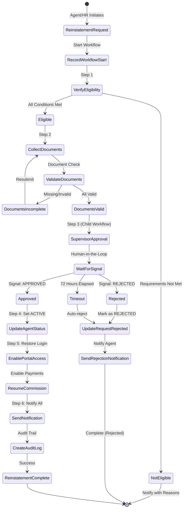

# BR-AGT-PRF-016: Status Update with Mandatory Reason & Reinstatement Workflow (WF-AGT-PRF-011)

**Date**: 2026-01-27
**Branch**: claude/develop-policy-apis-golang-BcDD3
**Status**: Detailed specification for Phase 8 implementation
**Related APIs**: AGT-039, AGT-041, AGT-060 to AGT-063, AGT-070 to AGT-072

---

## 📋 TABLE OF CONTENTS

1. [Business Rule BR-AGT-PRF-016 Details](#business-rule-br-agt-prf-016-details)
2. [Reinstatement Workflow (WF-AGT-PRF-011)](#reinstatement-workflow-wf-agt-prf-011)
3. [Workflow State Machine](#workflow-state-machine)
4. [Workflow Activities](#workflow-activities)
5. [API Endpoints](#api-endpoints)
6. [Database Schema](#database-schema)
7. [Implementation Code](#implementation-code)
8. [Error Scenarios](#error-scenarios)
9. [Testing Scenarios](#testing-scenarios)

---

## 📐 BUSINESS RULE BR-AGT-PRF-016 DETAILS

### **Rule Specification**

| Attribute | Details |
|-----------|---------|
| **ID** | BR-AGT-PRF-016 |
| **Name** | Status Update with Mandatory Reason |
| **Category** | Status Management |
| **Priority** | HIGH |
| **Related FR** | FR-AGT-PRF-013 (Status Update Interface)<br>FR-AGT-PRF-020 (Status Management) |
| **Related APIs** | AGT-039 (Terminate Agent)<br>AGT-041 (Reinstate Agent)<br>AGT-060 to AGT-063 (Reinstatement Workflow) |
| **Source** | Agent_SRS_Incentive, Commission and Producer Management.md, Section 3, FS_IC_009, Lines 154-156 |

### **Description**

Agent status updates (Active, Suspended, Terminated, Deactivated) require **mandatory reason entry** and **effective date**. This ensures accountability and transparency in all status changes and provides a clear audit trail for compliance.

### **Rule Logic**

```javascript
IF update_status(new_status) THEN
  require_fields(
    reason: string[min=10],      // Minimum 10 chars for reinstatement
                                 // Minimum 20 chars for termination
    reason_code: enum,           // Predefined reason codes
    effective_date: date[>=today] // Must be today or future
  )
  AND
  IF new_status IN ['SUSPENDED', 'TERMINATED', 'DEACTIVATED'] THEN
    send_notification(
      agent_email,
      agent_mobile,
      reason,
      effective_date
    )
  END IF
END IF
```

---

### **Validation Rules by Status Change**

| Status Change | Reason Min Length | Reason Code | Effective Date | Additional Requirements |
|---------------|------------------|-------------|----------------|------------------------|
| **ACTIVE → TERMINATED** | 20 characters | RESIGNATION<br>MISCONDUCT<br>NON_PERFORMANCE<br>FRAUD<br>OTHER | >= today | - Cannot terminate already TERMINATED agent<br>- Triggers termination workflow (WF-AGT-PRF-004)<br>- Generates termination letter<br>- Archives data for 7 years |
| **TERMINATED → ACTIVE** | 10 characters | LICENSE_RENEWED<br>APPEAL_APPROVED<br>CLEARANCE_OBTAINED<br>MUTUAL_AGREEMENT<br>WRONGFUL_TERMINATION | >= today | - Agent must be TERMINATED or SUSPENDED<br>- Supporting documents required<br>- Requires supervisor approval (WF-AGT-PRF-011)<br>- Approval timeout: 72 hours |
| **ACTIVE → SUSPENDED** | 10 characters | PENDING_INVESTIGATION<br>LICENSE_RENEWAL_PENDING<br>COMPLIANCE_REVIEW<br>DISCIPLINARY_ACTION | >= today | - Suspension duration may be specified<br>- Periodic review required<br>- Can be auto-lifted or manually reinstated |
| **ACTIVE → DEACTIVATED** | 10 characters | LICENSE_EXPIRED<br>INACTIVITY<br>NON_COMPLIANCE | >= today | - Usually system-triggered (license expiry)<br>- Manual deactivation requires approval<br>- Can be reactivated when issue resolved |
| **SUSPENDED → ACTIVE** | 10 characters | INVESTIGATION_CLEARED<br>SUSPENSION_PERIOD_COMPLETE<br>LICENSE_RENEWED | >= today | - Similar to reinstatement workflow<br>- May require supervisor approval based on suspension reason |

---

### **Business Impact**

| Impact Area | Description | Benefit |
|-------------|-------------|---------|
| **Accountability** | Every status change is traceable to a person and reason | Prevents arbitrary decisions |
| **Compliance** | Complete audit trail for regulatory requirements | Meets 7-year audit retention requirement |
| **Transparency** | Agents understand why their status changed | Reduces disputes and grievances |
| **Data Integrity** | Mandatory fields prevent incomplete records | Ensures data quality |
| **Notification** | Automatic notifications keep stakeholders informed | Improves communication |

---

### **Rationale**

From the source requirements document:

> "Status updates require mandatory reason entry to ensure accountability and transparency in status changes. All status changes must be documented with clear justification to support audits and prevent arbitrary actions."
>
> — Agent_SRS_Incentive, Commission and Producer Management.md, Section 3, FS_IC_009

**Key Principles**:
1. **No silent failures**: Every status change must be justified
2. **Audit trail**: Complete history for compliance and dispute resolution
3. **Agent rights**: Agents have right to know why their status changed
4. **Management oversight**: Prevents unauthorized status changes

---

### **Examples**

#### **Example 1: Termination (AGT-039)**

```json
{
  "status_change": "ACTIVE → TERMINATED",
  "agent_id": "AGT-2026-000567",
  "reason": "Agent involved in misconduct - policy violations documented in case #12345 dated 15-01-2026, including unauthorized commission claims and failure to maintain license compliance",
  "reason_code": "MISCONDUCT",
  "effective_date": "20-01-2026",
  "performed_by": "supervisor@company.com",
  "additional_actions": [
    "Termination letter generated",
    "Portal access disabled",
    "Commission processing stopped",
    "Data archived for 7 years",
    "Notification sent to agent email and mobile"
  ]
}
```

**Validation**:
- ✅ Reason length: 145 characters (>= 20 minimum)
- ✅ Reason code: Valid enum value
- ✅ Effective date: 20-01-2026 (>= today)
- ✅ Agent status: ACTIVE (can be terminated)

---

#### **Example 2: Reinstatement (AGT-060)**

```json
{
  "status_change": "TERMINATED → ACTIVE",
  "agent_id": "AGT-2026-000567",
  "reason": "Appeal approved by management committee meeting dated 25-01-2026. Original termination reversed after investigation.",
  "reason_code": "APPEAL_APPROVED",
  "effective_date": "01-02-2026",
  "requested_by": "hr@company.com",
  "supporting_documents": [
    {
      "document_id": "uuid-1",
      "document_type": "APPEAL_LETTER",
      "file_name": "management_committee_minutes.pdf"
    },
    {
      "document_id": "uuid-2",
      "document_type": "CLEARANCE_CERTIFICATE",
      "file_name": "clearance_certificate.pdf"
    }
  ],
  "workflow_status": "PENDING_SUPERVISOR_APPROVAL",
  "approval_timeout": "72 hours"
}
```

**Validation**:
- ✅ Reason length: 112 characters (>= 10 minimum)
- ✅ Reason code: Valid enum value
- ✅ Effective date: 01-02-2026 (>= today)
- ✅ Agent status: TERMINATED (eligible for reinstatement)
- ✅ Documents: 2 supporting documents provided
- ⏳ Approval: Pending supervisor approval within 72 hours

---

#### **Example 3: Validation Failure**

```json
{
  "status_change": "ACTIVE → TERMINATED",
  "agent_id": "AGT-2026-000567",
  "reason": "Misconduct",  // ❌ TOO SHORT (only 10 chars, need 20)
  "reason_code": "MISCONDUCT",
  "effective_date": "15-01-2026",  // ❌ PAST DATE
  "performed_by": "supervisor@company.com"
}
```

**Error Response**:
```json
{
  "error": {
    "code": "ERR-AGT-PRF-010",
    "message": "Termination reason validation failed",
    "details": [
      "Termination reason must be at least 20 characters (provided: 10)",
      "Effective date must be today or future date (provided: 15-01-2026, today: 27-01-2026)"
    ],
    "suggested_actions": [
      "Provide detailed termination reason with minimum 20 characters",
      "Set effective date to 27-01-2026 or later"
    ]
  }
}
```

---

## ⚙️ REINSTATEMENT WORKFLOW (WF-AGT-PRF-011)

### **Workflow Overview**

| Attribute | Details |
|-----------|---------|
| **Workflow ID** | WF-AGT-PRF-011 |
| **Name** | Agent Status Reinstatement Workflow |
| **Category** | Status Management |
| **Pattern** | Human-in-the-Loop with Child Workflow |
| **Priority** | HIGH |
| **Duration** | 3-5 days (typical), up to 72 hours for approval |
| **Related BR** | BR-AGT-PRF-016 (Status Update with Reason) |
| **Related APIs** | AGT-041 (Reinstate Agent)<br>AGT-060 (Create Reinstatement Request)<br>AGT-061 (Approve Reinstatement)<br>AGT-062 (Reject Reinstatement)<br>AGT-063 (Upload Documents) |

### **Purpose**

Restore a TERMINATED or SUSPENDED agent back to ACTIVE status through a structured approval process that ensures:
1. ✅ Eligibility verification
2. ✅ Document collection and validation
3. ✅ Supervisor approval (human-in-the-loop)
4. ✅ Status update and access restoration
5. ✅ Notification and audit trail

---

### **Workflow Triggers**

| Trigger | Description | Example Scenario |
|---------|-------------|-----------------|
| **License Renewed** | Agent renews expired license | License expired 01-01-2026, renewed 15-01-2026 → Request reinstatement |
| **Suspension Complete** | Temporary suspension period ends | 90-day suspension for investigation complete → Request reinstatement |
| **Appeal Approved** | Termination decision reversed by management | Management committee approves appeal → Reinstate agent |
| **HRMS Reactivation** | HRMS employee marked active again | Departmental employee returns from extended leave → Reinstate agent profile |
| **Clearance Obtained** | Agent clears pending issues | Fraud investigation cleared by legal department → Reinstate agent |
| **Compliance Met** | Agent completes required compliance training | Mandatory training completed after non-compliance suspension → Reinstate |

---

## 🔄 WORKFLOW STATE MACHINE



---

## 🔧 WORKFLOW ACTIVITIES

### **Activity Overview**

| Step | Activity Name | Description | Retry Policy |
|------|--------------|-------------|--------------|
| **0** | RecordWorkflowStartActivity | Record workflow in database (self-recording) | 3 retries, 2s backoff |
| **1** | ValidateReinstatementEligibilityActivity | Verify agent can be reinstated | 3 retries, 2s backoff |
| **2** | CollectAndValidateDocumentsActivity | Validate required documents | 3 retries, 2s backoff |
| **3** | SendApprovalRequestActivity (Child WF) | Start approval child workflow | No retry (child workflow handles retries) |
| **4** | UpdateAgentStatusToActiveActivity | Update agent status to ACTIVE | 3 retries, 2s backoff |
| **5** | EnablePortalAndCommissionActivity | Enable portal and commission | 3 retries, 2s backoff |
| **6** | SendNotificationAndAuditActivity | Send notifications and create audit log | 1 retry (notification failure shouldn't fail workflow) |

---

### **ACT-RNS-001: ValidateReinstatementEligibilityActivity**

**Purpose**: Verify agent is eligible for reinstatement

**Input**:
```go
type EligibilityInput struct {
    AgentID string
    Reason  string
    ReasonCode string
}
```

**Processing**:
1. ✅ Fetch agent profile from database
2. ✅ Verify current status is TERMINATED or SUSPENDED
3. ✅ Check reason for original status change
4. ✅ Determine required documents based on termination/suspension reason
5. ✅ Calculate eligibility score based on:
   - Time since termination/suspension
   - Reason for termination/suspension
   - Prior disciplinary history
   - Compliance record

**Output**:
```go
type EligibilityOutput struct {
    Eligible               bool
    ReasonForIneligibility string
    RequiredDocuments      []string
    EligibilityScore       int
}
```

**Required Documents by Reason**:

| Original Status Reason | Required Documents for Reinstatement |
|----------------------|-------------------------------------|
| **LICENSE_EXPIRED** | - Renewed license certificate<br>- License verification proof |
| **MISCONDUCT** | - Clearance certificate from management<br>- Disciplinary hearing minutes<br>- Behavioral improvement plan |
| **NON_PERFORMANCE** | - Training completion certificate<br>- Performance improvement plan<br>- Manager recommendation letter |
| **FRAUD** | - Legal clearance certificate<br>- Investigation closure report<br>- Restitution proof (if applicable) |
| **COMPLIANCE_VIOLATION** | - Compliance training certificate<br>- Audit clearance letter |

**Ineligibility Conditions**:
- ❌ Agent status is ACTIVE (already active)
- ❌ Agent status is DEACTIVATED due to permanent reasons
- ❌ Termination was within last 30 days (cooling period)
- ❌ Multiple termination history (3+ times in 5 years)
- ❌ Pending legal cases or investigations
- ❌ Outstanding financial liabilities to company

---

### **ACT-RNS-002: CollectAndValidateDocumentsActivity**

**Purpose**: Validate all required documents are submitted and authentic

**Input**:
```go
type DocumentsInput struct {
    RequestID        string
    RequiredDocs     []string
    SubmittedDocs    []string  // Document IDs from agent_documents table
}
```

**Processing**:
1. ✅ Fetch submitted documents from `agent_documents` table
2. ✅ Match submitted documents against required documents list
3. ✅ Validate document types, file formats, and sizes
4. ✅ Check document authenticity (if verification service available)
5. ✅ Verify document expiry dates (e.g., license validity)
6. ✅ Link documents to reinstatement request in `agent_reinstatement_documents` table

**Output**:
```go
type DocumentsOutput struct {
    AllValid       bool
    ValidDocs      []string
    InvalidDocs    []string
    MissingDocs    []string
    ExpiryWarnings []string
}
```

**Validation Rules**:
- ✅ File format: PDF, JPG, PNG only
- ✅ File size: Max 5MB per file
- ✅ Document age: Must be issued within last 6 months (for certificates)
- ✅ License validity: Must be valid for at least 30 days from effective date

**Database Updates**:
```sql
-- Link documents to reinstatement request
INSERT INTO agent_reinstatement_documents (request_id, document_id)
SELECT $1, document_id
FROM UNNEST($2::uuid[]) AS document_id;
```

---

### **ACT-RNS-003: SendApprovalRequestActivity (Child Workflow)**

**Purpose**: Start approval child workflow and wait for human approval

**Pattern**: This activity starts the **ApprovalWorkflow** (already implemented in `approval_workflow.go`)

**Input**:
```go
type ApprovalRequestInput struct {
    RequestID    string
    AgentID      string
    AgentType    string
    FirstName    string
    LastName     string
    PANNumber    string
    ApprovalType string // "REINSTATEMENT_APPROVAL"
    InitiatedBy  string
    Approvers    []string
    Reason       string
    Documents    []string
}
```

**Child Workflow Execution**:
```go
approvalInput := ApprovalWorkflowInput{
    RequestID:    input.RequestID,
    AgentType:    input.AgentType,
    FirstName:    input.FirstName,
    LastName:     input.LastName,
    PANNumber:    input.PANNumber,
    ApprovalType: "REINSTATEMENT_APPROVAL",
    InitiatedBy:  input.InitiatedBy,
    Approvers:    input.Approvers,
}

childWorkflowOptions := workflow.ChildWorkflowOptions{
    WorkflowID: fmt.Sprintf("reinstatement-approval-%s", input.RequestID),
}

var approvalResult ApprovalWorkflowOutput
err := workflow.ExecuteChildWorkflow(ctx, AgentApprovalWorkflow, approvalInput).Get(ctx, &approvalResult)
```

**Approval Workflow Behavior**:
1. ✅ Send approval notification to supervisor (email/SMS)
2. ⏳ Wait for signal: `approval-decision` (timeout: 72 hours)
3. ✅ Receive signal from AGT-061 (Approve) or AGT-062 (Reject)
4. ⏰ Auto-reject if 72 hours elapse without response

**Output**:
```go
type ApprovalWorkflowOutput struct {
    Approved   bool
    Decision   string    // "APPROVED", "REJECTED", "TIMEOUT"
    ApprovedBy string
    Comments   string
    ApprovedAt time.Time
}
```

---

### **ACT-RNS-004: UpdateAgentStatusToActiveActivity**

**Purpose**: Update agent status to ACTIVE in database (atomic operation)

**Input**:
```go
type UpdateStatusInput struct {
    AgentID       string
    EffectiveDate time.Time
    UpdatedBy     string
    RequestID     string
}
```

**Processing**:
1. ✅ Update agent status to ACTIVE
2. ✅ Set reinstatement_date
3. ✅ Clear termination fields (termination_date, termination_reason)
4. ✅ Update reinstatement request status to APPROVED
5. ✅ All in single transaction for atomicity

**SQL (Atomic Update with CTE)**:
```sql
-- Single transaction updates both tables
WITH updated_profile AS (
    UPDATE agent_profiles
    SET
        status = 'ACTIVE',
        reinstatement_date = $2,
        termination_date = NULL,
        termination_reason = NULL,
        termination_reason_code = NULL,
        updated_by = $3,
        updated_at = NOW()
    WHERE agent_id = $1
    RETURNING *
),
updated_request AS (
    UPDATE agent_reinstatement_requests
    SET
        status = 'APPROVED',
        approved_by = $3,
        approved_at = NOW(),
        updated_at = NOW()
    WHERE request_id = $4
    RETURNING *
)
SELECT * FROM updated_profile;
```

**Output**:
```go
type UpdateStatusOutput struct {
    Success     bool
    AgentStatus string
    Message     string
}
```

---

### **ACT-RNS-005: EnablePortalAndCommissionActivity**

**Purpose**: Restore portal access and enable commission processing

**Input**:
```go
type EnableInput struct {
    AgentID string
}
```

**Processing**:
1. ✅ Update `agent_authentication.status = 'ACTIVE'`
2. ✅ Set `agent_profiles.commission_enabled = true`
3. ✅ Reset `agent_authentication.failed_login_attempts = 0`
4. ✅ Clear `agent_authentication.locked_at = NULL`
5. ✅ Update `agent_authentication.last_status_change = NOW()`

**SQL (Atomic Update)**:
```sql
-- Update authentication status
UPDATE agent_authentication
SET
    status = 'ACTIVE',
    failed_login_attempts = 0,
    locked_at = NULL,
    last_status_change = NOW(),
    updated_at = NOW()
WHERE agent_id = $1;

-- Enable commission processing
UPDATE agent_profiles
SET
    commission_enabled = true,
    updated_at = NOW()
WHERE agent_id = $1;
```

**Output**:
```go
type EnableOutput struct {
    PortalEnabled      bool
    CommissionEnabled  bool
    Message            string
}
```

---

### **ACT-RNS-006: SendNotificationAndAuditActivity**

**Purpose**: Send notifications to all stakeholders and create audit log

**Input**:
```go
type NotificationInput struct {
    AgentID            string
    AgentEmail         string
    AgentMobile        string
    ReinstatementDate  time.Time
    ApprovedBy         string
    RequestID          string
}
```

**Processing**:

**1. Send Agent Notification (Email)**:
```
Subject: Your Profile Has Been Reinstated
Body:
Dear [Agent Name],

Your agent profile (ID: [AgentID]) has been successfully reinstated.

Reinstatement Details:
- Effective Date: [ReinstatementDate]
- Approved By: [ApprovedBy]
- Request ID: [RequestID]

Your portal access has been restored. You can now:
- Login to the agent portal
- Access your dashboard
- Resume commission processing
- Update your profile

If you have any questions, please contact your supervisor.

Regards,
Agent Management System
```

**2. Send Agent Notification (SMS)**:
```
Your agent profile has been reinstated. Effective date: [Date]. Portal access restored. Login at: [URL]
```

**3. Send Supervisor Notification**:
```
Subject: Reinstatement Completed - [Agent Name]

The reinstatement request for agent [Agent Name] (ID: [AgentID]) has been completed successfully.

Request ID: [RequestID]
Effective Date: [ReinstatementDate]
Approved By: [ApprovedBy]
```

**4. Create Audit Log**:
```go
auditLog := domain.AgentAuditLog{
    AgentID:      input.AgentID,
    ActionType:   "REINSTATEMENT",
    FieldName:    "status",
    OldValue:     "TERMINATED",
    NewValue:     "ACTIVE",
    PerformedBy:  input.ApprovedBy,
    PerformedAt:  time.Now(),
    RequestID:    input.RequestID,
    Comments:     "Agent reinstated via reinstatement workflow",
}
```

**5. Update Performance Records**:
```sql
-- Update agent performance table with reinstatement date
UPDATE agent_performance_records
SET
    reinstatement_date = $2,
    status = 'ACTIVE',
    updated_at = NOW()
WHERE agent_id = $1;
```

**Output**:
```go
type NotificationOutput struct {
    EmailSent       bool
    SMSSent         bool
    AuditLogCreated bool
    Message         string
}
```

**Error Handling**:
- ⚠️ If email fails: Log error but continue (don't fail workflow)
- ⚠️ If SMS fails: Log error but continue
- ❌ If audit log creation fails: Retry 3 times, then fail workflow

---

## 🔌 API ENDPOINTS

### **AGT-060: POST /reinstatement/request** (Initiate Reinstatement)

**Purpose**: Create reinstatement request and start workflow

**HTTP Method**: POST
**Path**: `/reinstatement/request`
**Authentication**: Required (Bearer Token)
**Authorization**: HR, Agent, Supervisor

**Request Body**:
```json
{
  "agent_id": "AGT-2026-000567",
  "reinstatement_reason": "License renewed after expiry, all pending issues cleared, training completed",
  "reinstatement_reason_code": "LICENSE_RENEWED",
  "effective_date": "01-02-2026",
  "supporting_documents": [
    "uuid-document-1",
    "uuid-document-2"
  ],
  "requested_by": "hr@company.com"
}
```

**Validation Rules**:
- ✅ `agent_id`: Required, must exist in database
- ✅ `reinstatement_reason`: Required, min 10 characters
- ✅ `reinstatement_reason_code`: Optional, valid enum
- ✅ `effective_date`: Required, >= today
- ✅ `supporting_documents`: Optional, array of document UUIDs
- ✅ `requested_by`: Required, valid email

**Success Response (201 Created)**:
```json
{
  "request_id": "uuid-reinstatement-request",
  "status": "PENDING_APPROVAL",
  "workflow_id": "reinstatement-workflow-uuid",
  "temporal_run_id": "temporal-run-uuid",
  "agent_id": "AGT-2026-000567",
  "message": "Reinstatement request created successfully. Pending supervisor approval.",
  "approval_deadline": "2026-01-30T10:30:00Z",
  "next_actions": [
    "Supervisor will review the request",
    "Approval decision required within 72 hours",
    "Check status via GET /reinstatement/request/{request_id}"
  ]
}
```

**Error Responses**:

**400 Bad Request** (Validation Error):
```json
{
  "error": {
    "code": "ERR-AGT-PRF-VALIDATION",
    "message": "Reinstatement request validation failed",
    "details": [
      "Reinstatement reason must be at least 10 characters (provided: 8)",
      "Effective date must be today or future date"
    ]
  }
}
```

**404 Not Found** (Agent Not Found):
```json
{
  "error": {
    "code": "E-AGT-PRF-008",
    "message": "Agent not found",
    "details": "Agent ID AGT-2026-000567 does not exist"
  }
}
```

**409 Conflict** (Agent Not Eligible):
```json
{
  "error": {
    "code": "ERR-AGT-PRF-INELIGIBLE",
    "message": "Agent not eligible for reinstatement",
    "details": "Agent status is ACTIVE. Only TERMINATED or SUSPENDED agents can be reinstated."
  }
}
```

---

### **AGT-061: PUT /reinstatement/{request_id}/approve** (Approve Reinstatement)

**Purpose**: Approve reinstatement request (sends signal to workflow)

**HTTP Method**: PUT
**Path**: `/reinstatement/{request_id}/approve`
**Authentication**: Required (Bearer Token)
**Authorization**: Supervisor, Manager only

**Path Parameters**:
- `request_id`: UUID of reinstatement request

**Request Body**:
```json
{
  "action": "APPROVE",
  "approver_comments": "All requirements met. License renewed, training completed, clearance obtained.",
  "approved_by": "supervisor@company.com"
}
```

**Handler Logic**:
```go
func (h *Handler) ApproveReinstatement(sctx *serverRoute.Context, req ApproveReinstatementRequest) (*Response, error) {
    // 1. Fetch reinstatement request
    request, err := h.reinstatementRepo.FindByID(sctx.Ctx, req.RequestID)
    if err != nil {
        return nil, err
    }

    // 2. Validate request status
    if request.Status != "PENDING_APPROVAL" {
        return nil, fmt.Errorf("request already processed")
    }

    // 3. Send signal to workflow (resumes from child workflow)
    signal := ApprovalDecisionSignal{
        Decision:   "APPROVED",
        ApprovedBy: req.ApprovedBy,
        Comments:   req.ApproverComments,
        ApprovedAt: time.Now(),
    }

    err = h.temporalClient.SignalWorkflow(
        sctx.Ctx,
        request.WorkflowID,
        request.TemporalRunID,
        ApprovalSignalName,  // "approval-decision"
        signal,
    )
    if err != nil {
        return nil, err
    }

    // 4. Update request status (workflow will update after processing)
    _, err = h.reinstatementRepo.ApproveReturning(
        sctx.Ctx,
        req.RequestID,
        req.ApprovedBy,
        req.ApproverComments,
    )

    return &Response{
        StatusCodeAndMessage: port.ApprovalSuccess,
        Data: map[string]interface{}{
            "request_id": req.RequestID,
            "status":     "APPROVED",
            "approved_by": req.ApprovedBy,
            "approved_at": time.Now(),
        },
    }, nil
}
```

**Success Response (200 OK)**:
```json
{
  "request_id": "uuid-reinstatement-request",
  "status": "APPROVED",
  "agent_id": "AGT-2026-000567",
  "new_status": "ACTIVE",
  "approved_by": "supervisor@company.com",
  "approved_at": "2026-01-27T10:30:00Z",
  "message": "Reinstatement approved successfully. Agent status updated to ACTIVE.",
  "actions_performed": [
    "Agent status updated to ACTIVE",
    "Portal access restored",
    "Commission processing enabled",
    "Notification sent to agent",
    "Audit log created"
  ]
}
```

---

### **AGT-062: PUT /reinstatement/{request_id}/reject** (Reject Reinstatement)

**Purpose**: Reject reinstatement request (sends signal to workflow)

**HTTP Method**: PUT
**Path**: `/reinstatement/{request_id}/reject`
**Authentication**: Required (Bearer Token)
**Authorization**: Supervisor, Manager only

**Request Body**:
```json
{
  "action": "REJECT",
  "rejector_comments": "Training certificate not submitted. Pending compliance review. Reapply after submitting required documents.",
  "rejected_by": "supervisor@company.com"
}
```

**Success Response (200 OK)**:
```json
{
  "request_id": "uuid-reinstatement-request",
  "status": "REJECTED",
  "agent_id": "AGT-2026-000567",
  "rejected_by": "supervisor@company.com",
  "rejected_at": "2026-01-27T10:35:00Z",
  "rejection_reason": "Training certificate not submitted. Pending compliance review.",
  "message": "Reinstatement request rejected",
  "next_steps": [
    "Complete required compliance training",
    "Submit training certificate",
    "Reapply for reinstatement after meeting requirements"
  ]
}
```

---

### **AGT-063: POST /reinstatement/{request_id}/documents** (Upload Documents)

**Purpose**: Upload supporting documents for reinstatement request

**HTTP Method**: POST
**Path**: `/reinstatement/{request_id}/documents`
**Authentication**: Required (Bearer Token)
**Authorization**: HR, Agent, Supervisor
**Content-Type**: multipart/form-data

**Form Data**:
- `documents`: Array of files (required)
- `document_type`: Enum (required)
  - IDENTITY_PROOF
  - ADDRESS_PROOF
  - LICENCE_COPY
  - NO_DUE_CERTIFICATE
  - TRAINING_CERTIFICATE
  - CLEARANCE_CERTIFICATE

**Example Request**:
```bash
curl -X POST /reinstatement/uuid-request/documents \
  -H "Authorization: Bearer $TOKEN" \
  -F "documents=@renewed_license.pdf" \
  -F "documents=@training_certificate.pdf" \
  -F "document_type=LICENCE_COPY"
```

**Success Response (201 Created)**:
```json
{
  "request_id": "uuid-reinstatement-request",
  "documents_uploaded": [
    {
      "document_id": "uuid-doc-1",
      "document_type": "LICENCE_COPY",
      "file_name": "renewed_license.pdf",
      "file_size_bytes": 245678,
      "uploaded_by": "hr@company.com",
      "uploaded_at": "2026-01-27T10:30:00Z",
      "upload_status": "SUCCESS"
    },
    {
      "document_id": "uuid-doc-2",
      "document_type": "TRAINING_CERTIFICATE",
      "file_name": "training_certificate.pdf",
      "file_size_bytes": 189234,
      "uploaded_by": "hr@company.com",
      "uploaded_at": "2026-01-27T10:30:15Z",
      "upload_status": "SUCCESS"
    }
  ],
  "message": "Documents uploaded successfully",
  "total_documents": 2
}
```

**Validation**:
- ✅ File format: PDF, JPG, PNG only
- ✅ File size: Max 5MB per file
- ✅ Max files: 10 files per request

---

## 🗄️ DATABASE SCHEMA

### **Table: agent_reinstatement_requests**

```sql
CREATE TABLE agent_reinstatement_requests (
    -- Primary Key
    request_id UUID PRIMARY KEY DEFAULT gen_random_uuid(),

    -- Agent Reference
    agent_id UUID NOT NULL REFERENCES agent_profiles(agent_id),

    -- Reinstatement Details
    reinstatement_reason TEXT NOT NULL CHECK (LENGTH(reinstatement_reason) >= 10),
    reinstatement_reason_code VARCHAR(50),
    effective_date DATE NOT NULL,
    requested_by VARCHAR(255) NOT NULL,

    -- Workflow State
    status VARCHAR(50) NOT NULL DEFAULT 'PENDING_APPROVAL',
    workflow_id UUID,
    temporal_run_id VARCHAR(255),

    -- Approval Details
    approved_by VARCHAR(255),
    approved_at TIMESTAMP WITH TIME ZONE,
    approver_comments TEXT,

    -- Rejection Details
    rejected_by VARCHAR(255),
    rejected_at TIMESTAMP WITH TIME ZONE,
    rejection_reason TEXT,

    -- Timestamps
    created_at TIMESTAMP WITH TIME ZONE DEFAULT NOW(),
    updated_at TIMESTAMP WITH TIME ZONE DEFAULT NOW(),

    -- Constraints
    CONSTRAINT chk_status CHECK (status IN ('PENDING_APPROVAL', 'APPROVED', 'REJECTED', 'TIMEOUT')),
    CONSTRAINT chk_effective_date CHECK (effective_date >= CURRENT_DATE),
    CONSTRAINT chk_approval_xor_rejection CHECK (
        (approved_by IS NULL AND rejected_by IS NULL) OR
        (approved_by IS NOT NULL AND rejected_by IS NULL) OR
        (approved_by IS NULL AND rejected_by IS NOT NULL)
    )
);

-- Indexes
CREATE INDEX idx_reinstatement_agent_id ON agent_reinstatement_requests(agent_id);
CREATE INDEX idx_reinstatement_status ON agent_reinstatement_requests(status);
CREATE INDEX idx_reinstatement_workflow_id ON agent_reinstatement_requests(workflow_id);
CREATE INDEX idx_reinstatement_created_at ON agent_reinstatement_requests(created_at DESC);
```

---

### **Table: agent_reinstatement_documents**

```sql
CREATE TABLE agent_reinstatement_documents (
    -- Composite Primary Key
    request_id UUID NOT NULL REFERENCES agent_reinstatement_requests(request_id) ON DELETE CASCADE,
    document_id UUID NOT NULL REFERENCES agent_documents(document_id) ON DELETE CASCADE,

    -- Metadata
    linked_at TIMESTAMP WITH TIME ZONE DEFAULT NOW(),
    linked_by VARCHAR(255),

    PRIMARY KEY (request_id, document_id)
);

-- Indexes
CREATE INDEX idx_reinstatement_docs_request ON agent_reinstatement_documents(request_id);
CREATE INDEX idx_reinstatement_docs_document ON agent_reinstatement_documents(document_id);
```

---

### **Updates to agent_profiles Table**

```sql
-- Add reinstatement tracking columns
ALTER TABLE agent_profiles
ADD COLUMN IF NOT EXISTS reinstatement_date DATE,
ADD COLUMN IF NOT EXISTS last_reinstatement_request_id UUID REFERENCES agent_reinstatement_requests(request_id),
ADD COLUMN IF NOT EXISTS reinstatement_count INTEGER DEFAULT 0;

-- Index for reinstatement tracking
CREATE INDEX IF NOT EXISTS idx_agent_reinstatement_date ON agent_profiles(reinstatement_date);
```

---

## 💻 IMPLEMENTATION CODE

### **Workflow Implementation**

```go
// workflows/agent_reinstatement_workflow.go

package workflows

import (
    "fmt"
    "strings"
    "time"

    "go.temporal.io/sdk/temporal"
    "go.temporal.io/sdk/workflow"

    "pli-agent/workflows/activities"
)

// ReinstatementInput contains reinstatement workflow input
type ReinstatementInput struct {
    RequestID      string
    AgentID        string
    AgentType      string
    FirstName      string
    LastName       string
    PANNumber      string
    AgentEmail     string
    AgentMobile    string
    Reason         string
    ReasonCode     string
    EffectiveDate  time.Time
    RequestedBy    string
    Approvers      []string
    Documents      []string // Document UUIDs
}

// ReinstatementOutput contains reinstatement workflow output
type ReinstatementOutput struct {
    Success    bool
    Message    string
    ApprovedBy string
    RejectedBy string
    Comments   string
    RequestID  string
}

// AgentReinstatementWorkflow implements WF-AGT-PRF-011
// Human-in-the-loop approval pattern for agent reinstatement
func AgentReinstatementWorkflow(ctx workflow.Context, input ReinstatementInput) (*ReinstatementOutput, error) {
    logger := workflow.GetLogger(ctx)
    logger.Info("AgentReinstatementWorkflow started",
        "RequestID", input.RequestID,
        "AgentID", input.AgentID)

    // Setup activity options
    ao := workflow.ActivityOptions{
        StartToCloseTimeout: time.Minute,
        RetryPolicy: &temporal.RetryPolicy{
            InitialInterval:    time.Second,
            BackoffCoefficient: 2.0,
            MaximumInterval:    time.Minute,
            MaximumAttempts:    3,
        },
    }
    ctx = workflow.WithActivityOptions(ctx, ao)

    var a *activities.AgentReinstatementActivities

    // Step 0: Record workflow start in database (self-recording pattern)
    logger.Info("Step 0: Recording workflow start in database")
    workflowInfo := workflow.GetInfo(ctx)
    var recordResult activities.RecordWorkflowStartOutput
    err := workflow.ExecuteActivity(ctx, a.RecordWorkflowStartActivity,
        activities.RecordWorkflowStartInput{
            RequestID:     input.RequestID,
            WorkflowID:    workflowInfo.WorkflowExecution.ID,
            RunID:         workflowInfo.WorkflowExecution.RunID,
            WorkflowState: "REINSTATEMENT_INITIATED",
            CurrentStep:   "WORKFLOW_STARTED",
        }).Get(ctx, &recordResult)
    if err != nil {
        logger.Error("Failed to record workflow start", "error", err)
        return nil, fmt.Errorf("failed to record workflow start: %w", err)
    }
    logger.Info("Workflow start recorded successfully")

    // Step 1: Validate reinstatement eligibility
    logger.Info("Step 1: Validating reinstatement eligibility")
    var eligibilityResult activities.EligibilityOutput
    err = workflow.ExecuteActivity(ctx, a.ValidateReinstatementEligibilityActivity,
        activities.EligibilityInput{
            AgentID:    input.AgentID,
            Reason:     input.Reason,
            ReasonCode: input.ReasonCode,
        }).Get(ctx, &eligibilityResult)
    if err != nil {
        logger.Error("Failed to validate eligibility", "error", err)
        return nil, err
    }

    if !eligibilityResult.Eligible {
        logger.Warn("Agent not eligible for reinstatement",
            "Reason", eligibilityResult.ReasonForIneligibility)
        return &ReinstatementOutput{
            Success: false,
            Message: "Agent not eligible for reinstatement: " + eligibilityResult.ReasonForIneligibility,
        }, nil
    }
    logger.Info("Agent eligible for reinstatement",
        "RequiredDocuments", eligibilityResult.RequiredDocuments)

    // Step 2: Collect and validate documents
    logger.Info("Step 2: Validating required documents")
    var documentsResult activities.DocumentsOutput
    err = workflow.ExecuteActivity(ctx, a.CollectAndValidateDocumentsActivity,
        activities.DocumentsInput{
            RequestID:     input.RequestID,
            RequiredDocs:  eligibilityResult.RequiredDocuments,
            SubmittedDocs: input.Documents,
        }).Get(ctx, &documentsResult)
    if err != nil {
        logger.Error("Failed to validate documents", "error", err)
        return nil, err
    }

    if !documentsResult.AllValid {
        logger.Warn("Documents validation failed",
            "MissingDocs", documentsResult.MissingDocs,
            "InvalidDocs", documentsResult.InvalidDocs)
        return &ReinstatementOutput{
            Success: false,
            Message: "Missing or invalid documents: " + strings.Join(append(documentsResult.MissingDocs, documentsResult.InvalidDocs...), ", "),
        }, nil
    }
    logger.Info("All documents validated successfully")

    // Step 3: Start approval child workflow (human-in-the-loop)
    logger.Info("Step 3: Starting approval child workflow")
    approvalInput := ApprovalWorkflowInput{
        RequestID:    input.RequestID,
        AgentType:    input.AgentType,
        FirstName:    input.FirstName,
        LastName:     input.LastName,
        PANNumber:    input.PANNumber,
        ApprovalType: "REINSTATEMENT_APPROVAL",
        InitiatedBy:  input.RequestedBy,
        Approvers:    input.Approvers,
    }

    childWorkflowOptions := workflow.ChildWorkflowOptions{
        WorkflowID: fmt.Sprintf("reinstatement-approval-%s", input.RequestID),
    }
    ctx = workflow.WithChildOptions(ctx, childWorkflowOptions)

    var approvalResult ApprovalWorkflowOutput
    err = workflow.ExecuteChildWorkflow(ctx, AgentApprovalWorkflow, approvalInput).Get(ctx, &approvalResult)
    if err != nil {
        logger.Error("Approval child workflow failed", "error", err)
        return nil, err
    }

    logger.Info("Approval workflow completed",
        "Decision", approvalResult.Decision,
        "ApprovedBy", approvalResult.ApprovedBy)

    // If not approved, update request and return
    if !approvalResult.Approved {
        logger.Warn("Reinstatement rejected",
            "Reason", approvalResult.Comments,
            "Decision", approvalResult.Decision)

        // Update request status to REJECTED or TIMEOUT
        var rejectResult activities.UpdateRequestOutput
        err = workflow.ExecuteActivity(ctx, a.UpdateRequestStatusActivity,
            activities.UpdateRequestInput{
                RequestID:  input.RequestID,
                Status:     approvalResult.Decision, // "REJECTED" or "TIMEOUT"
                RejectedBy: approvalResult.ApprovedBy,
                Comments:   approvalResult.Comments,
            }).Get(ctx, &rejectResult)
        if err != nil {
            logger.Error("Failed to update request status", "error", err)
        }

        return &ReinstatementOutput{
            Success:    false,
            Message:    fmt.Sprintf("Reinstatement %s by %s", strings.ToLower(approvalResult.Decision), approvalResult.ApprovedBy),
            RejectedBy: approvalResult.ApprovedBy,
            Comments:   approvalResult.Comments,
            RequestID:  input.RequestID,
        }, nil
    }

    // Step 4: Update agent status to ACTIVE (atomic operation)
    logger.Info("Step 4: Updating agent status to ACTIVE")
    var statusResult activities.UpdateStatusOutput
    err = workflow.ExecuteActivity(ctx, a.UpdateAgentStatusToActiveActivity,
        activities.UpdateStatusInput{
            AgentID:       input.AgentID,
            EffectiveDate: input.EffectiveDate,
            UpdatedBy:     approvalResult.ApprovedBy,
            RequestID:     input.RequestID,
        }).Get(ctx, &statusResult)
    if err != nil {
        logger.Error("Failed to update agent status", "error", err)
        return nil, err
    }
    logger.Info("Agent status updated successfully", "NewStatus", statusResult.AgentStatus)

    // Step 5: Enable portal access and commission processing
    logger.Info("Step 5: Enabling portal and commission")
    var enableResult activities.EnableOutput
    err = workflow.ExecuteActivity(ctx, a.EnablePortalAndCommissionActivity,
        activities.EnableInput{
            AgentID: input.AgentID,
        }).Get(ctx, &enableResult)
    if err != nil {
        logger.Error("Failed to enable portal and commission", "error", err)
        return nil, err
    }
    logger.Info("Portal and commission enabled",
        "PortalEnabled", enableResult.PortalEnabled,
        "CommissionEnabled", enableResult.CommissionEnabled)

    // Step 6: Send notifications and create audit log
    logger.Info("Step 6: Sending notifications and creating audit log")

    // Use notification activity options with only 1 retry
    // (notification failure shouldn't fail the entire workflow)
    notificationAO := workflow.ActivityOptions{
        StartToCloseTimeout: 30 * time.Second,
        RetryPolicy: &temporal.RetryPolicy{
            InitialInterval: time.Second,
            MaximumAttempts: 1, // Only 1 retry for notifications
        },
    }
    notificationCtx := workflow.WithActivityOptions(ctx, notificationAO)

    var notifyResult activities.NotificationOutput
    err = workflow.ExecuteActivity(notificationCtx, a.SendNotificationAndAuditActivity,
        activities.NotificationInput{
            AgentID:           input.AgentID,
            AgentEmail:        input.AgentEmail,
            AgentMobile:       input.AgentMobile,
            ReinstatementDate: input.EffectiveDate,
            ApprovedBy:        approvalResult.ApprovedBy,
            RequestID:         input.RequestID,
        }).Get(notificationCtx, &notifyResult)
    if err != nil {
        logger.Error("Failed to send notification", "error", err)
        // Continue even if notification fails
    } else {
        logger.Info("Notifications sent successfully",
            "EmailSent", notifyResult.EmailSent,
            "SMSSent", notifyResult.SMSSent)
    }

    logger.Info("Reinstatement workflow completed successfully",
        "AgentID", input.AgentID,
        "RequestID", input.RequestID)

    return &ReinstatementOutput{
        Success:    true,
        Message:    "Agent reinstated successfully",
        ApprovedBy: approvalResult.ApprovedBy,
        Comments:   approvalResult.Comments,
        RequestID:  input.RequestID,
    }, nil
}
```

---

## ❌ ERROR SCENARIOS

### **Error Handling Matrix**

| Scenario | Workflow Behavior | Retry Policy | Compensation |
|----------|------------------|--------------|--------------|
| **Agent Not Found** | Fail immediately | No retry | None required |
| **Agent Already ACTIVE** | Fail with eligibility error | No retry | None required |
| **Documents Missing** | Return error to user | No retry | User must upload docs |
| **Approval Timeout (72h)** | Auto-reject | No retry | Update request status to TIMEOUT |
| **Database Update Fails** | Retry activity | 3 retries, 2s backoff | None (retries handle transient failures) |
| **Portal Enable Fails** | Retry activity | 3 retries, 2s backoff | Rollback status to TERMINATED if all retries fail |
| **Notification Fails** | Log error, continue | 1 retry | None (workflow succeeds even if notification fails) |
| **Workflow Crashed** | Temporal auto-resumes | Automatic | None (idempotent activities) |
| **Signal Not Received** | Timeout after 72h | No retry | Auto-reject request |

---

### **Error Response Examples**

#### **1. Agent Not Eligible**
```json
{
  "error": {
    "code": "ERR-AGT-PRF-INELIGIBLE",
    "message": "Agent not eligible for reinstatement",
    "details": {
      "agent_id": "AGT-2026-000567",
      "current_status": "ACTIVE",
      "reason": "Agent status is ACTIVE. Only TERMINATED or SUSPENDED agents can be reinstated.",
      "eligibility_score": 0,
      "ineligibility_reasons": [
        "Agent is already ACTIVE",
        "No termination record found"
      ]
    },
    "suggested_actions": [
      "Verify agent status",
      "Check termination history",
      "Contact system administrator if this is an error"
    ]
  }
}
```

#### **2. Missing Documents**
```json
{
  "error": {
    "code": "ERR-AGT-PRF-DOCS-MISSING",
    "message": "Required documents missing or invalid",
    "details": {
      "request_id": "uuid-request",
      "missing_documents": [
        "LICENCE_COPY",
        "TRAINING_CERTIFICATE"
      ],
      "invalid_documents": [
        {
          "document_id": "uuid-doc-1",
          "document_type": "CLEARANCE_CERTIFICATE",
          "reason": "Document expired (issued: 01-06-2025, valid until: 01-12-2025)"
        }
      ]
    },
    "suggested_actions": [
      "Upload renewed license certificate",
      "Upload training completion certificate",
      "Replace expired clearance certificate",
      "Use POST /reinstatement/{request_id}/documents to upload"
    ]
  }
}
```

#### **3. Approval Timeout**
```json
{
  "error": {
    "code": "ERR-AGT-PRF-TIMEOUT",
    "message": "Reinstatement request timed out",
    "details": {
      "request_id": "uuid-request",
      "agent_id": "AGT-2026-000567",
      "status": "TIMEOUT",
      "submitted_at": "2026-01-24T10:30:00Z",
      "timeout_at": "2026-01-27T10:30:00Z",
      "approvers": [
        "supervisor1@company.com",
        "supervisor2@company.com"
      ],
      "reason": "No approval decision received within 72 hours"
    },
    "next_steps": [
      "Contact your supervisor to understand the delay",
      "Submit a new reinstatement request",
      "Ensure all required documents are complete before resubmitting"
    ]
  }
}
```

---

## ✅ TESTING SCENARIOS

### **Test Case 1: Successful Reinstatement (Happy Path)**

**Preconditions**:
- Agent status: TERMINATED
- Termination reason: LICENSE_EXPIRED
- License has been renewed
- All required documents uploaded

**Steps**:
1. POST /reinstatement/request (AGT-060)
2. Wait for workflow to start
3. Supervisor logs in and approves (AGT-061)
4. Verify agent status = ACTIVE
5. Verify portal access enabled
6. Verify notifications sent

**Expected Result**: ✅ Agent reinstated successfully

---

### **Test Case 2: Reinstatement Rejected by Supervisor**

**Preconditions**:
- Agent status: TERMINATED
- Training certificate not submitted

**Steps**:
1. POST /reinstatement/request (AGT-060)
2. Supervisor logs in and rejects (AGT-062) with reason: "Training not complete"
3. Verify agent status = TERMINATED (unchanged)
4. Verify request status = REJECTED

**Expected Result**: ✅ Reinstatement rejected, agent remains TERMINATED

---

### **Test Case 3: Approval Timeout (72 Hours)**

**Preconditions**:
- Agent status: TERMINATED
- Request submitted

**Steps**:
1. POST /reinstatement/request (AGT-060)
2. Wait 72 hours without supervisor action
3. Verify workflow auto-rejects
4. Verify request status = TIMEOUT
5. Verify agent status = TERMINATED (unchanged)

**Expected Result**: ✅ Auto-rejected after timeout

---

### **Test Case 4: Ineligible Agent (Already ACTIVE)**

**Preconditions**:
- Agent status: ACTIVE

**Steps**:
1. POST /reinstatement/request (AGT-060)
2. Verify immediate rejection with error

**Expected Result**: ✅ Error: Agent not eligible (already ACTIVE)

---

### **Test Case 5: Missing Documents**

**Preconditions**:
- Agent status: TERMINATED
- Termination reason: MISCONDUCT
- Required: Clearance certificate
- Submitted: None

**Steps**:
1. POST /reinstatement/request (AGT-060) without documents
2. Verify workflow fails at document validation
3. Upload documents via AGT-063
4. Resubmit reinstatement request

**Expected Result**: ✅ First request fails, second succeeds after document upload

---

### **Test Case 6: Database Failure and Retry**

**Preconditions**:
- Database temporarily unavailable during status update

**Steps**:
1. POST /reinstatement/request (AGT-060)
2. Supervisor approves (AGT-061)
3. Simulate database failure during Step 4
4. Verify activity retries (3 attempts)
5. Database comes back online
6. Verify workflow completes successfully

**Expected Result**: ✅ Temporal retries handle transient failure

---

### **Test Case 7: Notification Failure (Non-Critical)**

**Preconditions**:
- Email service temporarily down

**Steps**:
1. POST /reinstatement/request (AGT-060)
2. Supervisor approves (AGT-061)
3. Workflow completes Steps 4-5 successfully
4. Notification fails in Step 6
5. Verify workflow still succeeds
6. Verify audit log created

**Expected Result**: ✅ Workflow succeeds, notification failure logged but doesn't fail workflow

---

### **Test Case 8: Concurrent Reinstatement Requests**

**Preconditions**:
- Agent status: TERMINATED
- Two reinstatement requests submitted simultaneously

**Steps**:
1. POST /reinstatement/request (AGT-060) - Request A
2. POST /reinstatement/request (AGT-060) - Request B (immediately after)
3. Verify second request fails with error: "Reinstatement already in progress"

**Expected Result**: ✅ Only one active reinstatement request allowed per agent

---

## 📊 SUMMARY

### **Key Points**

| Aspect | Details |
|--------|---------|
| **Business Rule** | BR-AGT-PRF-016: Status Update with Mandatory Reason |
| **Workflow** | WF-AGT-PRF-011: Agent Status Reinstatement Workflow |
| **Pattern** | Human-in-the-Loop with Child Workflow + Signal-Based Approval |
| **Duration** | 3-5 days typical, 72-hour approval timeout |
| **APIs** | 5 endpoints (AGT-041, AGT-060 to AGT-063) |
| **Activities** | 6 activities (eligibility, documents, approval, status update, enable, notification) |
| **Database Tables** | 2 new tables (reinstatement_requests, reinstatement_documents) |

### **Critical Success Factors**

1. ✅ **Atomic Operations**: All database updates use CTE patterns for single round trip
2. ✅ **Workflow Self-Recording**: First activity records workflow start in database
3. ✅ **Human-in-the-Loop**: Uses existing ApprovalWorkflow for supervisor approval
4. ✅ **Timeout Handling**: Auto-rejects after 72 hours if no approval
5. ✅ **Error Resilience**: Activities retry on transient failures, workflow compensates on permanent failures
6. ✅ **Audit Trail**: Complete history logged for 7-year compliance
7. ✅ **Notification**: Stakeholders informed at each step

### **Implementation Checklist**

- [ ] Create domain models (ReinstatementRequest, ReinstatementDocument)
- [ ] Create database migration (003_agent_status_management.sql)
- [ ] Implement repository methods (Create, ApproveReturning, RejectReturning)
- [ ] Implement 6 workflow activities
- [ ] Implement reinstatement workflow
- [ ] Create API handlers (AGT-060 to AGT-063)
- [ ] Add request/response DTOs
- [ ] Register workflow and activities in bootstrap
- [ ] Add integration tests
- [ ] Document API endpoints in Swagger

---

**END OF DOCUMENT**
