# Agent Profile Management - Detailed Requirements Analysis

## Document Control

| Attribute | Details |
|-----------|---------|
| **Module** | Agent Profile Management |
| **Phase** | Phase 4 - Agent Management |
| **Team** | Team 1 - Agent Management |
| **Analysis Date** | January 23, 2026 |
| **Source Documents** | 3 SRS Documents |
| **Complexity** | Medium |
| **Technology Stack** | Golang, Temporal.io, PostgreSQL, Kafka, React |

---

## Table of Contents

1. [Executive Summary](#1-executive-summary)
2. [Business Rules](#2-business-rules)
3. [Functional Requirements](#3-functional-requirements)
4. [Validation Rules](#4-validation-rules)
5. [Workflows](#5-workflows)
6. [Data Entities](#6-data-entities)
7. [Error Codes](#7-error-codes)
8. [Integration Points](#8-integration-points)
9. [Traceability Matrix](#9-traceability-matrix)

---

## 1. Executive Summary

### 1.1 Purpose
This document provides comprehensive business requirements analysis for the **Agent Profile Management** module of the Postal Life Insurance (PLI) and Rural Postal Life Insurance (RPLI) system. This module is responsible for the complete lifecycle management of insurance agents, including onboarding, profile maintenance, licensing, and status management.

### 1.2 Scope
The analysis covers agent profile management across the following dimensions:
1. **Agent Onboarding** - New profile creation for different agent types
2. **Profile Maintenance** - Personal information, addresses, contact details
3. **License Management** - Licensing details, renewal tracking, reminders
4. **Status Management** - Active, Suspended, Terminated workflows
5. **Agent Hierarchy** - Advisor Coordinator relationships
6. **Authentication** - OTP-based login and access control
7. **Bank Details** - Account information for commission disbursement
8. **KYC Management** - Document management and verification

### 1.3 Key Statistics

| Metric | Count |
|--------|-------|
| **Total Business Rules** | 38 (30 original + 8 added) |
| **Functional Requirements** | 27 (18 original + 9 added) |
| **Validation Rules** | 37 (22 original + 15 added) |
| **Workflows** | 12 (7 original + 5 added) |
| **Data Entities** | 8 |
| **Error Codes** | 12 |
| **Agent Types** | 4 (Advisor, Advisor Coordinator, Departmental Employee, Field Officer) |
| **Address Types** | 3 (Official, Permanent, Communication) |
| **Status Types** | 4 (Active, Suspended, Terminated, Expired) |

### 1.4 Agent Types Supported
1. **Advisor** - Front-line insurance sales agents
2. **Advisor Coordinator** - Managers who oversee Advisors
3. **Departmental Employee** - Internal postal employees acting as agents
4. **Field Officer** - External field staff with agent capabilities

### 1.5 Critical Dependencies
- **Commission Processing** - Profile data required for commission calculations
- **Policy Services** - Agent validation during policy issuance
- **KYC/BCP Services** - Document verification integration
- **HRMS System** - Departmental employee data auto-population
- **Portal Services** - Agent dashboard and self-service access

---

## 2. Business Rules

### 2.1 Agent Hierarchy & Relationship Rules

#### BR-AGT-PRF-001: Advisor Coordinator Linkage Requirement
- **ID**: BR-AGT-PRF-001
- **Category**: Agent Hierarchy
- **Priority**: CRITICAL
- **Description**: All Advisors must be linked to an existing Advisor Coordinator at the time of profile creation
- **Rule**: `IF agent_type = 'ADVISOR' THEN advisor_coordinator_id IS NOT NULL AND advisor_coordinator_status = 'ACTIVE'`
- **Source**: `Agent_SRS_Incentive, Commission and Producer Management.md`, Section 3, FS_IC_001, Lines 120-123
- **Traceability**: FR-AGT-PRF-001, FR-AGT-PRF-005
- **Rationale**: Ensures proper reporting structure and supervision hierarchy
- **Impact**: Critical for commission flow and organizational accountability
- **Example**: New Advisor "Rajesh Kumar" must be linked to Advisor Coordinator "AC-00123" (Active) before profile creation

#### BR-AGT-PRF-002: Advisor Coordinator Geographic Assignment
- **ID**: BR-AGT-PRF-002
- **Category**: Agent Hierarchy
- **Priority**: CRITICAL
- **Description**: Advisor Coordinators must be assigned to specific circle and division
- **Rule**: `IF agent_type = 'ADVISOR_COORDINATOR' THEN circle_id IS NOT NULL AND division_id IS NOT NULL`
- **Source**: `Agent_SRS_Incentive, Commission and Producer Management.md`, Section 3, FS_IC_002, Lines 125-127
- **Traceability**: FR-AGT-PRF-002
- **Rationale**: Geographic organizational structure for field operations
- **Impact**: Enables territory-based reporting and performance tracking
- **Example**: Advisor Coordinator assigned to Circle="Mumbai", Division="South Mumbai"

#### BR-AGT-PRF-003: Departmental Employee HRMS Integration
- **ID**: BR-AGT-PRF-003
- **Category**: Agent Onboarding
- **Priority**: HIGH
- **Description**: Departmental Employee profiles must be auto-populated from HRMS system using valid Employee ID
- **Rule**: `IF agent_type = 'DEPARTMENTAL_EMPLOYEE' THEN employee_id IS NOT NULL AND validate_employee_id(HRMS) AND auto_populate_profile_data(employee_id)`
- **Source**: `Agent_SRS_Incentive, Commission and Producer Management.md`, Section 3, FS_IC_003, Lines 129-132
- **Traceability**: FR-AGT-PRF-003
- **Rationale**: Leverages existing employee data, reduces manual entry, ensures consistency
- **Impact**: Streamlines onboarding for internal employees, maintains data accuracy
- **Example**: Employee ID "EMP-45678" entered → System fetches name, DOB, designation, address from HRMS

#### BR-AGT-PRF-004: Field Officer Auto-Fetch or Manual Entry
- **ID**: BR-AGT-PRF-004
- **Category**: Agent Onboarding
- **Priority**: MEDIUM
- **Description**: Field Officers can be onboarded via auto-fetch using Employee ID or through manual profile entry
- **Rule**: `IF agent_type = 'FIELD_OFFICER' THEN allow_mode IN ['AUTO_FETCH_HRMS', 'MANUAL_ENTRY'] AND IF mode = 'AUTO_FETCH_HRMS' THEN employee_id IS NOT NULL`
- **Source**: `Agent_SRS_Incentive, Commission and Producer Management.md`, Section 3, FS_IC_004, Lines 134-136
- **Traceability**: FR-AGT-PRF-004
- **Rationale**: Provides flexibility for Field Officer onboarding
- **Impact**: Reduces data entry when HRMS integration available, allows manual fallback
- **Example**: Field Officer onboarding with Employee ID "FO-123" auto-fetches data OR manual entry of all fields

---

### 2.2 Personal Information Management Rules

#### BR-AGT-PRF-005: Name Update with Audit Logging
- **ID**: BR-AGT-PRF-005
- **Category**: Profile Maintenance
- **Priority**: HIGH
- **Description**: Agent name updates must be validated with proper audit trail including timestamp and user
- **Rule**: `IF update_agent_name() THEN validate_name_format() AND log_audit(field='agent_name', old_value, new_value, timestamp, user_id) AND require_approval(role='supervisor')`
- **Source**: `Agent_SRS_Incentive, Commission and Producer Management.md`, Section 3, FS_IC_007, Lines 146-148
- **Traceability**: FR-AGT-PRF-006
- **Rationale**: Name changes are sensitive; approval and audit trail prevent fraud
- **Impact**: Ensures accountability, prevents unauthorized name changes
- **Example**: Agent name change from "Rajesh Kumar" to "Rajesh K. Sharma" requires supervisor approval and logged

#### BR-AGT-PRF-006: PAN Update with Format and Uniqueness Validation
- **ID**: BR-AGT-PRF-006
- **Category**: Profile Maintenance
- **Priority**: HIGH
- **Description**: PAN updates must validate format (AAAAA9999A) and check uniqueness across all agent profiles
- **Rule**: `IF update_PAN(new_pan) THEN validate_format(regex='^[A-Z]{5}[0-9]{4}[A-Z]{1}$') AND check_uniqueness(PAN, exclude_current_agent) AND log_audit(field='PAN', old_value, new_value, timestamp)`
- **Source**: `Agent_SRS_Incentive, Commission and Producer Management.md`, Section 3, FS_IC_008, Lines 150-152
- **Traceability**: FR-AGT-PRF-007
- **Rationale**: PAN is critical tax identifier; format validation ensures correctness, uniqueness prevents duplicate registrations
- **Impact**: Prevents fraud, ensures tax compliance, maintains data integrity
- **Example**: PAN update from "ABCDE1234F" → "XYZPQ5678R" validated ✓, uniqueness checked ✓, audit logged

#### BR-AGT-PRF-007: Personal Information Update Rules
- **ID**: BR-AGT-PRF-007
- **Category**: Profile Maintenance
- **Priority**: MEDIUM
- **Description**: Personal information (DOB, gender, marital status) can be updated with validation
- **Rule**: `allow_update(fields{date_of_birth, gender, marital_status}) AND validate_date_of_birth(age_between_18_and_70) AND validate_gender(Male, Female, Other) AND validate_marital_status(Single, Married, Widowed, Divorced)`
- **Source**: `Agent_SRS_Incentive, Commission and Producer Management.md`, Section 3, FS_IC_010, Lines 158-160
- **Traceability**: FR-AGT-PRF-008
- **Rationale**: Personal information changes need proper validation
- **Impact**: Maintains accurate demographic data for compliance
- **Example**: DOB update from "15-08-1985" → "15-08-1986" validated (age 39, within range)

---

### 2.3 Address Management Rules

#### BR-AGT-PRF-008: Multiple Address Types Support
- **ID**: BR-AGT-PRF-008
- **Category**: Address Management
- **Priority**: HIGH
- **Description**: System must support two independent address types: Permanent and Communication
- **Rule**: `agent_addresses = manage_multiple_addresses(types{Permanent: mandatory, Communication: optional}) AND validate_each_address(fields{address_line1, city, district, state, pincode[6_digits], country})`
- **Source**: `Agent_SRS_Incentive, Commission and Producer Management.md`, Section 3, FS_IC_014, Lines 174-176
- **Traceability**: FR-AGT-PRF-010
- **Rationale**: Different addresses serve different purposes (correspondence, compliance, current residence)
- **Impact**: Improves communication accuracy, supports regulatory compliance, reduces RTO mail
- **Example**: Agent has Permanent Address (compliance), Communication Address (current residence)

#### BR-AGT-PRF-009: Communication Address Same as Permanent Option
- **ID**: BR-AGT-PRF-009
- **Category**: Address Management
- **Priority**: LOW
- **Description**: Communication address can be marked as "Same as Permanent" to auto-populate
- **Rule**: `IF communication_address.same_as_permanent = TRUE THEN copy_permanent_to_communication() AND sync_on_permanent_update()`
- **Source**: `Agent_SRS_Incentive, Commission and Producer Management.md`, Section 4.1.2, Address Section, Lines 330-352
- **Traceability**: FR-AGT-PRF-010
- **Rationale**: Reduces data entry when permanent and communication addresses are same
- **Impact**: Improves user experience, reduces redundant data entry
- **Example**: Checkbox "Same as Permanent" selected → Communication address fields auto-filled

---

### 2.4 Contact Information Rules

#### BR-AGT-PRF-010: Phone Number Categories
- **ID**: BR-AGT-PRF-010
- **Category**: Contact Management
- **Priority**: MEDIUM
- **Description**: System must support mobile numbers and alternate mobile numbers
- **Rule**: `phone_numbers = manage_categories(types{mobile: mandatory, alternate_mobile: optional}) AND validate_mobile_format(10_digits)
- **Source**: `Agent_SRS_Incentive, Commission and Producer Management.md`, Section 3, FS_IC_015, Lines 178-180
- **Traceability**: FR-AGT-PRF-011
- **Rationale**: Multiple contact numbers ensure reachability
- **Impact**: Improves communication success rate
- **Example**: Mobile: "9876543210" (mandatory), Alternate Mobile: "9876543210" (optional)

#### BR-AGT-PRF-011: Email Address
- **ID**: BR-AGT-PRF-011
- **Category**: Contact Management
- **Priority**: MEDIUM
- **Description**: One Email address to be captured
- **Rule**: `email_address:mandatory(validate_email_format() AND check_uniqueness(email)`
- **Source**: `Agent_SRS_Incentive, Commission and Producer Management.md`, Section 3, FS_IC_016, Lines 182-184
- **Traceability**: FR-AGT-PRF-012
- **Rationale**: Categorized emails enable targeted communications
- **Impact**: Ensures official communications reach correct inbox
- **Example**: email ID: "rajesh.kumar@indiapost.gov.in" (mandatory)

---

### 2.5 License Management Rules

#### BR-AGT-PRF-012: License Renewal Period Rules
- **ID**: BR-AGT-PRF-012
- **Category**: License Management
- **Priority**: CRITICAL
- **Description**: At first, a provisional license shall be issued for one (1) year. The licentiate examination must be passed within a maximum period of three (3) years from the provisional license issue date. If the licentiate examination is not passed within the first year, the provisional license may be renewed one year at a time, for a maximum of two (2) additional renewals. Upon passing the licentiate examination within the three-year period, a permanent license shall be issued with a validity of five (5) years. If the licentiate examination is not passed within three (3) years, the agency shall be terminated. After issuance of the permanent license, license renewal shall be required every one (1) year.
- **Rule**:
`license_type = "Provisional"
provisional_validity = 1 year
max_provisional_period = 3 years

IF licentiate_exam_passed = TRUE AND
   (current_date - provisional_issue_date) <= 3 years THEN
    license_type = "Permanent"
    license_validity = 5 years
    renewal_period = 1 year

ELSE IF licentiate_exam_passed = FALSE AND
        provisional_renewal_count < 2 THEN
    provisional_renewal = 1 year

ELSE IF licentiate_exam_passed = FALSE AND
        (current_date - provisional_issue_date) > 3 years THEN
    agency_status = "Terminated"
END IF`

- **Source**: `Agent_SRS_Incentive, Commission and Producer Management.md`, Section 3, FS_IC_019, Lines 195-197
- **Traceability**: FR-AGT-PRF-014
- **Rationale**: IRDAI regulatory requirement for license periodic renewal
- **Impact**: Compliance with insurance regulations, prevents unlicensed selling
- **Example**: Provisional license issued on 15-01-2025 → Renewal 1 due: 15-01-2026 (exam not passed)
Renewal 2 due: 15-01-2027 (exam not passed) → Exam passed on 01-12-2027 → Permanent license valid till 30-11-2032 → Exam not passed by 15-01-2028 → Agency terminated → First renewal due 15-01-2026, Second renewal due 15-01-2029

#### BR-AGT-PRF-013: Auto-Deactivation on License Expiry
- **ID**: BR-AGT-PRF-013
- **Category**: License Management
- **Priority**: CRITICAL
- **Description**: Agent code automatically deactivated if license renewal date elapsed without renewal
- **Rule**: `IF current_date > license_renewal_date AND license_status != 'RENEWED' THEN agent_status = 'DEACTIVATED' AND disable_portal_access() AND stop_commission_processing()`
- **Source**: `Agent_SRS_Incentive, Commission and Producer Management.md`, Section 3, FS_IC_020, Lines 199-202
- **Traceability**: FR-AGT-PRF-015
- **Rationale**: Prevents unlicensed agents from selling policies, ensures regulatory compliance
- **Impact**: Critical for compliance, protects company from penalties
- **Example**: License expiry 15-01-2026, not renewed by 16-01-2026 → Status auto-changed to "DEACTIVATED"

#### BR-AGT-PRF-014: License Renewal Reminder Schedule
- **ID**: BR-AGT-PRF-014
- **Category**: License Management
- **Priority**: HIGH
- **Description**: Automated reminders sent at 4 intervals: 1 month, 15 days, 7 days before expiry, and on expiry day
- **Rule**:
  ```
  reminder_schedule = [
    (renewal_date - 30 days, "1st Notice - License renewal due in 30 days"),
    (renewal_date - 15 days, "2nd Notice - License renewal due in 15 days"),
    (renewal_date - 7 days, "3rd Notice - License renewal due in 7 days"),
    (renewal_date, "FINAL Notice - License expires TODAY")
  ]
  IF license_status != 'RENEWED' THEN send_reminder(agent_email, agent_mobile, reminder_message)
  ```
- **Source**: `Agent_SRS_Incentive, Commission and Producer Management.md`, Section 3, FS_IC_018, Lines 191-193; Section 4.2.3, Lines 550-562
- **Traceability**: FR-AGT-PRF-016
- **Rationale**: Proactive renewal management reduces license expiry incidents
- **Impact**: Improves renewal compliance, reduces agent downtime
- **Example**: Renewal due 15-01-2026 → Reminders sent on 16-12-2025, 31-12-2025, 08-01-2026, 15-01-2026

---

### 2.6 Status Management Rules

#### BR-AGT-PRF-016: Status Update with Mandatory Reason
- **ID**: BR-AGT-PRF-016
- **Category**: Status Management
- **Priority**: HIGH
- **Description**: Agent status updates (Active, Suspended, Terminated, Deactivated) require mandatory reason entry and effective date
- **Rule**: `IF update_status(new_status) THEN require_fields(reason: string[min=10], effective_date: date[>=today]) AND IF new_status IN ['Suspended','Terminated','Deactivated'] THEN send_notification(agent, reason, effective_date)`
- **Source**: `Agent_SRS_Incentive, Commission and Producer Management.md`, Section 3, FS_IC_009, Lines 154-156
- **Traceability**: FR-AGT-PRF-017
- **Rationale**: Ensures accountability and transparency in status changes
- **Impact**: Prevents arbitrary status changes, provides clear audit trail
- **Example**: Status Active→Suspended, Reason: "License expired pending renewal", Effective Date: 20-01-2026

#### BR-AGT-PRF-017: Agent Termination Workflow
- **ID**: BR-AGT-PRF-017
- **Category**: Status Management
- **Priority**: CRITICAL
- **Description**: Agent termination requires mandatory termination reason, effective date, and triggers automatic workflows
- **Rule**:
  ```
  IF terminate_agent() THEN
    require_fields(termination_reason: string[min=20], effective_date: date[>=today])
    update_status('TERMINATED', effective_date)
    disable_portal_access(effective_date)
    generate_termination_letter(agent_id, reason, effective_date)
    stop_commission_processing(from=effective_date)
    archive_agent_data(retention_period=7_years)
  END
  ```
- **Source**: `Agent_SRS_Incentive, Commission and Producer Management.md`, Section 3, FS_IC_021, Lines 204-206; Section 4.2.3, Lines 564-587
- **Traceability**: FR-AGT-PRF-018
- **Rationale**: Proper termination process ensures compliance, prevents post-termination access, maintains records
- **Impact**: Critical for legal compliance, prevents unauthorized access, ensures proper commission cutoff
- **Example**: Agent terminated 20-01-2026, Reason: "Breach of conduct policy" → Portal disabled, letter generated, commission stopped

---

### 2.7 Bank Details Management Rules

#### BR-AGT-PRF-018: POSB Account/Bank Account Details for Commission Disbursement
- **ID**: BR-AGT-PRF-018
- **Category**: Financial Information
- **Priority**: HIGH
- **Description**: Bank Account Details or Post Office Savings Bank (POSB) Account Details are mandatory for commission disbursement.
- **Rule**: `(
  bank_details = mandatory_fields{
      account_number: encrypted,
      ifsc_code: validated,
      bank_name: auto_fetched_from_IFSC
  }
  AND validate_account_format(account_number)
  AND validate_IFSC_format(IFSC_code)
)
OR
(
  posb_details = mandatory_fields{
      account_number: encrypted
  }
  AND validate_account_format(account_number)
)`
- **Source**: `Agent_SRS_Incentive, Commission and Producer Management.md`, Section 4.1.2, Lines 357-359
- **Traceability**: FR-AGT-PRF-019
- **Rationale**: Bank details or POSB details are required for EFT commission payments
- **Impact**: Critical for commission disbursement, prevents failed payments
- **Example**: Account: "1234567890123" (encrypted), IFSC: "SBIN0001234" (validated), Bank: "State Bank of India" (auto-fetched), POSB Account: "987654325312"

---

### 2.8 Authentication & Access Control Rules

#### BR-AGT-PRF-019: OTP-Based Two-Factor Authentication
- **ID**: BR-AGT-PRF-019
- **Category**: Authentication
- **Priority**: HIGH
- **Description**: Agent portal login requires OTP verification sent to registered mobile number
- **Rule**: `login_success = TRUE ONLY IF (agent_id_valid = TRUE AND password_valid = TRUE AND otp_verified = TRUE) AND otp_expiry = 10_minutes`
- **Source**: `Agent_Agent Profile Management_Agent Portal.md`, Section 3, FS_AM_001, Lines 108-114; Section 4, Lines 240-270
- **Traceability**: FR-AGT-PRF-020
- **Rationale**: Two-factor authentication enhances security
- **Impact**: Prevents unauthorized access, protects sensitive agent data
- **Example**: Agent logs in with ID + Password → OTP sent to mobile → Agent enters OTP → Access granted

#### BR-AGT-PRF-020: Account Lockout After Failed Attempts
- **ID**: BR-AGT-PRF-020
- **Category**: Authentication
- **Priority**: HIGH
- **Description**: Agent account locked after 5 consecutive failed OTP attempts
- **Rule**: `IF failed_otp_attempts >= 5 THEN account_status = 'LOCKED' AND require_admin_unlock() AND send_notification(agent, 'Account locked due to 5 failed attempts')`
- **Source**: `Agent_Agent Profile Management_Agent Portal.md`, Section 4.1, Test Case TC_004, Lines 655-661
- **Traceability**: FR-AGT-PRF-020
- **Rationale**: Prevents brute force attacks on agent accounts
- **Impact**: Enhances security, prevents unauthorized access
- **Example**: 5 failed OTP attempts → Account locked → Admin must unlock → Agent notified

#### BR-AGT-PRF-021: Session Timeout
- **ID**: BR-AGT-PRF-021
- **Category**: Authentication
- **Priority**: MEDIUM
- **Description**: Agent portal session expires after period of inactivity
- **Rule**: `session_timeout = 15_minutes_inactivity AND auto_logout() AND redirect_to_login()`
- **Source**: `Agent_Agent Profile Management_Agent Portal.md`, Section 3, FS_AM_001, Lines 108-114
- **Traceability**: FR-AGT-PRF-020
- **Rationale**: Prevents unauthorized access on unattended devices
- **Impact**: Improves security, prevents session hijacking
- **Example**: Agent idle for 15 minutes → Auto logout → Redirected to login page

---

### 2.9 Profile Search & Display Rules

#### BR-AGT-PRF-022: Multi-Criteria Agent Search
- **ID**: BR-AGT-PRF-022
- **Category**: Profile Search
- **Priority**: HIGH
- **Description**: System must support agent search using multiple criteria with at least one mandatory
- **Rule**: `search_criteria = {agent_id, name, PAN, mobile_number, status, superior_advisor_code, office_id} AND at_least_one_criteria_mandatory() AND display_results(paginated_table, rows=20)`
- **Source**: `Agent_SRS_Incentive, Commission and Producer Management.md`, Section 3, FS_IC_005, Lines 138-140; Section 4.2.1, Lines 457-492
- **Traceability**: FR-AGT-PRF-021
- **Rationale**: Flexible search enables quick agent lookup
- **Impact**: Improves operational efficiency for administrators
- **Example**: Search by PAN "ABCDE1234F" OR by Mobile "9876543210" → Results displayed in table

#### BR-AGT-PRF-023: Dashboard Profile View
- **ID**: BR-AGT-PRF-023
- **Category**: Profile Display
- **Priority**: MEDIUM
- **Description**: Agent profile displayed as dashboard with editable sections
- **Rule**: `profile_dashboard = display_sections(sections{Advisor_Name, PAN_Information, Status_Information, Personal_Information, Distribution_Channel, External_Number, Product_Class}) AND each_section_has_update_link() AND require_authorization(role='admin')`
- **Source**: `Agent_SRS_Incentive, Commission and Producer Management.md`, Section 3, FS_IC_006, Lines 142-144; Section 4.2.2, Lines 494-520
- **Traceability**: FR-AGT-PRF-022
- **Rationale**: Organized display improves usability, section-based updates maintain data integrity
- **Impact**: Improves user experience, reduces errors
- **Example**: Profile shows 7 sections, each with "Update" link → Admin clicks section → Update form opens

---

### 2.10 Agent Goal Setting Rules

#### BR-AGT-PRF-024: Performance Goal Assignment
- **ID**: BR-AGT-PRF-024
- **Category**: Performance Management
- **Priority**: MEDIUM
- **Description**: Advisor Coordinator can set quarterly performance goals (policies, premium, product-wise targets) for advisors.
- **Rule**:
  ```
  goal_setting = create(agent_id, goal_period{from_date, to_date}, targets{
    policies_count: integer,
    premium_amount: decimal,
    productwise_breakdown: map{product_type, target_amount}
  }, manager_id, set_date)
  AND display_in_agent_portal(agent_dashboard)
  ```
- **Source**: `Agent_SRS_Incentive, Commission and Producer Management.md`, Section 4.3, Agent Goal Setting, Lines 589-615
- **Traceability**: FR-AGT-PRF-023
- **Rationale**: Aligns agent activities with organizational objectives
- **Impact**: Improves agent performance tracking, supports incentive calculations
- **Example**: Manager sets Q1-2026 goal: 20 policies, ₹10L premium, PLI: ₹7L, RPLI: ₹3L

---

### 2.11 Distribution Channel & Product Class Rules

#### BR-AGT-PRF-026: Product Class Authorization
- **ID**: BR-AGT-PRF-026
- **Category**: Product Authorization
- **Priority**: MEDIUM
- **Description**: Agents must be authorized for specific product classes (PLI, RPLI)
- **Rule**: `product_authorization = assign(product_class: enum[PLI, RPLI], effective_date: date) AND validate_license_eligibility(product_class) AND allow_multiple_product_classes()`
- **Source**: `Agent_SRS_Incentive, Commission and Producer Management.md`, Section 3, FS_IC_013, Lines 170-172
- **Traceability**: FR-AGT-PRF-025
- **Rationale**: Product authorization ensures agents sell only authorized products
- **Impact**: Compliance with product-specific regulations
- **Example**: Agent authorized for PLI from 01-01-2026, RPLI from 01-06-2026

---

### 2.12 External Identification Numbers Rules

#### BR-AGT-PRF-027: External ID Tracking
- **ID**: BR-AGT-PRF-027
- **Category**: Profile Management
- **Priority**: LOW
- **Description**: System must support external identification numbers from various sources
- **Rule**: `external_ids = manage(identification_number: string, source: string, effective_date: date) AND allow_multiple_sources() AND track_changes()`
- **Source**: `Agent_SRS_Incentive, Commission and Producer Management.md`, Section 3, FS_IC_012, Lines 166-168
- **Traceability**: FR-AGT-PRF-026
- **Rationale**: External IDs may be required for integration with other systems
- **Impact**: Enables system integration, improves record matching
- **Example**: External ID: "EXT-12345", Source: "Legacy System", Effective from 01-01-2026

---

### 2.15 License Date Management Rules

#### BR-AGT-PRF-030: License Date Tracking
- **ID**: BR-AGT-PRF-030
- **Category**: License Management
- **Priority**: HIGH
- **Description**: System must track license date, renewal date, and authority date
- **Rule**: `license_dates = track(license_date: date, renewal_date: date, authority_date: date) AND validate_renewal_date_after_license_date() AND calculate_reminder_schedule()`
- **Source**: `Agent_SRS_Incentive, Commission and Producer Management.md`, Section 4.2.3, Lines 536-540
- **Traceability**: FR-AGT-PRF-014
- **Rationale**: Complete date tracking required for compliance and reminder automation
- **Impact**: Enables automated renewal reminders, prevents license expiry
- **Example**: License Date: 15-01-2025, Renewal Date: 15-01-2026, Authority Date: 10-01-2025

---

### 2.16 Agent Profile Creation Workflow Rules

#### BR-AGT-PRF-031: Agent Profile Creation Workflow Orchestration
- **ID**: BR-AGT-PRF-031
- **Category**: Agent Onboarding
- **Priority**: CRITICAL
- **Description**: System must orchestrate the complete agent profile creation workflow including type selection, HRMS validation (for departmental employees), advisor coordinator linkage, and profile data entry
- **Rule**:
  ```
  IF create_agent_profile() THEN
    execute_workflow:
      1. Select Agent Type (Advisor/Coordinator/Dept Employee/Field Officer)
      2. IF agent_type = 'DEPARTMENTAL_EMPLOYEE' THEN validate_employee_id(HRMS)
      3. IF agent_type = 'FIELD_OFFICER' THEN check_fetch_mode(AUTO_HRMS/MANUAL)
      4. IF agent_type = 'ADVISOR' THEN require_advisor_coordinator()
      5. Enter and validate profile details
      6. Generate unique Agent ID
      7. Set initial status = 'ACTIVE'
    END
  ```
- **Source**: `Agent_SRS_Incentive, Commission and Producer Management.md`, Section 4.1, Lines 265-282; Section 4.1.1, Lines 266-281
- **Traceability**: FR-AGT-PRF-001, FR-AGT-PRF-002
- **Rationale**: Critical workflow orchestration ensures all onboarding steps are executed in correct sequence
- **Impact**: High - Implementation may miss critical workflow steps if not explicitly documented
- **Example**: New Advisor profile creation requires: Type selection → Coordinator linkage → Profile entry → Validation → Agent ID generation

---

### 2.17 Employee Validation Rules

#### BR-AGT-PRF-032: Employee ID Validation for Departmental Employees
- **ID**: BR-AGT-PRF-032
- **Category**: Agent Onboarding
- **Priority**: HIGH
- **Description**: Departmental Employee onboarding requires valid Employee ID that exists in HRMS system with active status
- **Rule**:
  ```
  IF agent_type = 'DEPARTMENTAL_EMPLOYEE' THEN
    employee_id IS NOT NULL
    AND validate_employee_id_exists(HRMS)
    AND check_employee_status(HRMS) = 'ACTIVE'
    AND auto_populate_fields(name, designation, address)
    ELSE error('Invalid Employee ID')
  ```
- **Source**: `Agent_SRS_Incentive, Commission and Producer Management.md`, Section 3, FS_IC_003, Lines 129-132; Section 4.1.1, Line 274
- **Traceability**: FR-AGT-PRF-002
- **Rationale**: HRMS integration is mandatory for departmental employees to ensure data accuracy
- **Impact**: High - Affects departmental employee onboarding validation
- **Example**: Employee ID "EMP-45678" validated against HRMS → Status confirmed as ACTIVE → Profile data auto-populated

---

### 2.18 Person Type Rules

#### BR-AGT-PRF-033: Person Type Selection Requirement
- **ID**: BR-AGT-PRF-033
- **Category**: Agent Onboarding
- **Priority**: HIGH
- **Description**: Agent profile creation requires selection of Person Type (Individual or Corporate/Group)
- **Rule**:
  ```
  person_type IS NOT NULL
  AND person_type IN ['INDIVIDUAL', 'CORPORATE/GROUP']
  IF person_type = 'CORPORATE/GROUP' THEN
    require_corporate_details()
  ```
- **Source**: `Agent_SRS_Incentive, Commission and Producer Management.md`, Section 4.1.1, Line 277
- **Traceability**: FR-AGT-PRF-002
- **Rationale**: Person type determines profile fields, validation requirements, and commission structure
- **Impact**: High - Affects profile structure and data collection requirements
- **Example**: Person Type "Corporate/Group" selected → Additional corporate details required (Company name, PAN, authorization signatory)

---

### 2.19 Office Association Rules

#### BR-AGT-PRF-034: Office Type and Office Code Association
- **ID**: BR-AGT-PRF-034
- **Category**: Profile Management
- **Priority**: HIGH
- **Description**: Every agent profile must be associated with an Office Type and Office Code
- **Rule**:
  ```
  office_type IS NOT NULL
  AND office_code IS NOT NULL
  AND validate_office_exists(office_code)
  AND link_agent_to_office(agent_id, office_code)
  ```
- **Source**: `Agent_SRS_Incentive, Commission and Producer Management.md`, Section 4.1.2, Lines 292-295
- **Traceability**: FR-AGT-PRF-002
- **Rationale**: Office association determines reporting hierarchy, commission processing, and organizational structure
- **Impact**: High - Critical for organizational structure and commission flow
- **Example**: Agent profile created with Office Type "Head Office", Office Code "HO-001" → Linked to organizational hierarchy

---

### 2.20 Training Status Rules

#### BR-AGT-PRF-035: Advisor Undergoing Training Flag
- **ID**: BR-AGT-PRF-035
- **Category**: Agent Onboarding
- **Priority**: MEDIUM
- **Description**: System must support flag for advisors undergoing training
- **Rule**:
  ```
  advisor_undergoing_training = BOOLEAN (Default: FALSE)
  IF advisor_undergoing_training = TRUE THEN
    enable_training_mode_features()
    set_training_period_limits()
  ```
- **Source**: `Agent_SRS_Incentive, Commission and Producer Management.md`, Section 4.1.1, Line 279; Section 4.2.1, Line 480
- **Traceability**: FR-AGT-PRF-002
- **Rationale**: Training status affects commission processing and system access permissions
- **Impact**: Medium - Affects new agent onboarding experience and commission calculations
- **Example**: New advisor marked "Undergoing Training" → will have access to training resources

---

### 2.21 Effective Date Management Rules

#### BR-AGT-PRF-036: Profile Effective Date Management
- **ID**: BR-AGT-PRF-036
- **Category**: Profile Management
- **Priority**: MEDIUM
- **Description**: Agent profile must have an effective date that determines when profile changes take effect
- **Rule**:
  ```
  effective_date IS NOT NULL
  AND effective_date >= CURRENT_DATE
  AND track_profile_history(effective_date)
  AND apply_changes_from(effective_date)
  ```
- **Source**: `Agent_SRS_Incentive, Commission and Producer Management.md`, Section 4.1.2, Line 298
- **Traceability**: FR-AGT-PRF-002
- **Rationale**: Effective dates support future-dated profile changes and historical tracking for audit
- **Impact**: Medium - Important for compliance, audit trails, and change management
- **Example**: Profile change with effective date 01-02-2026 → Changes applied automatically on that date

---

### 2.22 Sub-Type Management Rules

#### BR-AGT-PRF-037: Advisor Sub-Type Management
- **ID**: BR-AGT-PRF-037
- **Category**: Agent Onboarding
- **Priority**: MEDIUM
- **Description**: System must support Advisor Sub-Type classification for categorization
- **Rule**:
  ```
  advisor_sub_type IS NOT NULL
  AND advisor_sub_type IN dropdown_options
  AND validate_sub_type_matches_profile_type()
  ```
- **Source**: `Agent_SRS_Incentive, Commission and Producer Management.md`, Section 4.1.2, Line 296
- **Traceability**: FR-AGT-PRF-002
- **Rationale**: Sub-type enables finer categorization for reporting and commission structures
- **Impact**: Medium - Affects reporting granularity and commission calculations
- **Example**: Advisor Sub-Type "Direct Agent" vs "Agent through Supervisor" → Different commission rates

---

## 3. Functional Requirements

### 3.1 Agent Onboarding Requirements

#### FR-AGT-PRF-001: New Profile Creation
- **ID**: FR-AGT-PRF-001
- **Category**: Agent Onboarding
- **Priority**: CRITICAL
- **Description**: System shall provide interface to create new agent profiles with validation and hierarchy linkage
- **Source**: `Agent_SRS_Incentive, Commission and Producer Management.md`, Section 4.1, Lines 265-282
- **Traceability**: BR-AGT-PRF-001, BR-AGT-PRF-002, BR-AGT-PRF-003, BR-AGT-PRF-004

#### FR-AGT-PRF-002: Profile Details Entry
- **ID**: FR-AGT-PRF-002
- **Category**: Agent Onboarding
- **Priority**: CRITICAL
- **Description**: System shall provide comprehensive profile details entry form with all mandatory fields
- **Source**: `Agent_SRS_Incentive, Commission and Producer Management.md`, Section 4.1.2, Lines 283-414
- **Traceability**: BR-AGT-PRF-005, BR-AGT-PRF-006, BR-AGT-PRF-007, BR-AGT-PRF-008, BR-AGT-PRF-010, BR-AGT-PRF-011

#### FR-AGT-PRF-003: Advisor Coordinator Selection
- **ID**: FR-AGT-PRF-003
- **Category**: Agent Onboarding
- **Priority**: HIGH
- **Description**: System shall provide search and selection interface for linking Advisor to Advisor Coordinator
- **Source**: `Agent_SRS_Incentive, Commission and Producer Management.md`, Section 4.1.3, Lines 416-453
- **Traceability**: BR-AGT-PRF-001

---

### 3.2 Profile Maintenance Requirements

#### FR-AGT-PRF-004: Agent Search Interface
- **ID**: FR-AGT-PRF-004
- **Category**: Profile Management
- **Priority**: HIGH
- **Description**: System shall provide multi-criteria search interface with paginated results
- **Source**: `Agent_SRS_Incentive, Commission and Producer Management.md`, Section 4.2.1, Lines 457-492
- **Traceability**: BR-AGT-PRF-022

#### FR-AGT-PRF-005: Profile Dashboard View
- **ID**: FR-AGT-PRF-005
- **Category**: Profile Management
- **Priority**: HIGH
- **Description**: System shall display agent profile as dashboard with section-wise update capability
- **Source**: `Agent_SRS_Incentive, Commission and Producer Management.md`, Section 4.2.2, Lines 494-520
- **Traceability**: BR-AGT-PRF-023

#### FR-AGT-PRF-006: Personal Information Update
- **ID**: FR-AGT-PRF-006
- **Category**: Profile Management
- **Priority**: MEDIUM
- **Description**: System shall allow update of personal information with validation
- **Source**: `Agent_SRS_Incentive, Commission and Producer Management.md`, Section 3, FS_IC_010, Lines 158-160
- **Traceability**: BR-AGT-PRF-007

#### FR-AGT-PRF-007: PAN Number Update
- **ID**: FR-AGT-PRF-007
- **Category**: Profile Management
- **Priority**: HIGH
- **Description**: System shall allow PAN update with format validation and uniqueness check
- **Source**: `Agent_SRS_Incentive, Commission and Producer Management.md`, Section 3, FS_IC_008, Lines 150-152
- **Traceability**: BR-AGT-PRF-006

#### FR-AGT-PRF-008: Address Management
- **ID**: FR-AGT-PRF-008
- **Category**: Profile Management
- **Priority**: MEDIUM
- **Description**: System shall manage two address types with independent updates
- **Source**: `Agent_SRS_Incentive, Commission and Producer Management.md`, Section 3, FS_IC_014, Lines 174-176
- **Traceability**: BR-AGT-PRF-008, BR-AGT-PRF-009

#### FR-AGT-PRF-009: Contact Information Update
- **ID**: FR-AGT-PRF-009
- **Category**: Profile Management
- **Priority**: MEDIUM
- **Description**: System shall allow update of phone numbers and email address
- **Source**: `Agent_SRS_Incentive, Commission and Producer Management.md`, Section 3, FS_IC_015, FS_IC_016, Lines 178-184
- **Traceability**: BR-AGT-PRF-010, BR-AGT-PRF-011

---

### 3.3 License Management Requirements

#### FR-AGT-PRF-010: License Management Interface
- **ID**: FR-AGT-PRF-010
- **Category**: License Management
- **Priority**: HIGH
- **Description**: System shall provide interface to add, view, update, and delete licenses
- **Source**: `Agent_SRS_Incentive, Commission and Producer Management.md`, Section 4.2.3, Lines 521-563
- **Traceability**: BR-AGT-PRF-012, BR-AGT-PRF-013, BR-AGT-PRF-014, BR-AGT-PRF-015

#### FR-AGT-PRF-011: License Renewal Automation
- **ID**: FR-AGT-PRF-011
- **Category**: License Management
- **Priority**: HIGH
- **Description**: System shall auto-calculate renewal dates and generate renewal reminders
- **Source**: `Agent_SRS_Incentive, Commission and Producer Management.md`, Section 4.2.3, Lines 550-562
- **Traceability**: BR-AGT-PRF-012, BR-AGT-PRF-014

#### FR-AGT-PRF-012: License Auto-Deactivation
- **ID**: FR-AGT-PRF-012
- **Category**: License Management
- **Priority**: CRITICAL
- **Description**: System shall automatically deactivate agents with expired licenses
- **Source**: `Agent_SRS_Incentive, Commission and Producer Management.md`, Section 3, FS_IC_020, Lines 199-202
- **Traceability**: BR-AGT-PRF-013

---

### 3.4 Status Management Requirements

#### FR-AGT-PRF-013: Status Update Interface
- **ID**: FR-AGT-PRF-013
- **Category**: Status Management
- **Priority**: HIGH
- **Description**: System shall provide interface to update agent status with mandatory reason
- **Source**: `Agent_SRS_Incentive, Commission and Producer Management.md`, Section 3, FS_IC_009, Lines 154-156
- **Traceability**: BR-AGT-PRF-016

#### FR-AGT-PRF-014: Agent Termination Workflow
- **ID**: FR-AGT-PRF-014
- **Category**: Status Management
- **Priority**: CRITICAL
- **Description**: System shall provide complete termination workflow with all required actions
- **Source**: `Agent_SRS_Incentive, Commission and Producer Management.md`, Section 4.2.3, Lines 564-587
- **Traceability**: BR-AGT-PRF-017

---

### 3.5 Authentication Requirements

#### FR-AGT-PRF-015: OTP-Based Login
- **ID**: FR-AGT-PRF-015
- **Category**: Authentication
- **Priority**: HIGH
- **Description**: System shall implement OTP-based two-factor authentication for agent portal
- **Source**: `Agent_Agent Profile Management_Agent Portal.md`, Section 4, Lines 240-270
- **Traceability**: BR-AGT-PRF-019

#### FR-AGT-PRF-016: Account Lockout
- **ID**: FR-AGT-PRF-016
- **Category**: Authentication
- **Priority**: HIGH
- **Description**: System shall implement account lockout after 5 failed OTP attempts
- **Source**: `Agent_Agent Profile Management_Agent Portal.md`, Section 5, Test Case TC_004, Lines 655-661
- **Traceability**: BR-AGT-PRF-020

#### FR-AGT-PRF-017: Session Timeout
- **ID**: FR-AGT-PRF-017
- **Category**: Authentication
- **Priority**: MEDIUM
- **Description**: System shall implement session timeout after inactivity period
- **Source**: `Agent_Agent Profile Management_Agent Portal.md`, Section 5, Test Case TC_003, Lines 655-657
- **Traceability**: BR-AGT-PRF-021

---

### 3.6 Agent Portal Requirements

#### FR-AGT-PRF-018: Agent Home Dashboard
- **ID**: FR-AGT-PRF-018
- **Category**: Agent Portal
- **Priority**: MEDIUM
- **Description**: Agent portal shall display personalized dashboard with business metrics and quick links
- **Source**: `Agent_Agent Profile Management_Agent Portal.md`, Section 3, FS_AM_002, Lines 116-125
- **Traceability**: FS_AM_002 (Home Page & Dashboard)

---

### 3.7 Bank Details Management Requirements

#### FR-AGT-PRF-019: Bank Account Details Management
- **ID**: FR-AGT-PRF-019
- **Category**: Financial Information
- **Priority**: CRITICAL
- **Description**: System shall provide interface for agents to provide bank account details/POSB Account details for commission disbursement with validation and encryption
- **Source**: `Agent_SRS_Incentive, Commission and Producer Management.md`, Section 4.1.2, Lines 357-359; Section 4.4.3.9, Commission Disbursement
- **Traceability**: BR-AGT-PRF-018
- **Acceptance Criteria**:
  1. Bank account number/POSB Account Number must be encrypted at rest and in transit
  2. IFSC code must be validated against bank database
  3. Bank name must be auto-populated from IFSC code
  4. Account type must be selected (Savings/Current)
  5. Multiple bank accounts can be added with primary account selection
  6. Bank details update must require approval and re-verification
  7. Change history must be maintained for audit purposes

---

### 3.8 Performance Management Requirements

#### FR-AGT-PRF-020: Agent Goal Setting Interface
- **ID**: FR-AGT-PRF-020
- **Category**: Performance Management
- **Priority**: HIGH
- **Description**: System shall provide interface for Advisor Coordinators to set performance goals for agents with targets for policies, premium, and product-wise breakdown
- **Source**: `Agent_SRS_Incentive, Commission and Producer Management.md`, Section 4.3, Agent Goal Setting, Lines 589-615
- **Traceability**: BR-AGT-PRF-024
- **Acceptance Criteria**:
  1. Advisor Coordinators can search and select agents for goal assignment
  2. Goal period can be specified with from and to dates
  3. Targets can be set for: Number of policies, Premium collection amount, Product-wise targets
  4. Goals are reflected in agent portal dashboard upon login
  5. Historical goals can be viewed and tracked
  6. Goal progress can be monitored against actual performance
  7. Goals can be modified with proper authorization

---

### 3.9 Profile Self-Service Requirements

#### FR-AGT-PRF-021: Agent Profile Self-Service Update
- **ID**: FR-AGT-PRF-021
- **Category**: Agent Portal
- **Priority**: HIGH
- **Description**: Agent portal shall provide self-service interface for agents to view and update their own profile information with validation and approval workflow
- **Source**: `Agent_Agent Profile Management_Agent Portal.md`, Section 3, FS_AM_011, Lines 199-206
- **Traceability**: BR-AGT-PRF-023
- **Acceptance Criteria**:
  1. Agents can login to portal and view their complete profile
  2. Personal information can be updated with validation
  3. Address updates must be verified against proof documents
  4. Contact information can be updated with OTP verification
  5. Bank details can be updated with approval workflow
  6. KYC documents can be uploaded and managed
  7. License renewal notifications are displayed in portal
  8. All updates require re-authentication for security
  9. Update history is visible to agent

---

### 3.10 Profile Change History Requirements

#### FR-AGT-PRF-022: Profile Change History and Audit Trail
- **ID**: FR-AGT-PRF-022
- **Category**: Profile Management
- **Priority**: CRITICAL
- **Description**: System shall maintain complete audit trail of all profile changes with timestamps, user information, and change details
- **Source**: `Agent_SRS_Incentive, Commission and Producer Management.md`, Profile Management sections; Audit requirements
- **Traceability**: BR-AGT-PRF-005, BR-AGT-PRF-006, BR-AGT-PRF-016
- **Acceptance Criteria**:
  1. All profile updates are logged with timestamp and user ID
  2. Before and after values are captured for each field change
  3. Reason for change is mandatory for critical fields
  4. Approval workflow is documented for sensitive changes
  5. Complete change history can be viewed by authorized users
  6. Audit trail cannot be deleted or modified
  7. Audit logs are retained for 7 years as per compliance
  8. Change history is exportable for compliance reporting

---

### 3.12 Product Authorization Requirements

#### FR-AGT-PRF-024: Product Class Authorization Management
- **ID**: FR-AGT-PRF-024
- **Category**: Product Authorization
- **Priority**: MEDIUM
- **Description**: System shall support authorization of agents for specific product classes (PLI, RPLI) with validity tracking
- **Source**: `Agent_SRS_Incentive, Commission and Producer Management.md`, Section 3, FS_IC_013, Lines 170-172
- **Traceability**: BR-AGT-PRF-026
- **Acceptance Criteria**:
  1. Product classes (PLI, RPLI) can be authorized for agents
  2. License eligibility must be validated before authorization
  3. Effective date must be specified for authorization
  4. Multiple product classes can be authorized
  5. Authorization history is maintained
  6. Product authorization determines what policies agent can sell
  7. Authorization changes require supervisor approval
  8. Unauthorized product sales are blocked in system

---

### 3.13 Reporting Requirements

#### FR-AGT-PRF-025: Agent Profile Export
- **ID**: FR-AGT-PRF-025
- **Category**: Reporting
- **Priority**: MEDIUM
- **Description**: System shall support export of agent profile data in various formats for reporting and compliance
- **Source**: `Agent_SRS_Incentive, Commission and Producer Management.md`, Section 4.2.1, Export functionality
- **Traceability**: BR-AGT-PRF-022
- **Acceptance Criteria**:
  1. Agent profile can be exported to PDF format
  2. Agent profile can be exported to Excel format
  3. Export can be filtered by date range and fields
  4. Sensitive data is masked based on user role
  5. Export includes audit trail information
  6. Bulk export is available for all agents
  7. Export log is maintained for compliance
  8. Export files are watermarked with system information

---

### 3.14 External ID Management Requirements

#### FR-AGT-PRF-026: External ID Management
- **ID**: FR-AGT-PRF-026
- **Category**: Profile Management
- **Priority**: LOW
- **Description**: System shall support management of external identification numbers from various source systems
- **Source**: `Agent_SRS_Incentive, Commission and Producer Management.md`, Section 3, FS_IC_012, Lines 166-168
- **Traceability**: BR-AGT-PRF-027
- **Acceptance Criteria**:
  1. External ID can be added with source specification
  2. Multiple external IDs from different sources can be managed
  3. Effective date can be specified for external ID
  4. External ID changes are tracked in history
  5. External ID is used for system integration purposes
  6. External ID validation is based on source system format
  7. External IDs are optional fields

---

## 4. Validation Rules

### 4.1 Profile Field Validations

#### VR-AGT-PRF-001: Profile Type Mandatory
- **ID**: VR-AGT-PRF-001
- **Category**: Profile Creation
- **Priority**: HIGH
- **Description**: Profile Type must be selected before continuing
- **Rule**: `profile_type IS NOT NULL AND profile_type IN ['Advisor', 'Advisor Coordinator', 'Departmental Employee', 'Field Officer', 'Direct Agent','GDS']`
- **Error Message**: "Please select a Profile Type"
- **Source**: `Agent_SRS_Incentive, Commission and Producer Management.md`, Section 4.1.1, Validation Rule 1, Lines 371-375
- **Related FR**: FR-AGT-PRF-001

#### VR-AGT-PRF-002: PAN Uniqueness Check
- **ID**: VR-AGT-PRF-002
- **Category**: Profile Creation
- **Priority**: CRITICAL
- **Description**: PAN number must be unique across all agent profiles
- **Rule**: `pan_number IS NOT NULL AND NOT EXISTS (SELECT 1 FROM agent_profiles WHERE pan_number = input_pan AND agent_id != current_agent_id)`
- **Error Message**: "PAN number entered already exists for another advisor's profile and cannot be for this profile"
- **Source**: `Agent_SRS_Incentive, Commission and Producer Management.md`, Section 4.1.2, Validation Rule 2, Lines 377-382
- **Related FR**: FR-AGT-PRF-007

#### VR-AGT-PRF-003: PAN Format Validation
- **ID**: VR-AGT-PRF-003
- **Category**: Profile Creation
- **Priority**: HIGH
- **Description**: PAN must be exactly 10 characters in standard format
- **Rule**: `pan_number MATCHES '^[A-Z]{5}[0-9]{4}[A-Z]{1}$' AND LENGTH(pan_number) = 10`
- **Error Message**: "Please enter a 10 digit Permanent Account Number (PAN)"
- **Source**: `Agent_SRS_Incentive, Commission and Producer Management.md`, Section 4.1.2, Validation Rules 3,4, Lines 384-397
- **Related FR**: FR-AGT-PRF-007

#### VR-AGT-PRF-004: First Name Mandatory
- **ID**: VR-AGT-PRF-004
- **Category**: Profile Creation
- **Priority**: HIGH
- **Description**: First Name is mandatory for profile creation
- **Rule**: `first_name IS NOT NULL AND LENGTH(first_name) BETWEEN 2 AND 50`
- **Error Message**: "Please enter a First name"
- **Source**: `Agent_SRS_Incentive, Commission and Producer Management.md`, Section 4.1.2, Validation Rule 6, Lines 404-407
- **Related FR**: FR-AGT-PRF-002

#### VR-AGT-PRF-005: Last Name Mandatory
- **ID**: VR-AGT-PRF-005
- **Category**: Profile Creation
- **Priority**: HIGH
- **Description**: Last Name is mandatory for profile creation
- **Rule**: `last_name IS NOT NULL AND LENGTH(last_name) BETWEEN 1 AND 50`
- **Error Message**: "Please enter a Last name"
- **Source**: `Agent_SRS_Incentive, Commission and Producer Management.md`, Section 4.1.2, Validation Rule 5, Lines 399-402
- **Related FR**: FR-AGT-PRF-002

#### VR-AGT-PRF-006: Date of Birth Mandatory and Valid
- **ID**: VR-AGT-PRF-006
- **Category**: Profile Creation
- **Priority**: HIGH
- **Description**: Date of Birth is mandatory and must result in age between 18 and 70 years
- **Rule**: `date_of_birth IS NOT NULL AND is_valid_date(DD-MM-YYYY) AND calculate_age(date_of_birth) BETWEEN 18 AND 70`
- **Error Message**: "Please enter a valid Date of Birth"
- **Source**: `Agent_SRS_Incentive, Commission and Producer Management.md`, Section 4.1.2, Validation Rule 7, Lines 409-413
- **Related FR**: FR-AGT-PRF-002

#### VR-AGT-PRF-023: Employee Number Format Validation
- **ID**: VR-AGT-PRF-023
- **Category**: Profile Creation
- **Priority**: HIGH
- **Field**: Employee Number
- **Description**: Employee number must be validated for format and existence in HRMS
- **Rule**:
  ```
  IF agent_type = 'DEPARTMENTAL_EMPLOYEE' THEN
    employee_number IS NOT NULL
    AND LENGTH(employee_number) BETWEEN 5 AND 20
    AND validate_format(employee_number)
    AND check_exists_in_HRMS(employee_number)
  ```
- **Error Message**: "Please enter a valid Employee Number"
- **Source**: `Agent_SRS_Incentive, Commission and Producer Management.md`, Section 4.1.1, Line 274
- **Related FR**: FR-AGT-PRF-002

#### VR-AGT-PRF-024: Person Type Mandatory
- **ID**: VR-AGT-PRF-024
- **Category**: Profile Creation
- **Priority**: HIGH
- **Field**: Person Type
- **Description**: Person Type (Individual/Corporate) must be selected
- **Rule**:
  ```
  person_type IS NOT NULL
  AND person_type IN ['INDIVIDUAL', 'CORPORATE/GROUP']
  ```
- **Error Message**: "Please select a Person Type"
- **Source**: `Agent_SRS_Incentive, Commission and Producer Management.md`, Section 4.1.1, Line 277
- **Related FR**: FR-AGT-PRF-002

#### VR-AGT-PRF-025: Profile Type Valid Selection
- **ID**: VR-AGT-PRF-025
- **Category**: Profile Creation
- **Priority**: CRITICAL
- **Field**: Profile Type
- **Description**: Profile Type must be selected from valid options
- **Rule**:
  ```
  profile_type IS NOT NULL
  AND profile_type IN ['Advisor', 'Advisor Coordinator', 'Departmental Employee', 'Field Officer','Direct Agent', 'GDS']
  AND profile_type_matches_employee_type()
  ```
- **Error Message**: "Please select a valid Profile Type"
- **Source**: `Agent_SRS_Incentive, Commission and Producer Management.md`, Section 4.1.2, Line 290
- **Related FR**: FR-AGT-PRF-001, FR-AGT-PRF-002

#### VR-AGT-PRF-026: Office Type Mandatory
- **ID**: VR-AGT-PRF-026
- **Category**: Profile Creation
- **Priority**: HIGH
- **Field**: Office Type
- **Description**: Office Type must be selected
- **Rule**:
  ```
  office_type IS NOT NULL
  AND office_type IN dropdown_options
  ```
- **Error Message**: "Please select an Office Type"
- **Source**: `Agent_SRS_Incentive, Commission and Producer Management.md`, Section 4.1.2, Line 292
- **Related FR**: FR-AGT-PRF-002

#### VR-AGT-PRF-027: Office Code Valid and Exists
- **ID**: VR-AGT-PRF-027
- **Category**: Profile Creation
- **Priority**: HIGH
- **Field**: Office Code
- **Description**: Office Code must be valid and exist in system
- **Rule**:
  ```
  office_code IS NOT NULL
  AND LENGTH(office_code) BETWEEN 3 AND 20
  AND office_exists_in_system(office_code)
  ```
- **Error Message**: "Please enter a valid Office Code"
- **Source**: `Agent_SRS_Incentive, Commission and Producer Management.md`, Section 4.1.2, Line 294
- **Related FR**: FR-AGT-PRF-002

#### VR-AGT-PRF-028: Gender Mandatory and Valid
- **ID**: VR-AGT-PRF-028
- **Category**: Profile Creation
- **Priority**: HIGH
- **Field**: Gender
- **Description**: Gender must be selected from valid options
- **Rule**:
  ```
  gender IS NOT NULL
  AND gender IN ['Male', 'Female', 'Other']
  ```
- **Error Message**: "Please select a Gender"
- **Source**: `Agent_SRS_Incentive, Commission and Producer Management.md`, Section 4.1.2, Line 312
- **Related FR**: FR-AGT-PRF-002

#### VR-AGT-PRF-029: Marital Status Valid
- **ID**: VR-AGT-PRF-029
- **Category**: Profile Creation
- **Priority**: MEDIUM
- **Field**: Marital Status
- **Description**: Marital Status must be valid if provided
- **Rule**:
  ```
  IF marital_status IS NOT NULL THEN
    marital_status IN ['Single', 'Married', 'Widowed', 'Divorced']
  ```
- **Error Message**: "Please select a valid Marital Status"
- **Source**: `Agent_SRS_Incentive, Commission and Producer Management.md`, Section 4.1.2, Line 318
- **Related FR**: FR-AGT-PRF-002

#### VR-AGT-PRF-030: Country Default Value
- **ID**: VR-AGT-PRF-030
- **Category**: Address Management
- **Priority**: LOW
- **Field**: Country
- **Description**: Country should default to India if not provided
- **Rule**:
  ```
  IF country IS NULL THEN
    country = 'India'
  ELSE
    country IN valid_countries_list
  ```
- **Error Message**: null
- **Source**: `Agent_SRS_Incentive, Commission and Producer Management.md`, Section 4.1.2, Address Fields, Lines 330-352
- **Related FR**: FR-AGT-PRF-008

#### VR-AGT-PRF-031: License Type Mandatory
- **ID**: VR-AGT-PRF-031
- **Category**: License Management
- **Priority**: HIGH
- **Field**: License Type
- **Description**: License Type must be selected when adding license
- **Rule**:
  ```
  license_type IS NOT NULL
  AND license_type IN dropdown_options
  ```
- **Error Message**: "Please select a License Type"
- **Source**: `Agent_SRS_Incentive, Commission and Producer Management.md`, Section 4.2.3, Lines 528-546
- **Related FR**: FR-AGT-PRF-010

#### VR-AGT-PRF-032: Resident Status Mandatory
- **ID**: VR-AGT-PRF-032
- **Category**: License Management
- **Priority**: HIGH
- **Field**: Resident Status
- **Description**: Resident Status must be selected
- **Rule**:
  ```
  resident_status IS NOT NULL
  AND resident_status IN ['Resident', 'Non-Resident']
  ```
- **Error Message**: "Please select Resident Status"
- **Source**: `Agent_SRS_Incentive, Commission and Producer Management.md`, Section 4.2.3, Lines 528-546
- **Related FR**: FR-AGT-PRF-010

#### VR-AGT-PRF-033: Category Dropdown Valid
- **ID**: VR-AGT-PRF-033
- **Category**: Profile Creation
- **Priority**: MEDIUM
- **Field**: Category
- **Description**: Category must be from valid dropdown options
- **Rule**:
  ```
  IF category IS NOT NULL THEN
    category IN dropdown_options
  ```
- **Error Message**: "Please select a valid Category"
- **Source**: `Agent_SRS_Incentive, Commission and Producer Management.md`, Section 4.1.2, Line 316
- **Related FR**: FR-AGT-PRF-002

#### VR-AGT-PRF-034: Designation/Rank Valid
- **ID**: VR-AGT-PRF-034
- **Category**: Profile Creation
- **Priority**: MEDIUM
- **Field**: Designation/Rank
- **Description**: Designation/Rank must be from valid dropdown options
- **Rule**:
  ```
  IF designation_rank IS NOT NULL THEN
    designation_rank IN dropdown_options
  ```
- **Error Message**: "Please select a valid Designation/Rank"
- **Source**: `Agent_SRS_Incentive, Commission and Producer Management.md`, Section 4.1.2, Line 324
- **Related FR**: FR-AGT-PRF-002

#### VR-AGT-PRF-035: Aadhar Number Format
- **ID**: VR-AGT-PRF-035
- **Category**: Profile Creation
- **Priority**: MEDIUM
- **Field**: Aadhar Number
- **Description**: Aadhar Number must be 12 digits if provided
- **Rule**:
  ```
  IF aadhar_number IS NOT NULL THEN
    LENGTH(aadhar_number) = 12
    AND aadhar_number MATCHES '^[0-9]{12}$'
  ```
- **Error Message**: "Aadhar Number must be 12 digits"
- **Source**: `Agent_SRS_Incentive, Commission and Producer Management.md`, Section 4.1.2, Line 320
- **Related FR**: FR-AGT-PRF-002

#### VR-AGT-PRF-036: Authority Date Validation
- **ID**: VR-AGT-PRF-036
- **Category**: License Management
- **Priority**: MEDIUM
- **Field**: Authority Date
- **Description**: Authority Date must be on or before License Date
- **Rule**:
  ```
  IF authority_date IS NOT NULL THEN
    authority_date <= license_date
  ```
- **Error Message**: "Authority Date must be on or before License Date"
- **Source**: `Agent_SRS_Incentive, Commission and Producer Management.md`, Section 4.2.3, Lines 536-540
- **Related FR**: FR-AGT-PRF-010

---

### 4.2 Address Validations

#### VR-AGT-PRF-007: Address Line Mandatory
- **ID**: VR-AGT-PRF-007
- **Category**: Address Management
- **Priority**: HIGH
- **Description**: Address Line 1 is mandatory for all address types
- **Rule**: `IF address_type IN ['Permanent'] THEN address_line1 IS NOT NULL AND LENGTH(address_line1) BETWEEN 5 AND 200`
- **Error Message**: "Address Line 1 is mandatory"
- **Source**: `Agent_SRS_Incentive, Commission and Producer Management.md`, Section 4.1.2, Address Fields, Lines 330-352
- **Related FR**: FR-AGT-PRF-008

#### VR-AGT-PRF-008: PIN Code Format Validation
- **ID**: VR-AGT-PRF-008
- **Category**: Address Management
- **Priority**: HIGH
- **Description**: PIN Code must be 6 digits
- **Rule**: `pincode IS NOT NULL AND pincode MATCHES '^[0-9]{6}$'`
- **Error Message**: "PIN Code must be 6 digits"
- **Source**: `Agent_SRS_Incentive, Commission and Producer Management.md`, Section 4.1.2, Address Fields, Lines 330-352
- **Related FR**: FR-AGT-PRF-008

#### VR-AGT-PRF-009: City Mandatory
- **ID**: VR-AGT-PRF-009
- **Category**: Address Management
- **Priority**: HIGH
- **Description**: City is mandatory for all address types
- **Rule**: `city IS NOT NULL AND LENGTH(city) BETWEEN 2 AND 50`
- **Error Message**: "City is mandatory"
- **Source**: `Agent_SRS_Incentive, Commission and Producer Management.md`, Section 4.1.2, Address Fields, Lines 330-352
- **Related FR**: FR-AGT-PRF-008

#### VR-AGT-PRF-010: State Mandatory
- **ID**: VR-AGT-PRF-010
- **Category**: Address Management
- **Priority**: HIGH
- **Description**: State is mandatory for all address types
- **Rule**: `state IS NOT NULL AND state IN dropdown_options`
- **Error Message**: "State is mandatory"
- **Source**: `Agent_SRS_Incentive, Commission and Producer Management.md`, Section 4.1.2, Address Fields, Lines 330-352
- **Related FR**: FR-AGT-PRF-008

---

### 4.3 Contact Information Validations

#### VR-AGT-PRF-011: Mobile Number Format
- **ID**: VR-AGT-PRF-011
- **Category**: Contact Management
- **Priority**: HIGH
- **Description**: Mobile number must be 10 digits starting with 6-9
- **Rule**: `mobile_number IS NOT NULL AND mobile_number MATCHES '^[6-9][0-9]{9}$'`
- **Error Message**: "Mobile number must be 10 digits starting with 6, 7, 8, or 9"
- **Source**: `Agent_SRS_Incentive, Commission and Producer Management.md`, Section 4.1.2, Phone Fields
- **Related FR**: FR-AGT-PRF-009

#### VR-AGT-PRF-012: Email Format Validation
- **ID**: VR-AGT-PRF-012
- **Category**: Contact Management
- **Priority**: HIGH
- **Description**: Email must follow standard email format
- **Rule**: `email_address IS NOT NULL AND email_address MATCHES '^[a-zA-Z0-9._%+-]+@[a-zA-Z0-9.-]+\.[a-zA-Z]{2,}$'`
- **Error Message**: "Please enter a valid email address"
- **Source**: `Agent_SRS_Incentive, Commission and Producer Management.md`, Section 4.1.2, Email Fields
- **Related FR**: FR-AGT-PRF-009

---

### 4.4 License Validations

#### VR-AGT-PRF-013: License Number Mandatory
- **ID**: VR-AGT-PRF-013
- **Category**: License Management
- **Priority**: HIGH
- **Description**: License Number is mandatory when adding license
- **Rule**: `license_number IS NOT NULL AND LENGTH(license_number) BETWEEN 5 AND 30`
- **Error Message**: "License Number is mandatory"
- **Source**: `Agent_SRS_Incentive, Commission and Producer Management.md`, Section 4.2.3, Lines 528-546
- **Related FR**: FR-AGT-PRF-010

#### VR-AGT-PRF-014: License Date Before Renewal Date
- **ID**: VR-AGT-PRF-014
- **Category**: License Management
- **Priority**: HIGH
- **Description**: License Date must be before Renewal Date
- **Rule**: `license_date IS NOT NULL AND renewal_date IS NOT NULL AND renewal_date > license_date`
- **Error Message**: "Renewal Date must be after License Date"
- **Source**: `Agent_SRS_Incentive, Commission and Producer Management.md`, Section 4.2.3, Lines 536-540
- **Related FR**: FR-AGT-PRF-010

#### VR-AGT-PRF-015: Authority Date Validation
- **ID**: VR-AGT-PRF-015
- **Category**: License Management
- **Priority**: MEDIUM
- **Description**: Authority Date must be on or before License Date
- **Rule**: `authority_date IS NOT NULL AND authority_date <= license_date`
- **Error Message**: "Authority Date must be on or before License Date"
- **Source**: `Agent_SRS_Incentive, Commission and Producer Management.md`, Section 4.2.3, Lines 536-540
- **Related FR**: FR-AGT-PRF-010

---

### 4.5 Bank Details Validations

#### VR-AGT-PRF-016: Bank Account Number or POSB Account Number Mandatory
- **ID**: VR-AGT-PRF-016
- **Category**: Financial Information
- **Priority**: HIGH
- **Description**: Bank Account Number or POSB Account Number is mandatory for commission disbursement
- **Rule**: `bank_account_number IS NOT NULL AND LENGTH(bank_account_number) BETWEEN 8 AND 18`
- **Error Message**: "Bank Account Number or POSB Account Number is mandatory"
- **Source**: `Agent_SRS_Incentive, Commission and Producer Management.md`, Section 4.1.2, Lines 357-359
- **Related FR**: FR-AGT-PRF-019

#### VR-AGT-PRF-017: IFSC Code Format Validation
- **ID**: VR-AGT-PRF-017
- **Category**: Financial Information
- **Priority**: HIGH
- **Description**: IFSC Code must be 11 characters in format AAAA0123456
- **Rule**: `ifsc_code IS NOT NULL AND ifsc_code MATCHES '^[A-Z]{4}[0][A-Z0-9]{6}$' AND LENGTH(ifsc_code) = 11`
- **Error Message**: "IFSC Code must be 11 characters (e.g., SBIN0001234)"
- **Source**: `Agent_SRS_Incentive, Commission and Producer Management.md`, Section 4.1.2, Lines 357-359
- **Related FR**: FR-AGT-PRF-019

---

### 4.6 Search Validations

#### VR-AGT-PRF-018: At Least One Search Criterion
- **ID**: VR-AGT-PRF-018
- **Category**: Profile Search
- **Priority**: HIGH
- **Description**: At least one search criterion must be provided
- **Rule**: `search_criteria_count >= 1 WHERE search_criteria IN [agent_id, name, PAN, mobile_number, status]`
- **Error Message**: "Please provide at least one search criterion"
- **Source**: `Agent_SRS_Incentive, Commission and Producer Management.md`, Section 4.2.1, Lines 457-492
- **Related FR**: FR-AGT-PRF-004

#### VR-AGT-PRF-019: Search Result Limit
- **ID**: VR-AGT-PRF-019
- **Category**: Profile Search
- **Priority**: MEDIUM
- **Description**: Search results must be paginated with maximum 20 rows per page
- **Rule**: `results_per_page <= 20 AND pagination_enabled = TRUE`
- **Error Message**: null
- **Source**: `Agent_SRS_Incentive, Commission and Producer Management.md`, Section 4.2.1, Lines 457-492
- **Related FR**: FR-AGT-PRF-004

---

### 4.7 Status Update Validations

#### VR-AGT-PRF-020: Termination Reason Mandatory
- **ID**: VR-AGT-PRF-020
- **Category**: Status Management
- **Priority**: CRITICAL
- **Description**: Termination reason is mandatory when status changed to Terminated
- **Rule**: `IF new_status = 'TERMINATED' THEN termination_reason IS NOT NULL AND LENGTH(termination_reason) >= 20`
- **Error Message**: "Please provide termination reason (minimum 20 characters)"
- **Source**: `Agent_SRS_Incentive, Commission and Producer Management.md`, Section 4.2.3, Lines 564-587
- **Related FR**: FR-AGT-PRF-014

#### VR-AGT-PRF-021: Termination Date Future or Today
- **ID**: VR-AGT-PRF-021
- **Category**: Status Management
- **Priority**: HIGH
- **Description**: Termination Date must be today or in future
- **Rule**: `termination_date >= CURRENT_DATE`
- **Error Message**: "Termination Date cannot be in the past"
- **Source**: `Agent_SRS_Incentive, Commission and Producer Management.md`, Section 4.2.3, Lines 564-587
- **Related FR**: FR-AGT-PRF-014

---

### 4.8 Date Format Validations

#### VR-AGT-PRF-022: Date Format DD-MM-YYYY
- **ID**: VR-AGT-PRF-022
- **Category**: General Validation
- **Priority**: HIGH
- **Description**: All dates must be in DD-MM-YYYY format
- **Rule**: `date_field MATCHES '^(0[1-9]|[12][0-9]|3[01])-(0[1-9]|1[0-2])-\d{4}$'`
- **Error Message**: "Date must be in DD-MM-YYYY format"
- **Source**: `Agent_SRS_Incentive, Commission and Producer Management.md`, Date Fields throughout
- **Related FR**: All FRs with date fields

---

## 5. Workflows

### 5.1 Agent Profile Creation Workflow

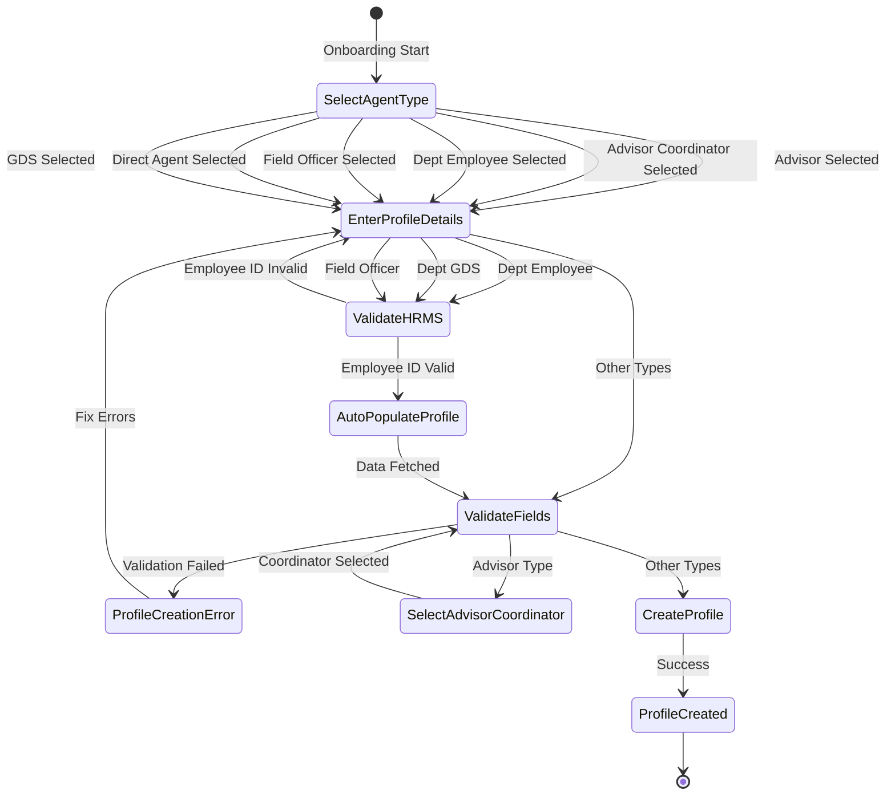

**Workflow Triggers:**
- New agent recruitment
- HRMS employee onboarding as agent
- Field officer activation

**Validations:**
- Profile type selection
- PAN uniqueness
- Mandatory fields (Name, DOB, Address, Mobile)
- Advisor Coordinator linkage for Advisors
- HRMS validation for Departmental Employees

**Actions:**
- Create agent profile record
- Generate unique Agent ID
- Link to hierarchy
- Send welcome notification
- Set initial status to "Active"

---

### 5.2 Agent Profile Update Workflow

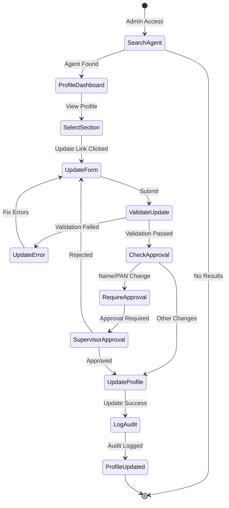

**Workflow Triggers:**
- Admin initiates profile update
- Name change request
- PAN update request
- Address change request
- Contact information update

**Validations:**
- Field format validation
- Uniqueness checks (PAN)
- Approval requirements (name, PAN)
- Date range validation

**Actions:**
- Update profile fields
- Log audit trail
- Send for approval (if required)
- Notify agent (for critical changes)
- Update timestamp

---

### 5.3 License Renewal Workflow

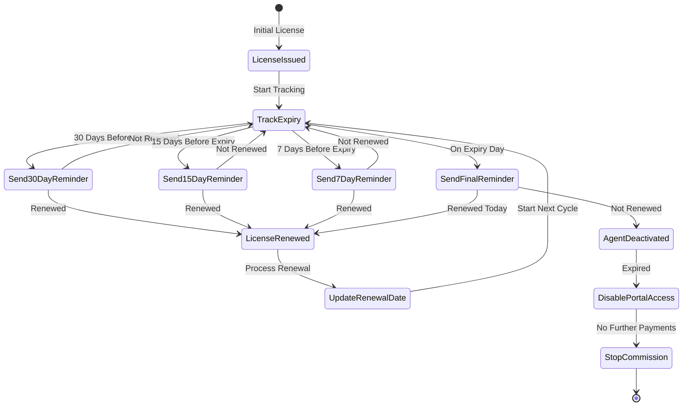

**Workflow Triggers:**
- License issuance
- Daily batch job for reminder checks
- Manual renewal update
- Expiry date reached

**Validations:**
- Renewal date format
- Renewal period rules (1 year / 5 years)
- Document verification (if required)

**Actions:**
- Send automated reminders (4 intervals)
- Update renewal date
- Log renewal in license history
- Deactivate agent if not renewed
- Disable portal access
- Stop commission processing

---

### 5.4 Agent Termination Workflow

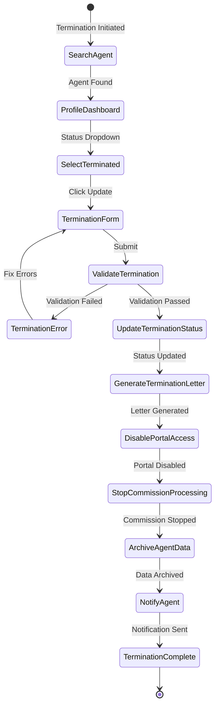

**Workflow Triggers:**
- Admin initiates termination
- Resignation received
- Death of agent
- Breach of conduct
- License not renewed after grace period

**Validations:**
- Termination reason mandatory (min 20 chars)
- Termination date cannot be in past
- Effective date >= today
- Approval by authorized person

**Actions:**
- Update status to "Terminated"
- Generate termination letter
- Disable portal access
- Stop all commission processing
- Archive agent data (7-year retention)
- Send notification to agent
- Update hierarchy (reassign Advisors if Coordinator)
- Log complete audit trail

---

### 5.5 Agent Authentication Workflow

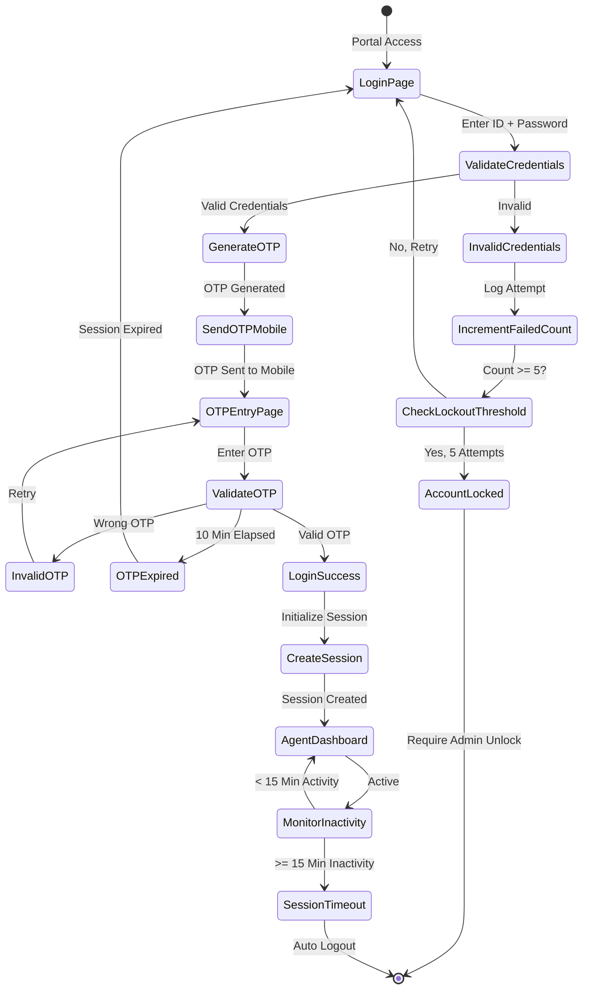

**Workflow Triggers:**
- Agent accesses portal
- Agent submits credentials
- Agent submits OTP
- Inactivity timeout

**Validations:**
- Agent ID format
- Password complexity
- OTP format (6 digits)
- OTP expiry (10 minutes)
- Failed attempt count

**Actions:**
- Validate credentials
- Generate OTP
- Send OTP to registered mobile
- Verify OTP
- Create user session
- Track failed attempts
- Lock account after 5 failures
- Auto logout on inactivity
- Log all authentication events

---

### 5.6 HRMS Integration Workflow (Departmental Employees)

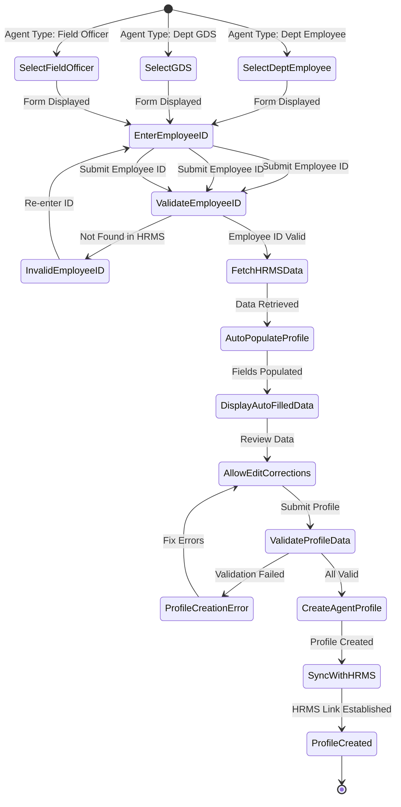

**Workflow Triggers:**
- Departmental employee onboarding
- Employee ID validation against HRMS
- Data synchronization

**Validations:**
- Employee ID existence in HRMS
- Employee active status in HRMS
- Mandatory HRMS fields populated

**Actions:**
- Call HRMS API to validate Employee ID
- Fetch employee data from HRMS
- Auto-populate profile fields
- Allow manual corrections if needed
- Create agent profile
- Establish HRMS link for future sync
- Log HRMS integration audit

---

### 5.7 License Deactivation Workflow

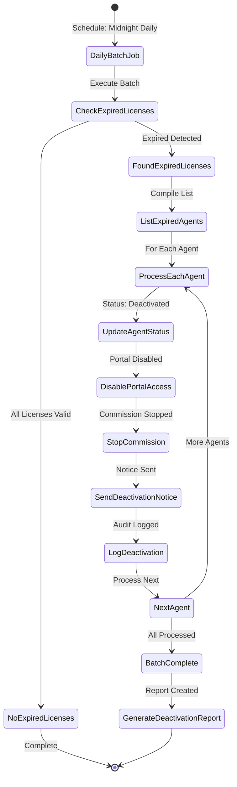

**Workflow Triggers:**
- Daily batch job execution
- License expiry date reached
- Manual trigger by admin

**Validations:**
- Current date > renewal date
- License status != "Renewed"
- Agent current status = "Active"

**Actions:**
- Identify agents with expired licenses
- Update agent status to "Deactivated"
- Disable portal access immediately
- Stop all commission processing
- Send deactivation notice via email and SMS
- Log deactivation in audit trail
- Generate daily deactivation report
- Notify supervisors of deactivated agents

---

### 5.8 Bank Details/POSB Details Update Workflow

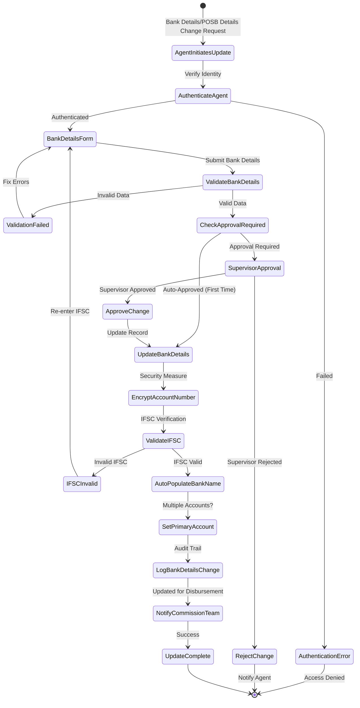

**Workflow Triggers:**
- Agent initiates bank details update from portal
- Admin updates bank details on behalf of agent
- New bank account addition during onboarding

**Validations:**
- Agent authentication required
- Bank account number format validation (encrypted storage)
- IFSC code format and existence validation
- Bank name auto-population from IFSC
- Account type selection (Savings/Current)
- Supervisor approval for changes (not for first-time entry)

**Actions:**
- Encrypt bank account number before storage
- Validate IFSC against bank database
- Auto-populate bank name from IFSC
- Set primary account if multiple accounts exist
- Log all changes in audit trail
- Notify commission team for disbursement updates
- Send confirmation to agent

---

### 5.9 Agent Goal Setting Workflow

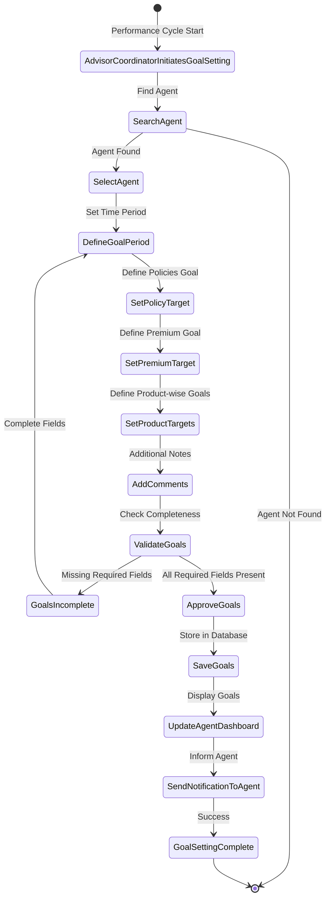

**Workflow Triggers:**
- Performance cycle begins (quarterly/annual)
- AdvisorCoordinator initiates goal setting exercise
- Agent promotion or role change requiring new goals

**Validations:**
- AdvisorCoordinator must have authorization to set goals
- Goal period must be valid (from date < to date)
- At least one target must be specified (policies or premium)
- Goals must be realistic based on agent's historical performance
- Product-wise targets must sum to total premium target

**Actions:**
- Search and select agent for goal assignment
- Define goal period with from and to dates
- Set target number of policies
- Set target premium collection amount (₹)
- Set product-wise targets (PLI, RPLI breakdown)
- Add comments or notes for context
- Validate goal completeness and realism
- Save goals to database
- Update agent portal dashboard with goals
- Send notification to agent about new goals
- Maintain goal history for tracking

---

### 5.10 Agent Self-Service Profile Update Workflow

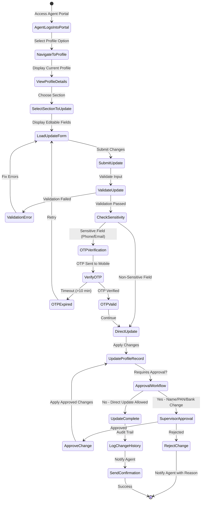

**Workflow Triggers:**
- Agent logs into portal and navigates to profile section
- Agent wants to update personal information, address, contact details
- Agent needs to update bank details/POSB Details for commission

**Validations:**
- Agent must be authenticated (logged in)
- Field format validations (PAN, email, phone, dates)
- OTP verification for sensitive fields (phone, email, bank)
- Approval workflow for critical fields (name, PAN, bank details)
- Business rule validations (unique PAN, address format)

**Actions:**
- Display current profile in read-only mode
- Allow section-wise editing for better UX
- Send OTP for sensitive field updates
- Route critical updates through approval workflow
- Apply non-critical updates directly
- Log all changes in audit history
- Send confirmation notification to agent
- Update profile across all relevant systems

---

### 5.11 Agent Status Reinstatement Workflow

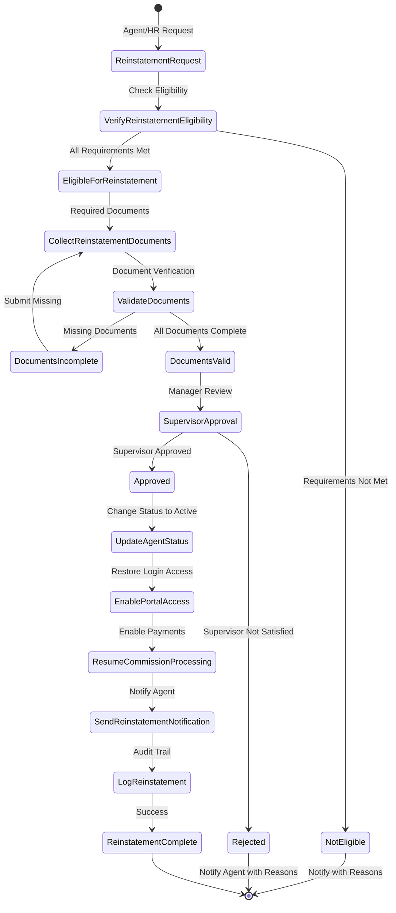

**Workflow Triggers:**
- Suspended agent completes requirements for reinstatement
- License renewed after expiry
- Termination decision reversed
- HRMS employee reactivated as agent

**Validations:**
- Reinstatement eligibility verified (reason for original status change)
- Required documents collected:
  - Renewed license (if deactivation due to expiry)
  - Clearance certificate (if disciplinary action)
  - New training completion certificate (if required)
- All documents validated for authenticity
- Supervisor approval obtained
- Effective date for reinstatement specified

**Actions:**
- Verify reinstatement eligibility conditions
- Collect and validate required documents
- Route to supervisor for approval
- Update agent status from Suspended/Terminated to Active
- Enable portal access immediately
- Resume commission processing from effective date
- Send reinstatement notification to agent via email and SMS
- Log complete reinstatement in audit trail
- Update performance records with reinstatement date

---

### 5.12 Agent Profile Export Workflow

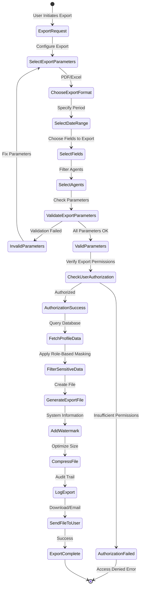

**Workflow Triggers:**
- Admin requests agent profile export for reporting
- Auditor requests profile data for compliance audit
- Supervisor requests team profiles for review
- Compliance officer requests bulk export for regulatory reporting

**Validations:**
- Export parameters validated (date range, fields, agents)
- User authorization checked (role-based permissions)
- Date range cannot exceed 1 year for security
- Sensitive fields identified for masking based on user role
- File size limit enforced (max 10MB for Excel, 50MB for PDF)

**Actions:**
- Configure export parameters:
  - Format selection (PDF/Excel)
  - Date range specification
  - Field selection (personal, contact, license, bank, etc.)
  - Agent filtering (by status, office, region, etc.)
- Validate user has export authorization
- Fetch profile data from database based on filters
- Apply role-based masking for sensitive fields:
  - Mask PAN: Show only first 5 and last 4 characters
  - Mask bank account: Show only last 4 digits
  - Mask mobile: Show only last 4 digits
  - Full details visible only to authorized roles
- Generate export file in selected format
- Add watermark with system information (timestamp, user, export ID)
- Compress file if size is large
- Log export event in audit trail with user details
- Send file to user (download link or email attachment)

---

## 6. Data Entities

### 6.1 Agent Profile Entity

**Table Name**: `agent_profiles`

| Attribute | Type | Required | Constraints | Description |
|-----------|------|----------|-------------|-------------|
| agent_id | UUID | Yes | PK | Unique agent identifier |
| profile_type | VARCHAR(50) | Yes | FK | Advisor, Coordinator, Dept Employee, Field Officer |
| office_code | VARCHAR(20) | Yes | FK | Linked office code |
| advisor_sub_type | VARCHAR(50) | No | - | Sub-category of advisor |
| effective_date | DATE | Yes | - | Profile effective date |
| title | VARCHAR(10) | No | - | Mr, Ms, Mrs, etc. |
| first_name | VARCHAR(50) | Yes | - | First name |
| middle_name | VARCHAR(50) | No | - | Middle name |
| last_name | VARCHAR(50) | Yes | - | Last name |
| gender | VARCHAR(10) | Yes | Enum: Male, Female, Other | Gender |
| date_of_birth | DATE | Yes | Age >= 18, <= 70 | Date of birth |
| category | VARCHAR(50) | No | - | Social category |
| marital_status | VARCHAR(20) | No | Enum: Single, Married, Widowed, Divorced | Marital status |
| aadhar_number | VARCHAR(12) | No | Unique, 12 digits | Aadhar number |
| pan_number | VARCHAR(10) | Yes | Unique, Format: AAAAA9999A | PAN number |
| designation_rank | VARCHAR(50) | No | - | Designation |
| service_number | VARCHAR(20) | No | - | Service number |
| professional_title | VARCHAR(50) | No | - | Professional title |
| employee_id | VARCHAR(20) | No | Unique, FK to HRMS | HRMS Employee ID |
| advisor_coordinator_id | UUID | Conditional | FK to agent_profiles | Required for Advisors |
| status | VARCHAR(20) | Yes | Enum: Active, Suspended, Terminated, Deactivated | Current status |
| status_date | DATE | Yes | - | Last status change date |
| status_reason | VARCHAR(200) | Conditional | Mandatory if status = Suspended/Terminated | Reason for status |
| created_by | VARCHAR(50) | Yes | - | User who created profile |
| created_at | TIMESTAMP | Yes | - | Creation timestamp |
| updated_by | VARCHAR(50) | No | - | User who last updated |
| updated_at | TIMESTAMP | No | - | Last update timestamp |

---

### 6.2 Agent Address Entity

**Table Name**: `agent_addresses`

| Attribute | Type | Required | Constraints | Description |
|-----------|------|----------|-------------|-------------|
| address_id | UUID | Yes | PK | Unique address identifier |
| agent_id | UUID | Yes | FK to agent_profiles | Linked agent |
| address_type | VARCHAR(20) | Yes | Enum: Official, Permanent, Communication | Address type |
| address_line1 | VARCHAR(200) | Yes | - | Primary address line |
| address_line2 | VARCHAR(200) | No | - | Secondary address line |
| village | VARCHAR(50) | No | - | Village |
| taluka | VARCHAR(50) | No | - | Taluka |
| city | VARCHAR(50) | Yes | - | City |
| district | VARCHAR(50) | No | - | District |
| state | VARCHAR(50) | Yes | - | State |
| country | VARCHAR(50) | Yes | Default: India | Country |
| pincode | VARCHAR(6) | Yes | 6 digits | PIN code |
| is_same_as_permanent | BOOLEAN | No | - | Flag for communication address |
| effective_from | DATE | Yes | - | Address effective date |
| created_at | TIMESTAMP | Yes | - | Creation timestamp |

---

### 6.3 Agent Contact Entity

**Table Name**: `agent_contacts`

| Attribute | Type | Required | Constraints | Description |
|-----------|------|----------|-------------|-------------|
| contact_id | UUID | Yes | PK | Unique contact identifier |
| agent_id | UUID | Yes | FK to agent_profiles | Linked agent |
| contact_type | VARCHAR(20) | Yes | Enum: mobile, official_landline, resident_landline | Contact type |
| contact_number | VARCHAR(15) | Yes | Format validated | Phone number |
| is_primary | BOOLEAN | No | - | Primary contact flag |
| effective_from | DATE | Yes | - | Contact effective date |
| created_at | TIMESTAMP | Yes | - | Creation timestamp |

---

### 6.4 Agent Email Entity

**Table Name**: `agent_emails`

| Attribute | Type | Required | Constraints | Description |
|-----------|------|----------|-------------|-------------|
| email_id | UUID | Yes | PK | Unique email identifier |
| agent_id | UUID | Yes | FK to agent_profiles | Linked agent |
| email_type | VARCHAR(20) | Yes | Enum: official, permanent, communication | Email type |
| email_address | VARCHAR(100) | Yes | Email format, Unique | Email address |
| is_primary | BOOLEAN | No | - | Primary email flag |
| effective_from | DATE | Yes | - | Email effective date |
| created_at | TIMESTAMP | Yes | - | Creation timestamp |

---

### 6.5 Agent Bank Details Entity

**Table Name**: `agent_bank_details`

| Attribute | Type | Required | Constraints | Description |
|-----------|------|----------|-------------|-------------|
| bank_id | UUID | Yes | PK | Unique bank detail identifier |
| agent_id | UUID | Yes | FK to agent_profiles, Unique | Linked agent |
| account_number | VARCHAR(30) | Yes | Encrypted | Bank account number |
| ifsc_code | VARCHAR(11) | Yes | Format: AAAA0123456 | IFSC code |
| bank_name | VARCHAR(100) | Yes | Auto-fetched from IFSC | Bank name |
| branch_name | VARCHAR(100) | No | - | Branch name |
| account_type | VARCHAR(20) | Yes | Enum: Savings, Current | Account type |
| effective_from | DATE | Yes | - | Details effective date |
| created_at | TIMESTAMP | Yes | - | Creation timestamp |

---

### 6.6 Agent License Entity

**Table Name**: `agent_licenses`

| Attribute | Type | Required | Constraints | Description |
|-----------|------|----------|-------------|-------------|
| license_id | UUID | Yes | PK | Unique license identifier |
| agent_id | UUID | Yes | FK to agent_profiles | Linked agent |
| license_line | VARCHAR(20) | Yes | Enum: Life | License line |
| license_type | VARCHAR(50) | Yes | - | License type |
| license_number | VARCHAR(30) | Yes | Unique | License number |
| resident_status | VARCHAR(20) | Yes | Enum: Resident, Non-Resident | Resident status |
| license_date | DATE | Yes | - | License issue date |
| renewal_date | DATE | Yes | - | License renewal date |
| authority_date | DATE | Yes | - | Authority date |
| renewal_count | INTEGER | Yes | Default: 0 | Number of renewals completed |
| license_status | VARCHAR(20) | Yes | Enum: Active, Expired, Renewed | Current status |
| is_primary | BOOLEAN | No | - | Primary license flag |
| created_at | TIMESTAMP | Yes | - | Creation timestamp |
| updated_at | TIMESTAMP | No | - | Last update timestamp |

---

### 6.7 Agent License Reminder Log Entity

**Table Name**: `agent_license_reminders`

| Attribute | Type | Required | Constraints | Description |
|-----------|------|----------|-------------|-------------|
| reminder_id | UUID | Yes | PK | Unique reminder identifier |
| license_id | UUID | Yes | FK to agent_licenses | Linked license |
| reminder_type | VARCHAR(20) | Yes | Enum: 30_days, 15_days, 7_days, expiry_day | Reminder type |
| reminder_date | DATE | Yes | - | Reminder scheduled date |
| sent_date | TIMESTAMP | No | - | Actual sent timestamp |
| sent_status | VARCHAR(20) | Yes | Enum: Pending, Sent, Failed | Sending status |
| email_sent | BOOLEAN | No | - | Email sent flag |
| sms_sent | BOOLEAN | No | - | SMS sent flag |
| failure_reason | VARCHAR(200) | No | - | Failure reason if any |
| created_at | TIMESTAMP | Yes | - | Creation timestamp |

---

### 6.8 Agent Audit Log Entity

**Table Name**: `agent_audit_logs`

| Attribute | Type | Required | Constraints | Description |
|-----------|------|----------|-------------|-------------|
| audit_id | UUID | Yes | PK | Unique audit identifier |
| agent_id | UUID | Yes | FK to agent_profiles | Linked agent |
| action_type | VARCHAR(50) | Yes | Enum: Create, Update, Delete, Status_Change, License_Add, etc. | Action performed |
| field_name | VARCHAR(50) | No | - | Field that changed |
| old_value | TEXT | No | - | Previous value |
| new_value | TEXT | No | - | New value |
| action_reason | VARCHAR(500) | No | - | Reason for change |
| performed_by | VARCHAR(50) | Yes | - | User who performed action |
| performed_at | TIMESTAMP | Yes | - | Action timestamp |
| ip_address | VARCHAR(45) | No | - | IP address of user |
| created_at | TIMESTAMP | Yes | - | Creation timestamp |

---

## 7. Error Codes

| Error Code | Error Message | Category | Severity | Trigger |
|------------|---------------|----------|----------|---------|
| ERR-AGT-PRF-001 | Profile Type not selected | Profile Creation | ERROR | Continue button clicked without selecting profile type |
| ERR-AGT-PRF-002 | PAN number already exists | Profile Creation | ERROR | Duplicate PAN entered |
| ERR-AGT-PRF-003 | Invalid PAN format (AAAAA9999A expected) | Profile Creation | ERROR | PAN format validation failed |
| ERR-AGT-PRF-004 | First name is mandatory | Profile Creation | ERROR | First name empty on submit |
| ERR-AGT-PRF-005 | Last name is mandatory | Profile Creation | ERROR | Last name empty on submit |
| ERR-AGT-PRF-006 | Invalid Date of Birth | Profile Creation | ERROR | DOB invalid or age not in range 18-70 |
| ERR-AGT-PRF-007 | Employee ID not found in HRMS | HRMS Integration | ERROR | Invalid employee ID for departmental employee |
| ERR-AGT-PRF-008 | Advisor Coordinator not found or inactive | Profile Creation | ERROR | Invalid coordinator selected |
| ERR-AGT-PRF-009 | License already expired | License Management | WARNING | License renewal date in past |
| ERR-AGT-PRF-010 | Termination reason required (min 20 chars) | Status Update | ERROR | Termination without proper reason |
| ERR-AGT-PRF-011 | Account locked due to 5 failed OTP attempts | Authentication | ERROR | 5 consecutive failed OTP attempts |
| ERR-AGT-PRF-012 | Session expired due to inactivity | Authentication | WARNING | 15 minutes of inactivity |

---

## 8. Integration Points

| System | Purpose | Data Exchange | Frequency | Direction |
|--------|---------|---------------|-----------|-----------|
| **HRMS System** | Departmental employee data auto-population | Employee profile data (name, DOB, designation, address) | Real-time (onboarding) | Bidirectional |
| **KYC/BCP Services** | Document verification and storage | KYC document status, verification results | Real-time | Request/Response |
| **Commission Processing** | Commission calculation and disbursement | Agent status, bank details, hierarchy | Monthly | Request → Response |
| **Policy Services** | Agent validation during policy issuance | Agent status, license validity, product authorization | Real-time | Request → Response |
| **Portal Services** | Agent dashboard and self-service | Profile data, goals, performance metrics | Real-time | Bidirectional |
| **Notification Service** | Reminders and alerts delivery | Agent contact data, message content | Scheduled (license reminders) | One-way |
| **Letter Generation** | Termination, welcome, license letters | Agent profile data, letter type | On-demand | One-way |
| **Payment Gateway** | Commission EFT disbursement | Bank details, commission amounts | Monthly | One-way |
| **Authentication Service** | OTP-based login validation | Agent credentials, mobile verification | Real-time | Bidirectional |

---

## 9. Traceability Matrix

### 9.1 Business Rules to Functional Requirements Traceability

| BR ID | BR Name | Related FRs |
|-------|---------|-------------|
| BR-AGT-PRF-001 | Advisor Coordinator Linkage | FR-AGT-PRF-001, FR-AGT-PRF-003, FR-AGT-PRF-005 |
| BR-AGT-PRF-002 | Coordinator Geographic Assignment | FR-AGT-PRF-001, FR-AGT-PRF-002 |
| BR-AGT-PRF-003 | Departmental Employee HRMS Integration | FR-AGT-PRF-002 |
| BR-AGT-PRF-004 | Field Officer Auto-Fetch or Manual Entry | FR-AGT-PRF-002 |
| BR-AGT-PRF-005 | Name Update with Audit Logging | FR-AGT-PRF-006 |
| BR-AGT-PRF-006 | PAN Update with Validation | FR-AGT-PRF-007 |
| BR-AGT-PRF-007 | Personal Information Update | FR-AGT-PRF-006 |
| BR-AGT-PRF-008 | Multiple Address Types | FR-AGT-PRF-008 |
| BR-AGT-PRF-009 | Communication Address Same as Permanent | FR-AGT-PRF-008 |
| BR-AGT-PRF-010 | Phone Number Categories | FR-AGT-PRF-009 |
| BR-AGT-PRF-011 | Email Address Categories | FR-AGT-PRF-009 |
| BR-AGT-PRF-012 | License Renewal Period Rules | FR-AGT-PRF-010, FR-AGT-PRF-011 |
| BR-AGT-PRF-013 | Auto-Deactivation on Expiry | FR-AGT-PRF-012 |
| BR-AGT-PRF-014 | License Renewal Reminder Schedule | FR-AGT-PRF-011 |
| BR-AGT-PRF-015 | Multiple License Support | FR-AGT-PRF-010 |
| BR-AGT-PRF-016 | Status Update with Mandatory Reason | FR-AGT-PRF-013 |
| BR-AGT-PRF-017 | Agent Termination Workflow | FR-AGT-PRF-014 |
| BR-AGT-PRF-018 | Bank Account Details | FR-AGT-PRF-019 |
| BR-AGT-PRF-019 | OTP-Based Authentication | FR-AGT-PRF-015 |
| BR-AGT-PRF-020 | Account Lockout | FR-AGT-PRF-016 |
| BR-AGT-PRF-021 | Session Timeout | FR-AGT-PRF-017 |
| BR-AGT-PRF-022 | Multi-Criteria Agent Search | FR-AGT-PRF-004 |
| BR-AGT-PRF-023 | Dashboard Profile View | FR-AGT-PRF-005 |
| BR-AGT-PRF-024 | Performance Goal Assignment | FR-AGT-PRF-023 |
| BR-AGT-PRF-025 | Distribution Channel Assignment | FR-AGT-PRF-024 |
| BR-AGT-PRF-026 | Product Class Authorization | FR-AGT-PRF-025 |
| BR-AGT-PRF-027 | External ID Tracking | FR-AGT-PRF-026 |
| BR-AGT-PRF-028 | Authority Assignment | FR-AGT-PRF-027 |
| BR-AGT-PRF-029 | License Line Classification | FR-AGT-PRF-010 |
| BR-AGT-PRF-030 | License Date Tracking | FR-AGT-PRF-010 |

### 9.2 Functional Requirements to Business Rules Traceability

| FR ID | FR Name | Related BRs |
|-------|---------|-------------|
| FR-AGT-PRF-001 | New Profile Creation | BR-AGT-PRF-001, BR-AGT-PRF-002, BR-AGT-PRF-003, BR-AGT-PRF-004 |
| FR-AGT-PRF-002 | Profile Details Entry | All profile field BRs (005-011, 025-028) |
| FR-AGT-PRF-003 | Advisor Coordinator Selection | BR-AGT-PRF-001 |
| FR-AGT-PRF-004 | Agent Search Interface | BR-AGT-PRF-022 |
| FR-AGT-PRF-005 | Profile Dashboard View | BR-AGT-PRF-023 |
| FR-AGT-PRF-006 | Personal Information Update | BR-AGT-PRF-005, BR-AGT-PRF-007 |
| FR-AGT-PRF-007 | PAN Number Update | BR-AGT-PRF-006 |
| FR-AGT-PRF-008 | Address Management | BR-AGT-PRF-008, BR-AGT-PRF-009 |
| FR-AGT-PRF-009 | Contact Information Update | BR-AGT-PRF-010, BR-AGT-PRF-011 |
| FR-AGT-PRF-010 | License Management Interface | BR-AGT-PRF-012, BR-AGT-PRF-014, BR-AGT-PRF-015, BR-AGT-PRF-029, BR-AGT-PRF-030 |
| FR-AGT-PRF-011 | License Renewal Automation | BR-AGT-PRF-012, BR-AGT-PRF-014 |
| FR-AGT-PRF-012 | License Auto-Deactivation | BR-AGT-PRF-013 |
| FR-AGT-PRF-013 | Status Update Interface | BR-AGT-PRF-016 |
| FR-AGT-PRF-014 | Agent Termination Workflow | BR-AGT-PRF-017 |
| FR-AGT-PRF-015 | OTP-Based Login | BR-AGT-PRF-019 |
| FR-AGT-PRF-016 | Account Lockout | BR-AGT-PRF-020 |
| FR-AGT-PRF-017 | Session Timeout | BR-AGT-PRF-021 |
| FR-AGT-PRF-018 | Agent Home Dashboard | BR-AGT-PRF-024 |
| FR-AGT-PRF-019 | Bank Details Management | BR-AGT-PRF-018 |
| FR-AGT-PRF-020 | Status Management | BR-AGT-PRF-016, BR-AGT-PRF-017 |
| FR-AGT-PRF-021 | Profile Search | BR-AGT-PRF-022 |
| FR-AGT-PRF-022 | Profile Display | BR-AGT-PRF-023 |
| FR-AGT-PRF-023 | Goal Setting | BR-AGT-PRF-024 |
| FR-AGT-PRF-024 | Channel Management | BR-AGT-PRF-025 |
| FR-AGT-PRF-025 | Product Authorization | BR-AGT-PRF-026 |
| FR-AGT-PRF-026 | External ID Management | BR-AGT-PRF-027 |
| FR-AGT-PRF-027 | Authority Management | BR-AGT-PRF-028 |

### 9.3 Validation Rules to Functional Requirements Traceability

| VR ID | Field | Related FR |
|-------|-------|-------------|
| VR-AGT-PRF-001 to VR-AGT-PRF-006 | Profile Creation Fields | FR-AGT-PRF-002 |
| VR-AGT-PRF-007 to VR-AGT-PRF-010 | Address Fields | FR-AGT-PRF-008 |
| VR-AGT-PRF-011 to VR-AGT-PRF-012 | Contact Fields | FR-AGT-PRF-009 |
| VR-AGT-PRF-013 to VR-AGT-PRF-015 | License Fields | FR-AGT-PRF-010 |
| VR-AGT-PRF-016 to VR-AGT-PRF-017 | Bank Fields | FR-AGT-PRF-019 |
| VR-AGT-PRF-018 to VR-AGT-PRF-019 | Search Fields | FR-AGT-PRF-004 |
| VR-AGT-PRF-020 to VR-AGT-PRF-021 | Status Fields | FR-AGT-PRF-013, FR-AGT-PRF-014 |
| VR-AGT-PRF-022 | Date Format | All FRs with dates |

---

## Appendix A: Agent Status Definitions

| Status | Definition | Can Sell Policies | Can Access Portal | Commission Paid |
|--------|------------|-------------------|-------------------|-----------------|
| **Active** | Agent is fully active with valid license | Yes | Yes | Yes |
| **Suspended** | Temporarily suspended (e.g., under investigation) | No | Yes (read-only) | No |
| **Terminated** | Agent relationship ended | No | No | No (up to termination date) |
| **Deactivated** | License expired, not renewed | No | No | No |
| **Expired** | License expired, in grace period | No | Yes (read-only) | No |

---

## Appendix B: Agent Type Comparison

| Agent Type | Requires Coordinator | HRMS Integration | License Required | Can Sell Both PLI/RPLI |
|------------|---------------------|-----------------|------------------|------------------------|
| **Advisor** | Yes (Mandatory) | No | Yes | If authorized |
| **Advisor Coordinator** | No | No | Yes | If authorized |
| **Departmental Employee** | No | Yes (Mandatory) | Yes | If authorized |
| **Field Officer** | Optional | Optional | Yes | If authorized |

---

## Appendix C: License Renewal Rules Summary

| Renewal Instance | Period | Example |
|------------------|--------|---------|
| First Renewal | 1 year from issue | Issue: 15-01-2025 → Renewal: 15-01-2026 |
| Subsequent Renewals | 3 years from previous renewal | Previous: 15-01-2026 → Renewal: 15-01-2029 |

**Reminder Schedule** (for all renewals):
- 1st Reminder: 30 days before expiry
- 2nd Reminder: 15 days before expiry
- 3rd Reminder: 7 days before expiry
- Final Reminder: On expiry day

---

## Document Control

| Version | Date | Author | Changes |
|---------|------|--------|---------|
| 1.0 | 2026-01-23 | Insurance Analyst | Initial detailed requirements document for Agent Profile Management |

---

**End of Document**
