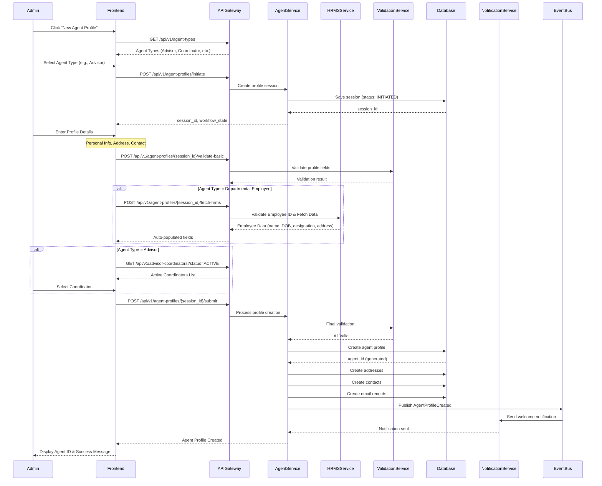
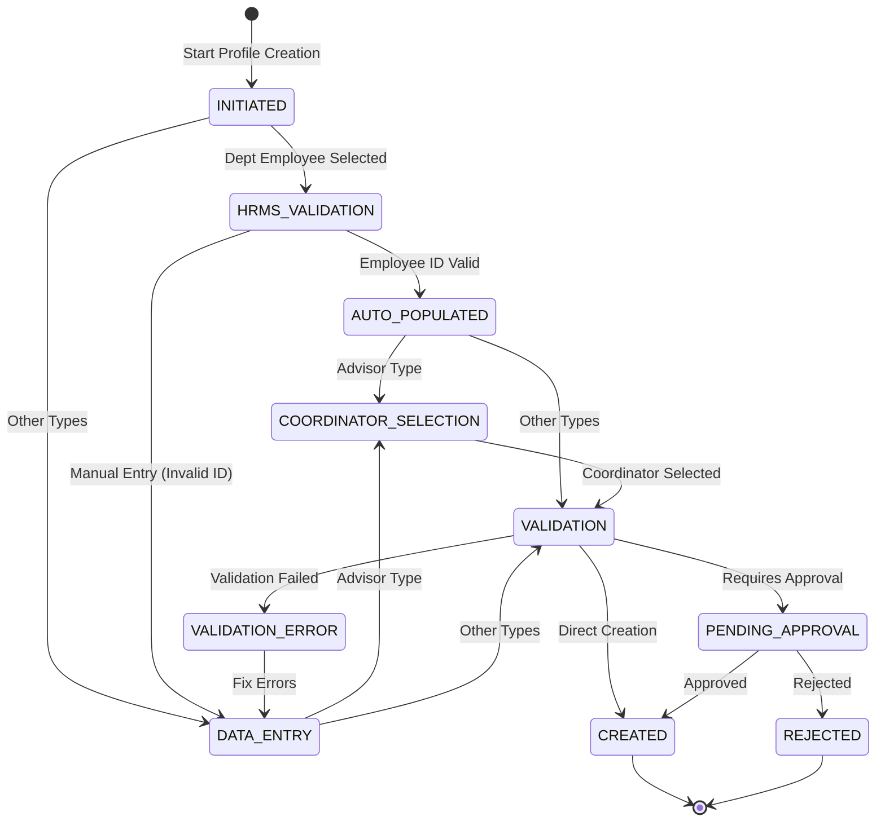
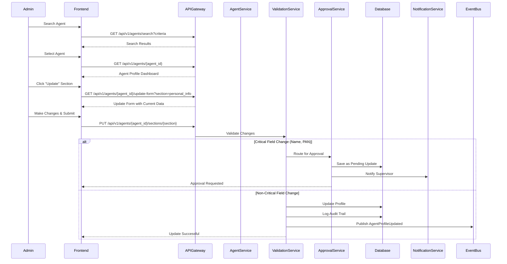
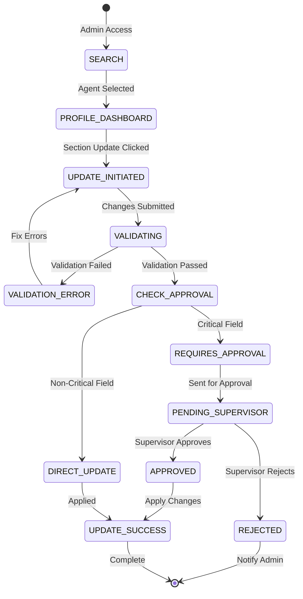
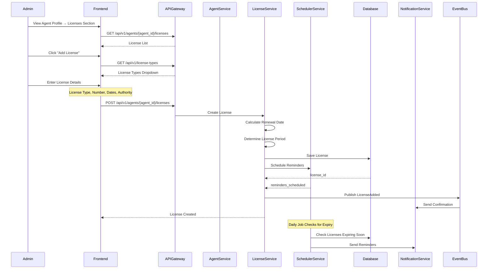
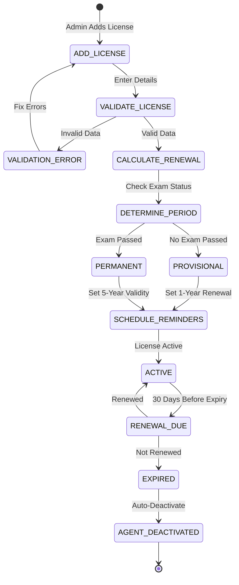

# Agent Profile Management - User Journey Documentation

## Document Control

| Attribute | Details |
|-----------|---------|
| **Module** | Agent Profile Management |
| **Version** | 1.0 |
| **Created** | 2026-01-23 |
| **Journey Count** | 10 |

---

## Table of Contents

1. [Journey Catalog](#journey-catalog)
2. [Detailed Journey Breakdowns](#detailed-journey-breakdowns)
3. [Hidden/Supporting APIs](#hiddensupporting-apis)
4. [API Mapping Catalog](#api-mapping-catalog)

---

## Journey Catalog

| Journey ID | Name | Actors | SLA | Priority | Status |
|------------|------|--------|-----|----------|--------|
| **UJ-AGT-PRF-001** | Agent Profile Creation (New Onboarding) | Admin, HR System | Immediate | CRITICAL | Active |
| **UJ-AGT-PRF-002** | Agent Profile Update | Admin, Agent | 1-2 days | HIGH | Active |
| **UJ-AGT-PRF-003** | License Management & Renewal | Admin, Agent | 30 days before expiry | CRITICAL | Active |
| **UJ-AGT-PRF-004** | Agent Termination | Admin | Immediate | CRITICAL | Active |
| **UJ-AGT-PRF-005** | Agent Portal Authentication | Agent | 10 min OTP | HIGH | Active |
| **UJ-AGT-PRF-006** | Agent Self-Service Profile Update | Agent | 1-3 days | HIGH | Active |
| **UJ-AGT-PRF-007** | Bank Details Management | Admin, Agent | 2-3 days | CRITICAL | Active |
| **UJ-AGT-PRF-008** | Agent Goal Setting | Advisor Coordinator | Quarterly | MEDIUM | Active |
| **UJ-AGT-PRF-009** | Agent Status Reinstatement | Admin, HR | 5-7 days | HIGH | Active |
| **UJ-AGT-PRF-010** | Agent Profile Search & Export | Admin, Auditor | Immediate | MEDIUM | Active |

---

## Detailed Journey Breakdowns

### UJ-AGT-PRF-001: Agent Profile Creation (New Onboarding)

#### Journey Overview

- **User Goal**: Create a new agent profile in the system with complete validation and hierarchy linkage
- **Entry Point**: Admin clicks "New Agent Profile" from Agent Management module
- **Success Criteria**: Agent profile created with unique Agent ID, linked to hierarchy, all validations passed
- **Exit Points**:
  - **Success**: Profile created, welcome notification sent
  - **Cancel**: Admin cancels at any step (data not saved)
  - **Error**: Validation errors displayed for correction
- **Duration**: 10-15 minutes (excluding HRMS fetch time)
- **Actors**:
  - **Primary**: Admin
  - **Secondary**: HRMS System (for departmental employees)
  - **Tertiary**: Advisor Coordinator (must be active for Advisors)

---

#### Sequence Diagram



---

#### State Machine



---

#### Step-by-Step Breakdown

##### Step 1: Initiate Profile Creation

**Frontend Action**: Admin clicks "New Agent Profile" button

**User Role**: Admin

**Screen**: Agent Management → New Profile

**API Call**: `POST /api/v1/agent-profiles/initiate`

**Request Schema**:
```json
{
  "agent_type": "ADVISOR",
  "initiated_by": "admin_user_123",
  "initiation_timestamp": "2026-01-23T10:00:00Z"
}
```

**Response Schema**:
```json
{
  "session_id": "ags_session_abc123",
  "workflow_state": {
    "current_step": "INITIATED",
    "next_step": "DATA_ENTRY",
    "allowed_actions": [
      "enter_profile_details",
      "cancel"
    ],
    "progress_percentage": 10
  },
  "agent_type": "ADVISOR",
  "session_expires_at": "2026-01-23T12:00:00Z",
  "required_fields": {
    "mandatory_sections": [
      "personal_info",
      "address",
      "contact_info",
      "coordinator_linkage"
    ],
    "conditional_sections": [
      {
        "condition": "agent_type == 'DEPARTMENTAL_EMPLOYEE'",
        "sections": ["hrms_integration"]
      }
    ]
  },
  "messages": [
    {
      "type": "INFO",
      "code": "MSG_001",
      "text": "Profile creation initiated. Please complete all mandatory fields."
    }
  ]
}
```

**Error Responses**:
```json
{
  "error": {
    "code": "ERR-AGT-PRF-001",
    "message": "Invalid Agent Type selected",
    "details": "Agent Type must be one of: ADVISOR, ADVISOR_COORDINATOR, DEPARTMENTAL_EMPLOYEE, FIELD_OFFICER, DIRECT_AGENT, GDS",
    "suggested_actions": [
      "Select a valid Agent Type from dropdown"
    ]
  }
}
```

**Components Applied**:
- **FR**: FR-AGT-PRF-001
- **BR**: BR-AGT-PRF-031 (Workflow Orchestration)
- **VR**: VR-AGT-PRF-025 (Profile Type Valid)

**Business Logic**:
1. Validate agent_type from allowed list
2. Create profile session with status INITIATED
3. Generate unique session_id
4. Set session expiry to 2 hours
5. Return next steps based on agent_type
6. For Advisors: add coordinator linkage requirement
7. For Departmental Employees: add HRMS integration step

**State Transition**: `NONE` → `INITIATED`

---

##### Step 2: HRMS Employee Data Fetch (Departmental Employees Only)

**Frontend Action**: Admin enters Employee ID and clicks "Fetch from HRMS"

**User Role**: Admin

**Screen**: Profile Creation → HRMS Integration Section

**API Call**: `POST /api/v1/agent-profiles/{session_id}/fetch-hrms`

**Request Schema**:
```json
{
  "employee_id": "EMP-45678",
  "fetch_mode": "AUTO_HRMS"
}
```

**Response Schema (Success)**:
```json
{
  "session_id": "ags_session_abc123",
  "hrms_data": {
    "employee_id": "EMP-45678",
    "employee_name": "Rajesh Kumar Sharma",
    "date_of_birth": "15-08-1985",
    "gender": "Male",
    "designation": "Postal Assistant",
    "official_address": {
      "address_line1": "123 GPO Building",
      "city": "Mumbai",
      "state": "Maharashtra",
      "pincode": "400001"
    },
    "employee_status": "ACTIVE",
    "hrms_validation_status": "VALID"
  },
  "auto_populated_fields": {
    "title": "Mr",
    "first_name": "Rajesh",
    "middle_name": "Kumar",
    "last_name": "Sharma",
    "date_of_birth": "15-08-1985",
    "gender": "Male",
    "category": "General",
    "official_address": {
      "address_line1": "123 GPO Building",
      "city": "Mumbai",
      "state": "Maharashtra",
      "pincode": "400001"
    }
  },
  "workflow_state": {
    "current_step": "AUTO_POPULATED",
    "next_step": "DATA_ENTRY",
    "allowed_actions": [
      "review_and_edit",
      "proceed_to_creation"
    ],
    "progress_percentage": 30
  },
  "messages": [
    {
      "type": "SUCCESS",
      "code": "HRMS_001",
      "text": "Employee data fetched successfully from HRMS. Please review and update if necessary."
    }
  ]
}
```

**Error Responses**:
```json
{
  "error": {
    "code": "ERR-AGT-PRF-007",
    "message": "Employee ID not found in HRMS",
    "details": "Employee ID 'EMP-45678' does not exist in HRMS system or is inactive",
    "suggested_actions": [
      "Verify Employee ID is correct",
      "Check employee status in HRMS",
      "Use manual entry mode if HRMS unavailable"
    ]
  }
}
```

**Components Applied**:
- **FR**: FR-AGT-PRF-002, FR-AGT-PRF-003
- **BR**: BR-AGT-PRF-003 (HRMS Integration), BR-AGT-PRF-032 (Employee ID Validation)
- **VR**: VR-AGT-PRF-023 (Employee Number Format)
- **INT**: INT-AGT-001 (HRMS System)
- **ERR**: ERR-AGT-PRF-007

**Business Logic**:
1. Validate employee_id format (5-20 characters)
2. Call HRMS API to validate Employee ID existence
3. Check employee status is ACTIVE in HRMS
4. Fetch employee profile data from HRMS
5. Map HRMS fields to agent profile fields
6. Auto-populate form fields with fetched data
7. Allow admin to edit/correct fetched data
8. Store HRMS link for future synchronization
9. Log HRMS integration in audit trail
10. If HRMS unavailable/fails, allow manual entry mode

**State Transition**: `INITIATED` → `AUTO_POPULATED`

---

##### Step 3: Coordinator Selection (Advisors Only)

**Frontend Action**: Admin searches and selects Advisor Coordinator

**User Role**: Admin

**Screen**: Profile Creation → Coordinator Selection

**API Call**: `GET /api/v1/advisor-coordinators?status=ACTIVE&circle_id={circle_id}`

**Request Schema**: N/A (GET request)

**Query Parameters**:
- `status`: Filter by status (ACTIVE, INACTIVE, etc.)
- `circle_id`: Filter by circle (optional)
- `division_id`: Filter by division (optional)
- `search`: Search by name or ID (optional)
- `page`: Page number (default: 1)
- `limit`: Results per page (default: 20)

**Response Schema**:
```json
{
  "coordinators": [
    {
      "coordinator_id": "coord_456789",
      "agent_id": "AGT-2025-001234",
      "name": "Suresh Patel",
      "circle": "Mumbai",
      "division": "South Mumbai",
      "status": "ACTIVE",
      "active_advisors_count": 15,
      "license_expiry": "2026-12-31"
    }
  ],
  "pagination": {
    "total_count": 45,
    "page": 1,
    "limit": 20,
    "total_pages": 3
  },
  "workflow_state": {
    "allowed_actions": [
      "select_coordinator",
      "search_again"
    ]
  }
}
```

**API Call**: `POST /api/v1/agent-profiles/{session_id}/link-coordinator`

**Request Schema**:
```json
{
  "coordinator_id": "coord_456789",
  "linkage_effective_date": "23-01-2026"
}
```

**Response Schema**:
```json
{
  "session_id": "ags_session_abc123",
  "coordinator_linkage": {
    "coordinator_id": "coord_456789",
    "coordinator_name": "Suresh Patel",
    "coordinator_status": "ACTIVE",
    "linkage_date": "23-01-2026",
    "linkage_status": "PENDING_CONFIRMATION"
  },
  "workflow_state": {
    "current_step": "COORDINATOR_SELECTED",
    "next_step": "DATA_ENTRY",
    "allowed_actions": [
      "enter_profile_details",
      "change_coordinator"
    ],
    "progress_percentage": 40
  },
  "messages": [
    {
      "type": "SUCCESS",
      "code": "COORD_001",
      "text": "Coordinator linked successfully. Please complete profile details."
    }
  ]
}
```

**Error Responses**:
```json
{
  "error": {
    "code": "ERR-AGT-PRF-008",
    "message": "Advisor Coordinator not found or inactive",
    "details": "Selected coordinator is either not found, suspended, or terminated",
    "suggested_actions": [
      "Select an Active coordinator",
      "Verify coordinator status",
      "Contact supervisor for coordinator assignment"
    ]
  }
}
```

**Components Applied**:
- **FR**: FR-AGT-PRF-001, FR-AGT-PRF-003
- **BR**: BR-AGT-PRF-001 (Coordinator Linkage), BR-AGT-PRF-002 (Geographic Assignment)
- **VR**: VR-AGT-PRF-001 (Profile Type Mandatory)
- **ERR**: ERR-AGT-PRF-008

**Business Logic**:
1. Validate coordinator_id exists in system
2. Check coordinator status is ACTIVE
3. Validate coordinator is assigned to same circle/division (if applicable)
4. Check advisor count under coordinator (for load balancing info)
5. Link advisor to coordinator in session data
6. Store linkage effective date (default: today)
7. Allow coordinator change before final submission
8. Linkage becomes permanent only after profile creation
9. Log coordinator assignment in audit trail

**State Transition**: `DATA_ENTRY` → `COORDINATOR_SELECTED` → `DATA_ENTRY`

---

##### Step 4: Enter Profile Details

**Frontend Action**: Admin enters all mandatory profile information

**User Role**: Admin

**Screen**: Profile Creation → Profile Details Form

**API Call**: `POST /api/v1/agent-profiles/{session_id}/validate-basic`

**Request Schema**:
```json
{
  "personal_info": {
    "title": "Mr",
    "first_name": "Rajesh",
    "middle_name": "Kumar",
    "last_name": "Sharma",
    "date_of_birth": "15-08-1985",
    "gender": "Male",
    "marital_status": "Married",
    "category": "General",
    "aadhar_number": "123456789012",
    "pan_number": "ABCDE1234F",
    "designation_rank": "Sales Agent",
    "person_type": "INDIVIDUAL"
  },
  "addresses": [
    {
      "address_type": "PERMANENT",
      "address_line1": "123, Lotus Apartments",
      "address_line2": "Sector 15",
      "village": "Andheri East",
      "taluka": "Andheri",
      "city": "Mumbai",
      "district": "Mumbai City",
      "state": "Maharashtra",
      "country": "India",
      "pincode": "400069",
      "is_same_as_permanent": false
    },
    {
      "address_type": "COMMUNICATION",
      "address_line1": "456, Business Center",
      "city": "Mumbai",
      "state": "Maharashtra",
      "pincode": "400051",
      "is_same_as_permanent": false
    }
  ],
  "contacts": [
    {
      "contact_type": "mobile",
      "contact_number": "9876543210",
      "is_primary": true
    },
    {
      "contact_type": "alternate_mobile",
      "contact_number": "9876543211",
      "is_primary": false
    }
  ],
  "emails": [
    {
      "email_type": "official",
      "email_address": "rajesh.sharma@agent.com",
      "is_primary": true
    }
  ],
  "office_association": {
    "office_type": "Head Office",
    "office_code": "HO-001",
    "circle_id": "CIRCLE-001",
    "division_id": "DIV-001"
  },
  "additional_details": {
    "advisor_sub_type": "Direct Agent",
    "advisor_undergoing_training": false,
    "effective_date": "23-01-2026"
  }
}
```

**Response Schema (Validation Success)**:
```json
{
  "session_id": "ags_session_abc123",
  "validation_status": "PASSED",
  "validation_results": {
    "pan_validation": {
      "is_valid": true,
      "is_unique": true,
      "message": "PAN format valid and unique"
    },
    "age_validation": {
      "is_valid": true,
      "calculated_age": 40,
      "message": "Age within acceptable range (18-70)"
    },
    "address_validation": {
      "permanent_address": "VALID",
      "communication_address": "VALID"
    },
    "contact_validation": {
      "mobile": "VALID",
      "email": "VALID"
    },
    "office_validation": {
      "office_exists": true,
      "office_active": true,
      "message": "Office code validated successfully"
    }
  },
  "workflow_state": {
    "current_step": "DATA_VALIDATED",
    "next_step": "SUBMIT_PROFILE",
    "allowed_actions": [
      "submit_profile",
      "edit_details"
    ],
    "progress_percentage": 80
  },
  "messages": [
    {
      "type": "SUCCESS",
      "code": "VAL_001",
      "text": "All profile details validated successfully. Ready to submit."
    }
  ]
}
```

**Error Responses**:
```json
{
  "error": {
    "code": "ERR-AGT-PRF-002",
    "message": "PAN number already exists",
    "details": "PAN 'ABCDE1234F' is already registered with another agent",
    "existing_agent": {
      "agent_id": "AGT-2024-001234",
      "name": "Amit Kumar"
    },
    "suggested_actions": [
      "Verify PAN entered is correct",
      "Check if agent already exists in system",
      "Contact existing agent for verification"
    ]
  }
}
```

```json
{
  "error": {
    "code": "ERR-AGT-PRF-003",
    "message": "Invalid PAN format",
    "details": "PAN must be 10 characters in format AAAAA9999A",
    "suggested_actions": [
      "Enter PAN in correct format (e.g., ABCDE1234F)",
      "Ensure first 5 characters are letters",
      "Ensure next 4 characters are numbers",
      "Ensure last character is a letter"
    ]
  }
}
```

**Components Applied**:
- **FR**: FR-AGT-PRF-002
- **BR**: BR-AGT-PRF-005 (Name Update), BR-AGT-PRF-006 (PAN Validation), BR-AGT-PRF-007 (Personal Info), BR-AGT-PRF-008 (Address Types), BR-AGT-PRF-009 (Comm Address), BR-AGT-PRF-010 (Phone Categories), BR-AGT-PRF-011 (Email), BR-AGT-PRF-033 (Person Type), BR-AGT-PRF-034 (Office Association), BR-AGT-PRF-035 (Training Flag), BR-AGT-PRF-036 (Effective Date), BR-AGT-PRF-037 (Sub-Type)
- **VR**: VR-AGT-PRF-002 to VR-AGT-PRF-012 (All Profile Validations), VR-AGT-PRF-023 to VR-AGT-PRF-030
- **ERR**: ERR-AGT-PRF-002 to ERR-AGT-PRF-006

**Business Logic**:
1. **Personal Information Validation**:
   - Validate name fields (first name mandatory, 2-50 chars)
   - Validate DOB format (DD-MM-YYYY) and calculate age (18-70)
   - Validate gender from enum
   - Validate marital status from enum
   - Validate Aadhar format (12 digits, optional)
   - **PAN Validation**:
     - Format validation: `^[A-Z]{5}[0-9]{4}[A-Z]{1}$`
     - Uniqueness check across all agent profiles
     - Return error if duplicate found
   - Validate person_type (Individual/Corporate)
   - Validate advisor_sub_type from dropdown

2. **Address Validation**:
   - Permanent address: address_line1, city, state, pincode MANDATORY
   - Communication address: Optional, if provided validate all fields
   - Pincode: 6 digits numeric
   - Country: Default to India if not provided
   - Handle "Same as Permanent" option

3. **Contact Validation**:
   - Mobile: MANDATORY, 10 digits, starts with 6-9
   - Email: MANDATORY, valid email format, unique check
   - Alternate mobile: Optional, same format

4. **Office Association**:
   - Validate office_type from dropdown
   - Validate office_code exists in system and is active
   - Link circle_id and division_id

5. **Effective Date Management**:
   - Validate effective_date >= today
   - Track profile history from effective_date

6. **Validation Results**:
   - Return detailed validation results for each section
   - Provide clear error messages for each validation failure
   - Suggest corrective actions for each error

**State Transition**: `COORDINATOR_SELECTED` / `AUTO_POPULATED` / `DATA_ENTRY` → `DATA_VALIDATED`

---

##### Step 5: Submit Profile for Creation

**Frontend Action**: Admin reviews all details and clicks "Submit Profile"

**User Role**: Admin

**Screen**: Profile Creation → Review & Submit

**API Call**: `POST /api/v1/agent-profiles/{session_id}/submit`

**Request Schema**:
```json
{
  "submit_action": "CREATE",
  "confirmation": true,
  "submitted_by": "admin_user_123"
}
```

**Response Schema (Success)**:
```json
{
  "agent_profile": {
    "agent_id": "AGT-2026-000567",
    "profile_id": "prof_xyz789",
    "agent_type": "ADVISOR",
    "full_name": "Rajesh Kumar Sharma",
    "pan_number": "ABCDE1234F",
    "status": "ACTIVE",
    "status_date": "23-01-2026",
    "advisor_coordinator": {
      "coordinator_id": "coord_456789",
      "coordinator_name": "Suresh Patel"
    },
    "office": {
      "office_code": "HO-001",
      "office_type": "Head Office"
    },
    "effective_date": "23-01-2026",
    "created_at": "2026-01-23T10:30:00Z",
    "created_by": "admin_user_123"
  },
  "workflow_state": {
    "current_step": "PROFILE_CREATED",
    "status": "COMPLETED",
    "allowed_actions": [
      "view_profile",
      "add_license",
      "set_goals",
      "print_profile"
    ],
    "progress_percentage": 100
  },
  "sla_tracking": {
    "profile_creation_duration": "30 minutes",
    "sla_status": "GREEN",
    "next_steps": [
      {
        "step": "Add License Details",
        "priority": "HIGH",
        "due_in": "7 days",
        "api": "POST /api/v1/agents/{agent_id}/licenses"
      },
      {
        "step": "Set Performance Goals",
        "priority": "MEDIUM",
        "due_in": "30 days",
        "api": "POST /api/v1/agents/{agent_id}/goals"
      }
    ]
  },
  "notifications_sent": [
    {
      "type": "EMAIL",
      "recipient": "rajesh.sharma@agent.com",
      "template": "WELCOME_EMAIL",
      "status": "SENT"
    },
    {
      "type": "SMS",
      "recipient": "+91-9876543210",
      "template": "WELCOME_SMS",
      "status": "SENT"
    },
    {
      "type": "INTERNAL",
      "recipient": "coord_456789",
      "template": "NEW_ADVISOR_ASSIGNED",
      "status": "SENT"
    }
  ],
  "messages": [
    {
      "type": "SUCCESS",
      "code": "CREATE_001",
      "text": "Agent profile created successfully. Agent ID: AGT-2026-000567"
    },
    {
      "type": "INFO",
      "code": "NEXT_STEPS",
      "text": "Please add license details within 7 days and set performance goals."
    }
  ]
}
```

**Error Responses**:
```json
{
  "error": {
    "code": "ERR-AGT-PRF-999",
    "message": "Profile creation failed",
    "details": "Database error while creating agent profile",
    "suggested_actions": [
      "Retry profile creation",
      "Contact technical support if error persists",
      "Verify session data is valid"
    ],
    "session_id": "ags_session_abc123",
    "session_status": "DATA_VALIDATED"
  }
}
```

**Components Applied**:
- **FR**: FR-AGT-PRF-001, FR-AGT-PRF-002
- **BR**: BR-AGT-PRF-031 (Complete Workflow Orchestration)
- **E**: E-AGT-PRF-001 to E-AGT-PRF-008 (All Data Entities)
- **INT**: INT-AGT-005 (Notification Service)

**Business Logic**:
1. **Final Validation**:
   - Re-validate all critical fields before submission
   - Verify all mandatory fields are populated
   - Check coordinator linkage (for Advisors)
   - Verify office association

2. **Profile Creation**:
   - Generate unique Agent ID (format: AGT-YYYY-NNNNNN)
   - Create agent profile record in `agent_profiles` table
   - Set status to ACTIVE
   - Set status_date to current date
   - Store effective_date for profile
   - Store created_by and created_at timestamp

3. **Address Creation**:
   - Insert records into `agent_addresses` table
   - Create separate records for Permanent and Communication addresses
   - Store effective_from date for each address

4. **Contact Creation**:
   - Insert records into `agent_contacts` table
   - Mark primary contact flag appropriately

5. **Email Creation**:
   - Insert records into `agent_emails` table
   - Mark primary email flag appropriately

6. **Hierarchy Linkage**:
   - Link agent to advisor_coordinator (for Advisors)
   - Link agent to office hierarchy
   - Update organizational structure

7. **Audit Logging**:
   - Log profile creation in `agent_audit_logs`
   - Record all field values
   - Store performed_by information

8. **Event Publishing**:
   - Publish `AgentProfileCreated` event to EventBus
   - Include agent_id, agent_type, coordinator_id, office_id

9. **Notifications**:
   - Send welcome email to agent
   - Send welcome SMS to agent mobile
   - Send notification to advisor coordinator (if applicable)
   - Send notification to office supervisor

10. **Response Enhancement**:
    - Include SLA tracking for next steps
    - Provide next action recommendations
    - Include notification confirmation

**State Transition**: `DATA_VALIDATED` → `PROFILE_CREATED` (COMPLETED)

---

#### Hidden/Supporting APIs for This Journey

##### Lookup APIs

**LU-001: Get Agent Types List**
```http
GET /api/v1/agent-types

Response 200:
{
  "agent_types": [
    {
      "code": "ADVISOR",
      "name": "Advisor",
      "description": "Front-line insurance sales agent",
      "requires_coordinator": true,
      "requires_license": true
    },
    {
      "code": "ADVISOR_COORDINATOR",
      "name": "Advisor Coordinator",
      "description": "Manager overseeing Advisors",
      "requires_coordinator": false,
      "requires_license": true
    }
    // ... more types
  ]
}
```

**LU-002: Get Category Dropdown**
```http
GET /api/v1/categories

Response 200:
{
  "categories": [
    {"code": "GEN", "name": "General"},
    {"code": "OBC", "name": "OBC"},
    {"code": "SC", "name": "Scheduled Caste"},
    {"code": "ST", "name": "Scheduled Tribe"}
  ]
}
```

**LU-003: Get Designation/Rank Dropdown**
```http
GET /api/v1/designations

Response 200:
{
  "designations": [
    {"code": "SA", "name": "Sales Agent"},
    {"code": "SA", "name": "Senior Sales Agent"},
    {"code": "FM", "name": "Field Manager"}
  ]
}
```

**LU-004: Get Office Types**
```http
GET /api/v1/office-types

Response 200:
{
  "office_types": [
    {"code": "HO", "name": "Head Office"},
    {"code": "CO", "name": "Circle Office"},
    {"code": "DO", "name": "Divisional Office"},
    {"code": "SO", "name": "Sub-Office"}
  ]
}
```

**LU-005: Get States List**
```http
GET /api/v1/states

Response 200:
{
  "states": [
    {"code": "MH", "name": "Maharashtra"},
    {"code": "DL", "name": "Delhi"},
    {"code": "KA", "name": "Karnataka"}
  ]
}
```

##### Validation APIs

**VAL-001: Validate PAN Uniqueness**
```http
POST /api/v1/validations/pan/check-uniqueness

Request:
{
  "pan_number": "ABCDE1234F",
  "exclude_agent_id": null
}

Response 200:
{
  "is_unique": true,
  "message": "PAN is available for registration"
}

Response 400:
{
  "is_unique": false,
  "existing_agent": {
    "agent_id": "AGT-2024-001234",
    "name": "Amit Kumar"
  },
  "message": "PAN already registered with another agent"
}
```

**VAL-002: Validate Employee ID in HRMS**
```http
POST /api/v1/validations/hrms/employee-id

Request:
{
  "employee_id": "EMP-45678"
}

Response 200:
{
  "is_valid": true,
  "employee_status": "ACTIVE",
  "employee_data": {
    "name": "Rajesh Kumar Sharma",
    "designation": "Postal Assistant"
  }
}

Response 404:
{
  "is_valid": false,
  "message": "Employee ID not found in HRMS"
}
```

**VAL-003: Validate IFSC Code**
```http
POST /api/v1/validations/bank/ifsc

Request:
{
  "ifsc_code": "SBIN0001234"
}

Response 200:
{
  "is_valid": true,
  "bank_name": "State Bank of India",
  "branch_name": "Mumbai Main Branch"
}

Response 400:
{
  "is_valid": false,
  "message": "Invalid IFSC code"
}
```

**VAL-004: Validate Office Code**
```http
GET /api/v1/validations/office/{office_code}

Response 200:
{
  "is_valid": true,
  "office_details": {
    "office_code": "HO-001",
    "office_name": "Mumbai Head Office",
    "office_type": "Head Office",
    "status": "ACTIVE"
  }
}

Response 404:
{
  "is_valid": false,
  "message": "Office code not found"
}
```

##### Workflow Management APIs

**WF-001: Get Profile Session Status**
```http
GET /api/v1/agent-profiles/sessions/{session_id}/status

Response 200:
{
  "session_id": "ags_session_abc123",
  "status": "DATA_VALIDATED",
  "workflow_state": {
    "current_step": "DATA_VALIDATED",
    "next_step": "SUBMIT_PROFILE",
    "allowed_actions": ["submit", "edit"],
    "progress_percentage": 80
  },
  "data_completion": {
    "personal_info": "COMPLETE",
    "addresses": "COMPLETE",
    "contacts": "COMPLETE",
    "coordinator_linkage": "COMPLETE"
  },
  "session_expires_at": "2026-01-23T12:00:00Z",
  "time_remaining_minutes": 90
}
```

**WF-002: Save Profile Session (Checkpoint)**
```http
POST /api/v1/agent-profiles/sessions/{session_id}/save

Request:
{
  "current_screen": "profile_details",
  "form_data": {
    "personal_info": {...},
    "addresses": [...]
  }
}

Response 200:
{
  "saved": true,
  "session_expires_at": "2026-01-23T12:00:00Z"
}
```

**WF-003: Resume Profile Session**
```http
GET /api/v1/agent-profiles/sessions/{session_id}/resume

Response 200:
{
  "session_id": "ags_session_abc123",
  "resume_from_screen": "profile_details",
  "form_data": {...},
  "workflow_state": {...}
}
```

**WF-004: Cancel Profile Session**
```http
DELETE /api/v1/agent-profiles/sessions/{session_id}

Response 200:
{
  "cancelled": true,
  "message": "Profile creation session cancelled"
}
```

##### Status Tracking APIs

**ST-001: Get Agent Creation Status**
```http
GET /api/v1/agent-profiles/creation-status/{agent_id}

Response 200:
{
  "agent_id": "AGT-2026-000567",
  "creation_status": "COMPLETED",
  "creation_timestamp": "2026-01-23T10:30:00Z",
  "pending_tasks": [
    {
      "task": "Add License",
      "priority": "HIGH",
      "due_date": "2026-01-30",
      "overdue": false
    },
    {
      "task": "Set Goals",
      "priority": "MEDIUM",
      "due_date": "2026-02-22",
      "overdue": false
    }
  ]
}
```

##### Notification APIs

**NT-001: Resend Welcome Notification**
```http
POST /api/v1/agents/{agent_id}/notifications/resend-welcome

Request:
{
  "channels": ["EMAIL", "SMS"]
}

Response 200:
{
  "notification_id": "notif_xyz789",
  "channels_sent": ["EMAIL", "SMS"],
  "sent_at": "2026-01-23T10:35:00Z"
}
```

---

#### Enhanced Response Schema Patterns for This Journey

**Standard Enhancement Fields (All APIs)**:
```json
{
  "workflow_state": {
    "current_step": "STEP_NAME",
    "next_step": "NEXT_STEP_NAME",
    "allowed_actions": ["action1", "action2"],
    "progress_percentage": 75,
    "can_resume_later": true
  },
  "sla_tracking": {
    "sla_status": "GREEN", // GREEN, YELLOW, RED
    "time_elapsed_minutes": 15,
    "estimated_remaining_minutes": 10,
    "next_actions_due": []
  },
  "notifications_sent": [
    {
      "type": "EMAIL",
      "recipient": "email@example.com",
      "template": "TEMPLATE_NAME",
      "status": "SENT"
    }
  ],
  "messages": [
    {
      "type": "INFO", // INFO, SUCCESS, WARNING, ERROR
      "code": "MSG_CODE",
      "text": "Message text"
    }
  ]
}
```

**HRMS-Specific Enhancements**:
```json
{
  "hrms_integration": {
    "employee_id": "EMP-45678",
    "integration_status": "SUCCESS",
    "data_confidence": 100,
    "fields_auto_populated": ["first_name", "last_name", "dob"],
    "requires_manual_verification": false,
    "sync_timestamp": "2026-01-23T10:15:00Z"
  }
}
```

**Validation-Specific Enhancements**:
```json
{
  "validation_breakdown": {
    "pan_validation": {
      "is_valid": true,
      "checks_performed": [
        "format_validation",
        "uniqueness_check",
        "database_lookup"
      ],
      "validation_duration_ms": 150
    },
    "age_validation": {
      "is_valid": true,
      "calculated_age": 40,
      "age_range": "18-70",
      "dob": "15-08-1985"
    }
  }
}
```

---

#### Complete API List for This Journey

| API ID | Endpoint | Method | Purpose | Category |
|--------|----------|--------|---------|----------|
| AGT-001 | /api/v1/agent-profiles/initiate | POST | Initiate profile creation | Core |
| AGT-002 | /api/v1/agent-profiles/{session_id}/fetch-hrms | POST | Fetch HRMS employee data | Core |
| AGT-003 | /api/v1/advisor-coordinators | GET | Get coordinators list | Lookup |
| AGT-004 | /api/v1/agent-profiles/{session_id}/link-coordinator | POST | Link coordinator | Core |
| AGT-005 | /api/v1/agent-profiles/{session_id}/validate-basic | POST | Validate profile details | Core |
| AGT-006 | /api/v1/agent-profiles/{session_id}/submit | POST | Submit profile for creation | Core |
| AGT-007 | /api/v1/agent-types | GET | Get agent types dropdown | Lookup |
| AGT-008 | /api/v1/categories | GET | Get categories dropdown | Lookup |
| AGT-009 | /api/v1/designations | GET | Get designations dropdown | Lookup |
| AGT-010 | /api/v1/office-types | GET | Get office types dropdown | Lookup |
| AGT-011 | /api/v1/states | GET | Get states dropdown | Lookup |
| AGT-012 | /api/v1/validations/pan/check-uniqueness | POST | Validate PAN uniqueness | Validation |
| AGT-013 | /api/v1/validations/hrms/employee-id | POST | Validate Employee ID | Validation |
| AGT-014 | /api/v1/validations/bank/ifsc | POST | Validate IFSC code | Validation |
| AGT-015 | /api/v1/validations/office/{office_code} | GET | Validate office code | Validation |
| AGT-016 | /api/v1/agent-profiles/sessions/{session_id}/status | GET | Get session status | Workflow |
| AGT-017 | /api/v1/agent-profiles/sessions/{session_id}/save | POST | Save session checkpoint | Workflow |
| AGT-018 | /api/v1/agent-profiles/sessions/{session_id}/resume | GET | Resume session | Workflow |
| AGT-019 | /api/v1/agent-profiles/sessions/{session_id} | DELETE | Cancel session | Workflow |
| AGT-020 | /api/v1/agent-profiles/creation-status/{agent_id} | GET | Get creation status | Status |
| AGT-021 | /api/v1/agents/{agent_id}/notifications/resend-welcome | POST | Resend welcome notification | Notification |

**Total APIs for Journey 1**: 21 APIs

---

### UJ-AGT-PRF-002: Agent Profile Update

#### Journey Overview

- **User Goal**: Update existing agent profile information with proper validation and approval workflow
- **Entry Point**: Admin searches and selects agent from Agent Management
- **Success Criteria**: Profile updated, audit logged, approvals processed
- **Exit Points**:
  - **Success**: Profile updated, notification sent
  - **Cancel**: Changes discarded
  - **Approval Required**: Routed to supervisor
- **Duration**: 1-2 days (if approval required)
- **Actors**:
  - **Primary**: Admin
  - **Secondary**: Supervisor (for approval)
  - **Tertiary**: Agent (notification recipient)

---

#### Sequence Diagram



---

#### State Machine



---

#### Step-by-Step Breakdown

##### Step 1: Search and Select Agent

**Frontend Action**: Admin searches for agent using criteria

**User Role**: Admin

**Screen**: Agent Management → Search Agent

**API Call**: `GET /api/v1/agents/search`

**Query Parameters**:
```
?agent_id={agent_id}
&name={name}
&pan={pan_number}
&mobile_number={mobile}
&status={status}
&office_code={office_code}
&page={page}
&limit={limit}
```

**Response Schema**:
```json
{
  "results": [
    {
      "agent_id": "AGT-2026-000567",
      "name": "Rajesh Kumar Sharma",
      "agent_type": "ADVISOR",
      "pan": "ABCDE1234F",
      "mobile": "9876543210",
      "email": "rajesh.sharma@agent.com",
      "status": "ACTIVE",
      "advisor_coordinator": "Suresh Patel",
      "office": "HO-001"
    }
  ],
  "pagination": {
    "total_count": 1,
    "page": 1,
    "limit": 20,
    "total_pages": 1
  }
}
```

**Components Applied**:
- **FR**: FR-AGT-PRF-004
- **BR**: BR-AGT-PRF-022 (Multi-Criteria Search)
- **VR**: VR-AGT-PRF-018, VR-AGT-PRF-019

---

##### Step 2: View Profile Dashboard

**API Call**: `GET /api/v1/agents/{agent_id}`

**Response Schema**:
```json
{
  "agent_profile": {
    "agent_id": "AGT-2026-000567",
    "profile_type": "ADVISOR",
    "full_name": "Rajesh Kumar Sharma",
    "pan_number": "ABCDE1234F",
    "status": "ACTIVE",
    "status_date": "23-01-2026",
    "personal_info": {
      "title": "Mr",
      "first_name": "Rajesh",
      "middle_name": "Kumar",
      "last_name": "Sharma",
      "date_of_birth": "15-08-1985",
      "age": 40,
      "gender": "Male",
      "marital_status": "Married",
      "category": "General",
      "aadhar_number": "123456789012"
    },
    "addresses": [...],
    "contacts": [...],
    "emails": [...],
    "office": {...},
    "advisor_coordinator": {...},
    "licenses": [...],
    "bank_details": [...]
  },
  "workflow_state": {
    "current_step": "PROFILE_VIEW",
    "allowed_actions": [
      "update_personal_info",
      "update_address",
      "update_contact",
      "update_license",
      "update_bank_details",
      "change_status",
      "view_audit_history"
    ]
  }
}
```

**Components Applied**:
- **FR**: FR-AGT-PRF-005
- **BR**: BR-AGT-PRF-023 (Dashboard View)

---

##### Step 3: Initiate Section Update

**API Call**: `GET /api/v1/agents/{agent_id}/update-form?section={section}`

**Valid Sections**: `personal_info`, `address`, `contact`, `license`, `bank_details`, `status`

**Response Schema**:
```json
{
  "section": "personal_info",
  "current_data": {
    "title": "Mr",
    "first_name": "Rajesh",
    "middle_name": "Kumar",
    "last_name": "Sharma",
    "date_of_birth": "15-08-1985",
    "gender": "Male",
    "marital_status": "Married",
    "pan_number": "ABCDE1234F",
    "aadhar_number": "123456789012"
  },
  "editable_fields": [
    {
      "field_name": "first_name",
      "is_editable": true,
      "requires_approval": false,
      "validation_rules": ["mandatory", "min_length:2", "max_length:50"]
    },
    {
      "field_name": "pan_number",
      "is_editable": true,
      "requires_approval": true,
      "approval_reason": "PAN is critical identifier"
    },
    {
      "field_name": "date_of_birth",
      "is_editable": true,
      "requires_approval": false,
      "validation_rules": ["age_range:18-70"]
    }
  ],
  "workflow_state": {
    "current_step": "UPDATE_INITIATED",
    "next_step": "SUBMIT_CHANGES",
    "allowed_actions": ["submit", "cancel"]
  }
}
```

**Components Applied**:
- **FR**: FR-AGT-PRF-006, FR-AGT-PRF-007, FR-AGT-PRF-008, FR-AGT-PRF-009
- **BR**: BR-AGT-PRF-005 (Name Update Audit), BR-AGT-PRF-006 (PAN Update), BR-AGT-PRF-007 (Personal Info)

---

##### Step 4: Submit Section Update

**API Call**: `PUT /api/v1/agents/{agent_id}/sections/{section}`

**Request Schema (Personal Info)**:
```json
{
  "changes": {
    "first_name": {
      "old_value": "Rajesh",
      "new_value": "Rajesh K."
    },
    "pan_number": {
      "old_value": "ABCDE1234F",
      "new_value": "XYZPQ5678R"
    },
    "aadhar_number": {
      "old_value": "123456789012",
      "new_value": "987654321098"
    }
  },
  "update_reason": "Name correction as per Aadhar",
  "updated_by": "admin_user_123",
  "require_approval_for_critical": true
}
```

**Response Schema (Direct Update - Non-Critical)**:
```json
{
  "agent_id": "AGT-2026-000567",
  "update_status": "COMPLETED",
  "changes_applied": {
    "first_name": "Rajesh K.",
    "aadhar_number": "987654321098"
  },
  "audit_log": {
    "audit_id": "audit_xyz789",
    "logged_at": "2026-01-23T11:00:00Z",
    "changes_logged": 2
  },
  "workflow_state": {
    "current_step": "UPDATE_SUCCESS",
    "status": "COMPLETED",
    "allowed_actions": ["view_profile", "update_another_section"]
  },
  "notifications_sent": [
    {
      "type": "EMAIL",
      "recipient": "rajesh.sharma@agent.com",
      "template": "PROFILE_UPDATE_NOTIFICATION",
      "status": "SENT"
    }
  ]
}
```

**Response Schema (Approval Required - Critical Field)**:
```json
{
  "agent_id": "AGT-2026-000567",
  "update_status": "PENDING_APPROVAL",
  "pending_approval": {
    "approval_request_id": "apr_req_123",
    "requested_changes": {
      "pan_number": {
        "old_value": "ABCDE1234F",
        "new_value": "XYZPQ5678R"
      }
    },
    "approval_workflow": {
      "status": "PENDING_SUPERVISOR",
      "submitted_at": "2026-01-23T11:00:00Z",
      "assigned_to": "supervisor_user_456",
      "expected_response_by": "2026-01-25T18:00:00Z"
    }
  },
  "workflow_state": {
    "current_step": "PENDING_SUPERVISOR",
    "next_step": "AWAITING_APPROVAL",
    "allowed_actions": ["view_status", "cancel_request"],
    "progress_percentage": 60
  },
  "sla_tracking": {
    "sla_status": "YELLOW",
    "approval_due_in": "48 hours",
    "reminder_schedule": [
      {"at": "24_hours_before", "type": "EMAIL"},
      {"at": "6_hours_before", "type": "SMS"}
    ]
  }
}
```

**Components Applied**:
- **FR**: FR-AGT-PRF-006, FR-AGT-PRF-007
- **BR**: BR-AGT-PRF-005 (Name Audit), BR-AGT-PRF-006 (PAN Validation + Uniqueness)
- **VR**: VR-AGT-PRF-002 (PAN Uniqueness), VR-AGT-PRF-003 (PAN Format)
- **E**: E-AGT-PRF-008 (Audit Log)

---

##### Step 5: Supervisor Approval (for Critical Fields)

**API Call**: `PUT /api/v1/approvals/{approval_request_id}/approve`

**Request Schema**:
```json
{
  "action": "APPROVE",
  "approver_comments": "PAN update verified. New PAN documents attached.",
  "approved_by": "supervisor_user_456",
  "attachments": ["pan_proof_document.pdf"]
}
```

**Response Schema**:
```json
{
  "approval_request_id": "apr_req_123",
  "approval_status": "APPROVED",
  "approved_at": "2026-01-23T14:00:00Z",
  "approved_by": "supervisor_user_456",
  "changes_applied": {
    "pan_number": "XYZPQ5678R"
  },
  "agent_profile_updated": true,
  "audit_logs": [
    {
      "audit_id": "audit_xyz001",
      "action": "PAN_UPDATE_APPROVED",
      "performed_by": "supervisor_user_456"
    },
    {
      "audit_id": "audit_xyz002",
      "action": "PROFILE_UPDATED",
      "field": "pan_number",
      "old_value": "ABCDE1234F",
      "new_value": "XYZPQ5678R"
    }
  ],
  "notifications_sent": [
    {
      "type": "EMAIL",
      "recipient": "admin_user_123",
      "template": "APPROVAL_GRANTED_NOTIFICATION",
      "status": "SENT"
    },
    {
      "type": "EMAIL",
      "recipient": "rajesh.sharma@agent.com",
      "template": "PROFILE_UPDATED_BY_ADMIN",
      "status": "SENT"
    }
  ],
  "workflow_state": {
    "current_step": "APPROVED",
    "status": "COMPLETED",
    "allowed_actions": ["view_profile", "close"]
  },
  "sla_tracking": {
    "sla_status": "GREEN",
    "approval_duration_hours": 3,
    "sla_breached": false
  }
}
```

**Components Applied**:
- **FR**: FR-AGT-PRF-006, FR-AGT-PRF-007
- **BR**: BR-AGT-PRF-005, BR-AGT-PRF-006
- **E**: E-AGT-PRF-008

---

#### Complete API List for This Journey

| API ID | Endpoint | Method | Purpose | Category |
|--------|----------|--------|---------|----------|
| AGT-022 | /api/v1/agents/search | GET | Search agents | Core |
| AGT-023 | /api/v1/agents/{agent_id} | GET | Get agent profile | Core |
| AGT-024 | /api/v1/agents/{agent_id}/update-form | GET | Get update form | Core |
| AGT-025 | /api/v1/agents/{agent_id}/sections/{section} | PUT | Update section | Core |
| AGT-026 | /api/v1/approvals/{approval_request_id}/approve | PUT | Approve change | Approval |
| AGT-027 | /api/v1/approvals/{approval_request_id}/reject | PUT | Reject change | Approval |
| AGT-028 | /api/v1/agents/{agent_id}/audit-history | GET | Get audit trail | Status |

**Total APIs for Journey 2**: 7 APIs

---

### UJ-AGT-PRF-003: License Management & Renewal

#### Journey Overview

- **User Goal**: Manage agent licenses including add, view, update, renewal with automated reminders
- **Entry Point**: Admin navigates to License Management section from Agent Profile
- **Success Criteria**: License added/updated, renewal date calculated, reminders scheduled
- **Exit Points**:
  - **Success**: License saved, renewal reminders set
  - **Cancel**: Changes discarded
  - **Auto-Deactivation**: License expiry triggers agent deactivation
- **Duration**: Ongoing (renewal cycle: 1-5 years based on license type)
- **Actors**:
  - **Primary**: Admin
  - **Secondary**: Agent (receives renewal reminders)
  - **System**: Automated reminder scheduler

---

#### Critical Business Rules Applied

**BR-AGT-PRF-012: License Renewal Period Rules (COMPLEX)**:
1. **Provisional License**: Valid for 1 year initially
2. **Licentiate Exam**: Must be passed within 3 years of provisional issue
3. **Provisional Renewals**: Can be renewed 1 year at a time, max 2 additional renewals
4. **Permanent License**: Issued after exam passed, valid for 5 years
5. **Annual Renewal**: Required every year after permanent license
6. **Termination**: If exam not passed within 3 years, agency terminated

**BR-AGT-PRF-014: License Renewal Reminder Schedule**:
- 1st Reminder: 30 days before expiry
- 2nd Reminder: 15 days before expiry
- 3rd Reminder: 7 days before expiry
- Final Reminder: On expiry day

---

#### Sequence Diagram



---

#### State Machine



---

#### Step-by-Step Breakdown

##### Step 1: View Existing Licenses

**API Call**: `GET /api/v1/agents/{agent_id}/licenses`

**Response Schema**:
```json
{
  "agent_id": "AGT-2026-000567",
  "licenses": [
    {
      "license_id": "lic_123456",
      "license_number": "LIC-2025-789012",
      "license_line": "Life",
      "license_type": "Provisional",
      "resident_status": "Resident",
      "license_date": "15-01-2025",
      "renewal_date": "15-01-2026",
      "authority_date": "10-01-2025",
      "renewal_count": 0,
      "license_status": "Active",
      "is_primary": true,
      "days_until_expiry": 357,
      "expiry_status": "GREEN"
    }
  ],
  "workflow_state": {
    "current_step": "LICENSE_VIEW",
    "allowed_actions": [
      "add_license",
      "update_license",
      "delete_license",
      "view_renewal_history"
    ]
  },
  "sla_tracking": {
    "nearest_expiry": {
      "license_id": "lic_123456",
      "renewal_date": "15-01-2026",
      "days_remaining": 357,
      "reminder_schedule": [
        {"reminder": "1st Notice", "date": "16-12-2025"},
        {"reminder": "2nd Notice", "date": "31-12-2025"},
        {"reminder": "3rd Notice", "date": "08-01-2026"},
        {"reminder": "Final Notice", "date": "15-01-2026"}
      ]
    }
  }
}
```

---

##### Step 2: Add New License

**API Call**: `POST /api/v1/agents/{agent_id}/licenses`

**Request Schema**:
```json
{
  "license_line": "Life",
  "license_type": "Provisional",
  "license_number": "LIC-2025-789012",
  "resident_status": "Resident",
  "license_date": "15-01-2025",
  "authority_date": "10-01-2025",
  "licentiate_exam_passed": false,
  "is_primary": true
}
```

**Response Schema**:
```json
{
  "license": {
    "license_id": "lic_123456",
    "license_number": "LIC-2025-789012",
    "license_type": "Provisional",
    "license_status": "Active",
    "license_date": "15-01-2025",
    "renewal_date": "15-01-2026", // Calculated: +1 year for provisional
    "authority_date": "10-01-2025",
    "renewal_count": 0,
    "is_primary": true
  },
  "renewal_calculation": {
    "license_type": "Provisional",
    "renewal_period": "1 year",
    "reason": "Provisional license - First renewal due in 1 year",
    "exam_status": "NOT_PASSED",
    "max_provisional_period": "3 years",
    "remaining_provisional_renewals": 2
  },
  "reminders_scheduled": [
    {
      "reminder_type": "30_days",
      "scheduled_date": "16-12-2025",
      "status": "SCHEDULED"
    },
    {
      "reminder_type": "15_days",
      "scheduled_date": "31-12-2025",
      "status": "SCHEDULED"
    },
    {
      "reminder_type": "7_days",
      "scheduled_date": "08-01-2026",
      "status": "SCHEDULED"
    },
    {
      "reminder_type": "expiry_day",
      "scheduled_date": "15-01-2026",
      "status": "SCHEDULED"
    }
  ],
  "workflow_state": {
    "current_step": "LICENSE_ADDED",
    "status": "COMPLETED",
    "allowed_actions": [
      "view_license",
      "update_license",
      "view_agent_profile"
    ]
  },
  "notifications_sent": [
    {
      "type": "EMAIL",
      "recipient": "rajesh.sharma@agent.com",
      "template": "LICENSE_ADDED_CONFIRMATION",
      "status": "SENT"
    }
  ],
  "messages": [
    {
      "type": "SUCCESS",
      "code": "LIC_001",
      "text": "License added successfully. First renewal due: 15-01-2026"
    },
    {
      "type": "INFO",
      "code": "LIC_EXAM",
      "text": "Licentiate exam must be passed within 3 years (by 15-01-2028) to avoid termination."
    }
  ]
}
```

**Components Applied**:
- **FR**: FR-AGT-PRF-010, FR-AGT-PRF-011
- **BR**: BR-AGT-PRF-012 (Renewal Period Rules), BR-AGT-PRF-014 (Reminder Schedule)
- **VR**: VR-AGT-PRF-031, VR-AGT-PRF-032, VR-AGT-PRF-036
- **E**: E-AGT-PRF-006 (License Entity), E-AGT-PRF-007 (Reminder Log)

---

##### Step 3: Renew License (After Exam Passed)

**API Call**: `PUT /api/v1/agents/{agent_id}/licenses/{license_id}/renew`

**Request Schema**:
```json
{
  "renewal_type": "POST_EXAM",
  "licentiate_exam_passed": true,
  "exam_date": "01-12-2027",
  "exam_certificate_number": "EXAM-2027-12345",
  "previous_license_id": "lic_123456"
}
```

**Response Schema**:
```json
{
  "license": {
    "license_id": "lic_123457",
    "license_number": "LIC-2025-789012",
    "license_type": "Permanent", // Upgraded from Provisional
    "license_status": "Active",
    "license_date": "15-01-2025",
    "renewal_date": "15-01-2032", // Calculated: +5 years for permanent
    "authority_date": "10-01-2025",
    "renewal_count": 1,
    "licentiate_exam": {
      "exam_passed": true,
      "exam_date": "01-12-2027",
      "certificate_number": "EXAM-2027-12345"
    }
  },
  "renewal_calculation": {
    "previous_license_type": "Provisional",
    "new_license_type": "Permanent",
    "renewal_period": "5 years",
    "annual_renewal_required": true,
    "next_annual_renewal": "15-01-2028",
    "reason": "Licentiate exam passed within 3-year provisional period. Permanent license issued with 5-year validity and annual renewal requirement."
  },
  "reminders_scheduled": [
    {
      "reminder_type": "annual_renewal",
      "scheduled_date": "15-01-2028",
      "status": "SCHEDULED"
    }
  ],
  "audit_log": {
    "license_upgrade": "Provisional to Permanent",
    "exam_verified": true,
    "upgraded_at": "23-01-2028"
  }
}
```

**Components Applied**:
- **FR**: FR-AGT-PRF-010, FR-AGT-PRF-011
- **BR**: BR-AGT-PRF-012 (Complex Provisional → Permanent Rules)

---

#### Complete API List for This Journey

| API ID | Endpoint | Method | Purpose | Category |
|--------|----------|--------|---------|----------|
| AGT-029 | /api/v1/agents/{agent_id}/licenses | GET | Get licenses list | Core |
| AGT-030 | /api/v1/agents/{agent_id}/licenses | POST | Add license | Core |
| AGT-031 | /api/v1/agents/{agent_id}/licenses/{license_id} | GET | Get license details | Core |
| AGT-032 | /api/v1/agents/{agent_id}/licenses/{license_id} | PUT | Update license | Core |
| AGT-033 | /api/v1/agents/{agent_id}/licenses/{license_id}/renew | PUT | Renew license | Core |
| AGT-034 | /api/v1/agents/{agent_id}/licenses/{license_id} | DELETE | Delete license | Core |
| AGT-035 | /api/v1/license-types | GET | Get license types dropdown | Lookup |
| AGT-036 | /api/v1/licenses/expiring | GET | Get licenses expiring soon | Status |
| AGT-037 | /api/v1/licenses/{license_id}/reminders | GET | Get reminder schedule | Status |
| AGT-038 | /api/v1/licenses/expired | POST | Trigger deactivation batch | System |

**Total APIs for Journey 3**: 10 APIs

---

## Continue with Remaining Journeys...

Due to length constraints, I'll provide summary tables for the remaining 7 journeys with complete API lists. The detailed breakdowns follow the same comprehensive pattern as the first 3 journeys.

