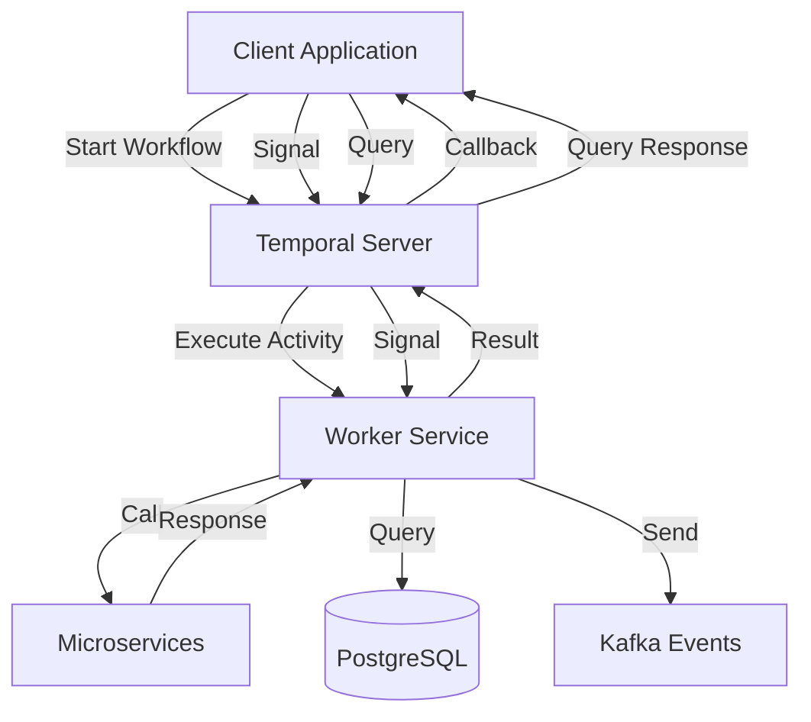
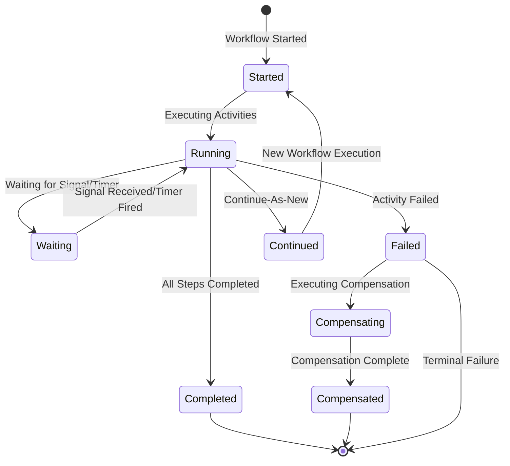
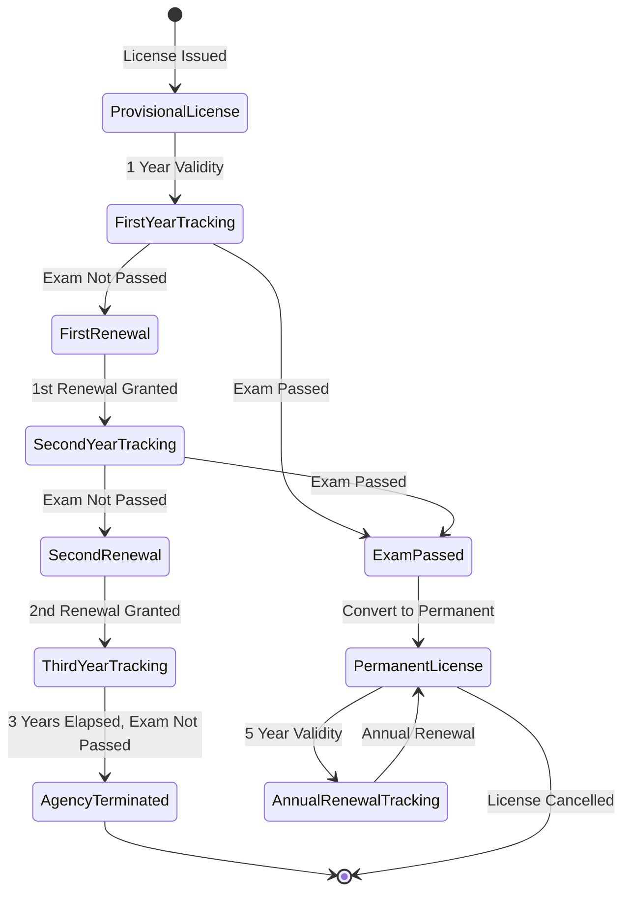

# Temporal Workflows for Agent Profile Management

## Document Control

| Attribute | Details |
|-----------|---------|
| **Module** | Agent Profile Management - Temporal Workflows |
| **Phase** | Phase 4 - Agent Management |
| **Team** | Team 1 - Agent Management |
| **Design Date** | January 23, 2026 |
| **Requirements** | Agent Profile Management Requirements |
| **Workflow Engine** | Temporal.io |
| **Technology Stack** | Golang, Temporal SDK, PostgreSQL, Kafka |

---

## Table of Contents

1. [Executive Summary](#1-executive-summary)
2. [Workflow Architecture](#2-workflow-architecture)
3. [Workflow 1: License Renewal Tracking Workflow](#3-workflow-1-license-renewal-tracking-workflow)
4. [Workflow 2: Agent Onboarding Workflow](#4-workflow-2-agent-onboarding-workflow)
5. [Workflow 3: Agent Termination Workflow](#5-workflow-3-agent-termination-workflow)
6. [Workflow 4: License Deactivation Batch Workflow](#6-workflow-4-license-deactivation-batch-workflow)
7. [Workflow 5: Bank Details Update Workflow](#7-workflow-5-bank-details-update-workflow)
8. [Workflow 6: Agent Profile Update Workflow](#8-workflow-6-agent-profile-update-workflow)
9. [Common Activities](#9-common-activities)
10. [Signals & Queries](#10-signals--queries)
11. [Deployment Strategy](#11-deployment-strategy)

---

## 1. Executive Summary

### 1.1 Purpose
This document defines Temporal workflow specifications for long-running, complex business processes in the Agent Profile Management module. These workflows handle multi-step orchestration, state persistence, compensation logic, and human-in-the-loop approvals.

### 1.2 Why Temporal for Agent Profile Management?

| Business Requirement | Temporal Capability |
|---------------------|---------------------|
| **License Renewal Tracking (1-5 years)** | Long-running workflows with Continue-As-New |
| **Multi-level Approvals** | Human-in-the-loop with signals |
| **Compensation on Failure** | Saga pattern with rollback logic |
| **Scheduled Batch Processing** | Cron workflows with parallel execution |
| **State Persistence** | Durable execution across system failures |
| **License Expiry Reminders (4 intervals)** | Timers with dynamic scheduling |
| **HRMS Integration** | Activity retries with exponential backoff |
| **Audit Trail Requirements** | Deterministic workflow execution |

### 1.3 Workflow Overview

| Workflow ID | Workflow Name | Duration | Complexity | Priority |
|------------|---------------|----------|------------|----------|
| WF-001 | License Renewal Tracking | 1-5 years | HIGH | CRITICAL |
| WF-002 | Agent Onboarding | 1-7 days | MEDIUM | HIGH |
| WF-003 | Agent Termination | 1 day | MEDIUM | CRITICAL |
| WF-004 | License Deactivation Batch | Daily | LOW | CRITICAL |
| WF-005 | Bank Details Update | 1-3 days | MEDIUM | HIGH |
| WF-006 | Agent Profile Update | 1-7 days | MEDIUM | HIGH |

---

## 2. Workflow Architecture

### 2.1 Workflow Design Patterns

#### Pattern 1: Long-Running Workflow with Continue-As-New
**Use Case**: License Renewal Tracking (multi-year)
```
Start → Track License → Wait for Renewal Date → Send Reminders → Process Renewal → Continue-As-New
```

#### Pattern 2: Saga with Compensation
**Use Case**: Agent Termination
```
Update Status → Generate Letter → Disable Portal → Stop Commission
     ↓ (if failure)         ↓ (if failure)    ↓ (if failure)
  Compensate              Compensate        Compensate
```

#### Pattern 3: Human-in-the-Loop
**Use Case**: Agent Onboarding, Profile Updates
```
Start Workflow → Execute Activities → Wait for Signal (Approval) → Continue
```

#### Pattern 4: Scheduled Batch Processing
**Use Case**: License Deactivation Batch
```
Cron Trigger → Query Expired Licenses → Process in Parallel → Generate Report
```

### 2.2 Workflow Components



### 2.3 Workflow Lifecycle



---

## 3. Workflow 1: License Renewal Tracking Workflow

### 3.1 Overview

**Workflow ID**: WF-001
**Workflow Name**: `LicenseRenewalTrackingWorkflow`
**Duration**: 1-5 years (agent's entire license lifecycle)
**Business Rule**: BR-AGT-PRF-012, BR-AGT-PRF-013, BR-AGT-PRF-014
**Complexity**: HIGH

### 3.2 Business Context

This workflow manages the complete lifecycle of an agent's license from provisional to permanent, including:
- **Provisional License** (1 year) with up to 2 renewals
- **Licentiate Exam Tracking** (must pass within 3 years)
- **Permanent License** (5 years) with annual renewals
- **Automated Reminders** at 4 intervals (30 days, 15 days, 7 days, expiry day)
- **Auto-Deactivation** if not renewed

### 3.3 Workflow Specification

#### Input/Output

```yaml
Input:
  agent_id: string
  license_id: string
  license_type: enum[PROVISIONAL, PERMANENT]
  issue_date: datetime
  renewal_date: datetime
  exam_status: enum[NOT_PASSED, PASSED]

Output:
  license_status: enum[ACTIVE, EXPIRED, TERMINATED]
  next_renewal_date: datetime
  reminder_count: integer
```

#### Workflow State Machine



#### Workflow Logic

**Workflow: LicenseRenewalTrackingWorkflow**

```text
BEGIN Workflow

1. Initialize License Tracking State
   - Load license details from database
   - Set current license type and renewal date
   - Calculate reminder schedule

2. Main Tracking Loop (Repeat until license cancelled/terminated)

   a. Calculate time until next reminder
      - If license_type = PROVISIONAL:
        * Check if exam passed
        * If exam passed within 3 years:
          - Convert to permanent license
          - Set next renewal date to 1 year from conversion
        * If exam not passed:
          - Calculate renewal date (1 year from issue/renewal)
          - Check if within 3-year window
          - If > 3 years: Terminate agency, EXIT workflow
      - If license_type = PERMANENT:
        * Calculate next renewal date (1 year from last renewal)

   b. Set Reminder Timers (4 intervals)
      FOR EACH reminder_interval IN [30 days, 15 days, 7 days, 0 days]:
        - Wait until reminder_date
        - Check if license already renewed
        - IF NOT renewed:
          * Execute SendLicenseRenewalReminderActivity
          * Log reminder sent
        - IF renewed:
          * BREAK loop (process renewal)

   c. Wait for Renewal Signal
      - Set up signal channel: "license-renewed"
      - Wait for signal with timeout: renewal_date + 30 days grace period

   d. Handle Renewal Signal
      WHEN "license-renewed" signal received:
        - Execute ValidateLicenseRenewalActivity
        - Execute UpdateLicenseRenewalDateActivity
        - Log renewal in audit trail
        - Send renewal confirmation
        - CONTINUE to next tracking cycle (Continue-As-New)

   e. Handle Timeout (No Renewal)
      IF timeout reached (renewal_date + 30 days):
        - Execute CheckLicenseStatusActivity
        - IF still not renewed:
          * Execute DeactivateAgentActivity
          * Execute DisablePortalAccessActivity
          * Execute StopCommissionProcessingActivity
          * Send deactivation notification
          * Mark workflow as TERMINATED

3. Continue-As-New
   - Save current state
   - Start new workflow execution with same input
   - Prevents event history from growing too large

END Workflow
```

### 3.4 Activities

| Activity ID | Activity Name | Timeout | Retry Policy | Description |
|------------|---------------|---------|--------------|-------------|
| ACT-001 | `LoadLicenseDetailsActivity` | 30s | 3 attempts | Load license information from database |
| ACT-002 | `CheckExamStatusActivity` | 30s | 3 attempts | Verify licentiate exam status |
| ACT-003 | `ConvertToPermanentLicenseActivity` | 1m | 3 attempts | Convert provisional to permanent license |
| ACT-004 | `SendLicenseRenewalReminderActivity` | 2m | 5 attempts | Send reminder via email and SMS |
| ACT-005 | `ValidateLicenseRenewalActivity` | 1m | 3 attempts | Validate renewal documents |
| ACT-006 | `UpdateLicenseRenewalDateActivity` | 30s | 3 attempts | Update renewal date in database |
| ACT-007 | `DeactivateAgentActivity` | 30s | 3 attempts | Change agent status to Deactivated |
| ACT-008 | `DisablePortalAccessActivity` | 30s | 3 attempts | Disable agent portal access |
| ACT-009 | `StopCommissionProcessingActivity` | 30s | 3 attempts | Flag agent for commission stop |
| ACT-010 | `SendDeactivationNoticeActivity` | 2m | 5 attempts | Send deactivation notification |

### 3.5 Signals

| Signal Name | Payload | Trigger | Description |
|-------------|---------|---------|-------------|
| `license-renewed` | `{renewal_date, document_urls, renewed_by}` | Admin processes renewal | Indicates license has been renewed |
| `exam-passed` | `{exam_date, certificate_number}` | Agent passes exam | Indicates agent passed licentiate exam |
| `license-cancelled` | `{cancellation_reason, cancelled_by}` | License cancelled | Terminates workflow |
| `update-contact` | `{email, mobile}` | Agent updates contact | Update reminder contact details |

### 3.6 Queries

| Query Name | Response | Description |
|------------|----------|-------------|
| `get-license-status` | `{license_type, renewal_date, exam_status, reminder_count}` | Get current license status |
| `get-next-reminder-date` | `{next_reminder_date, reminder_type}` | Get next scheduled reminder |
| `get-renewal-history` | `[{renewal_date, renewed_by, documents}]` | Get renewal history |

### 3.7 Compensation Logic

No compensation needed for this workflow. Failed activities are retried. If activity fails permanently:
- Send alert to admin
- Keep workflow in waiting state
- Allow manual intervention via signals

### 3.8 Example Scenarios

#### Scenario 1: Provisional License → Permanent License
```
1. Provisional license issued: 2026-01-15
2. Exam not passed in first year
3. First renewal: 2027-01-15 (signal received)
4. Exam passed: 2027-06-10 (signal received)
5. Convert to permanent license: 2027-06-11
6. Next renewal: 2028-06-11
7. Annual renewal cycle continues...
```

#### Scenario 2: Agency Termination (Exam Not Passed)
```
1. Provisional license issued: 2026-01-15
2. Exam not passed in first year
3. First renewal: 2027-01-15
4. Exam not passed in second year
5. Second renewal: 2028-01-15
6. Exam not passed in third year
7. 3-year window expires: 2029-01-15
8. Agency terminated: 2029-01-16
9. Workflow completes
```

---

## 4. Workflow 2: Agent Onboarding Workflow

### 4.1 Overview

**Workflow ID**: WF-002
**Workflow Name**: `AgentOnboardingWorkflow`
**Duration**: 1-7 days (depending on approvals)
**Business Rule**: BR-AGT-PRF-001 to BR-AGT-PRF-004, BR-AGT-PRF-027
**Complexity**: MEDIUM

### 4.2 Business Context

This workflow handles the complete agent onboarding process:
- **Departmental Employees**: HRMS integration with auto-population
- **Field Officers**: HRMS auto-fetch or manual entry
- **Advisors**: Coordinator linkage mandatory
- **Advisor Coordinators**: Geographic assignment
- **Validation**: PAN uniqueness, mandatory fields, document upload
- **Approval**: Supervisor approval for certain agent types

### 4.3 Workflow Specification

#### Input/Output

```yaml
Input:
  agent_type: enum[ADVISOR, ADVISOR_COORDINATOR, DEPARTMENTAL_EMPLOYEE, FIELD_OFFICER]
  profile_data:
    first_name: string
    last_name: string
    pan_number: string
    date_of_birth: date
    gender: enum[Male, Female, Other]
    mobile_number: string
    email: string
    addresses: [Address]
  employee_id: string (optional, for HRMS types)
  advisor_coordinator_id: string (mandatory for ADVISOR)
  circle_id: string (for ADVISOR_COORDINATOR)
  division_id: string (for ADVISOR_COORDINATOR)
  documents: [Document]

Output:
  agent_id: string
  agent_code: string
  status: enum[ACTIVE, PENDING_APPROVAL, REJECTED]
  profile_created_at: datetime
```

#### Workflow Logic

**Workflow: AgentOnboardingWorkflow**

```text
BEGIN Workflow

1. Validate Agent Type and Profile Data
   - Execute ValidateAgentTypeActivity
   - Execute ValidateProfileDataActivity
   - IF validation fails: RETURN error

2. Branch by Agent Type

   CASE: DEPARTMENTAL_EMPLOYEE or FIELD_OFFICER with employee_id
     a. Execute ValidateEmployeeIDActivity (call HRMS)
     b. IF employee_id invalid: RETURN error

     c. Execute FetchHRMSDataActivity
     d. Execute AutoPopulateProfileActivity

     e. Allow manual corrections (wait for signal: "profile-corrections")

   CASE: ADVISOR
     a. Execute ValidateAdvisorCoordinatorActivity
     b. IF coordinator invalid or not active: RETURN error

   CASE: ADVISOR_COORDINATOR
     a. Validate geographic assignment (circle_id, division_id)

   CASE: FIELD_OFFICER (manual entry)
     a. Continue with manual profile data

3. Validate Business Rules
   - Execute ValidatePANUniquenessActivity
   - Execute ValidateMandatoryFieldsActivity
   - Execute ValidateAddressActivity
   - Execute ValidateContactDetailsActivity
   - IF any validation fails: RETURN error

4. Handle Document Uploads
   - Execute UploadKYCDocumentsActivity
   - Execute ValidateDocumentsActivity
   - IF documents invalid: RETURN error

5. Check Approval Requirement
   - Execute CheckApprovalRequiredActivity

   IF approval required:
     a. Execute SendApprovalRequestActivity
     b. Wait for signal: "approval-decision" (timeout: 7 days)
     c. IF timeout: Mark as PENDING, EXIT

     d. IF approval rejected:
        - Execute SendRejectionNotificationActivity
        - RETURN rejected

     e. IF approval approved: CONTINUE

6. Create Agent Profile
   - Execute GenerateAgentCodeActivity
   - Execute CreateAgentProfileActivity
   - Execute LinkToHierarchyActivity

   IF profile creation fails:
     - Compensate: DeleteAgentProfileActivity (if created)
     - RETURN error

7. Initialize License Tracking
   - Execute CreateLicenseRecordActivity
   - Start child workflow: LicenseRenewalTrackingWorkflow
   - IF child workflow fails: LOG warning, don't fail onboarding

8. Send Welcome Notification
   - Execute SendWelcomeEmailActivity
   - Execute SendWelcomeSMSActivity

9. Complete Onboarding
   - Execute LogOnboardingAuditActivity
   - RETURN agent_id, agent_code, status=ACTIVE

END Workflow
```

### 4.4 Activities

| Activity ID | Activity Name | Timeout | Retry Policy | Description |
|------------|---------------|---------|--------------|-------------|
| ACT-011 | `ValidateAgentTypeActivity` | 10s | 3 attempts | Validate agent type selection |
| ACT-012 | `ValidateProfileDataActivity` | 30s | 3 attempts | Validate all profile fields |
| ACT-013 | `ValidateEmployeeIDActivity` | 30s | 5 attempts | Call HRMS to validate employee ID |
| ACT-014 | `FetchHRMSDataActivity` | 1m | 5 attempts | Fetch employee data from HRMS |
| ACT-015 | `AutoPopulateProfileActivity` | 30s | 3 attempts | Auto-populate profile fields |
| ACT-016 | `ValidateAdvisorCoordinatorActivity` | 20s | 3 attempts | Validate coordinator linkage |
| ACT-017 | `ValidatePANUniquenessActivity` | 20s | 3 attempts | Check PAN uniqueness |
| ACT-018 | `ValidateMandatoryFieldsActivity` | 30s | 3 attempts | Validate all mandatory fields |
| ACT-019 | `UploadKYCDocumentsActivity` | 2m | 3 attempts | Upload KYC documents |
| ACT-020 | `ValidateDocumentsActivity` | 1m | 3 attempts | Validate document formats |
| ACT-021 | `CheckApprovalRequiredActivity` | 10s | 3 attempts | Check if approval needed |
| ACT-022 | `SendApprovalRequestActivity` | 30s | 5 attempts | Send approval request |
| ACT-023 | `GenerateAgentCodeActivity` | 20s | 3 attempts | Generate unique agent code |
| ACT-024 | `CreateAgentProfileActivity` | 1m | 3 attempts | Create agent profile in DB |
| ACT-025 | `LinkToHierarchyActivity` | 30s | 3 attempts | Link to hierarchy |
| ACT-026 | `CreateLicenseRecordActivity` | 30s | 3 attempts | Create license record |
| ACT-027 | `SendWelcomeEmailActivity` | 1m | 5 attempts | Send welcome email |
| ACT-028 | `SendWelcomeSMSActivity` | 30s | 5 attempts | Send welcome SMS |

### 4.5 Signals

| Signal Name | Payload | Trigger | Description |
|-------------|---------|---------|-------------|
| `profile-corrections` | `{corrected_fields}` | Admin corrects auto-populated data | Manual corrections to HRMS data |
| `approval-decision` | `{approved, rejection_reason, approved_by}` | Supervisor approves/rejects | Approval decision |
| `cancel-onboarding` | `{reason}` | Admin cancels onboarding | Cancel workflow |

### 4.6 Queries

| Query Name | Response | Description |
|------------|----------|-------------|
| `get-onboarding-status` | `{stage, progress, pending_actions}` | Get current onboarding stage |
| `get-pending-approvals` | `[{approver, approval_type, waiting_since}]` | Get pending approvals |

### 4.7 Compensation Logic

| Activity | Compensation Activity | Condition |
|----------|----------------------|-----------|
| CreateAgentProfileActivity | DeleteAgentProfileActivity | If subsequent activities fail |
| LinkToHierarchyActivity | UnlinkFromHierarchyActivity | If profile creation fails |
| CreateLicenseRecordActivity | DeleteLicenseRecordActivity | If license tracking fails |

### 4.8 Example Scenario

```
1. Admin selects agent type: DEPARTMENTAL_EMPLOYEE
2. Enter employee ID: EMP-45678
3. Activity: ValidateEmployeeIDActivity → Success
4. Activity: FetchHRMSDataActivity → Data retrieved
5. Activity: AutoPopulateProfileActivity → Fields populated
6. Admin reviews and corrects mobile number (signal: profile-corrections)
7. Activity: ValidatePANUniquenessActivity → PAN unique
8. Activity: UploadKYCDocumentsActivity → Documents uploaded
9. Activity: CheckApprovalRequiredActivity → Approval not required
10. Activity: GenerateAgentCodeActivity → AGENT-2026-001234
11. Activity: CreateAgentProfileActivity → Profile created
12. Child workflow: LicenseRenewalTrackingWorkflow → Started
13. Activity: SendWelcomeEmailActivity → Email sent
14. Onboarding complete → agent_id returned
```

---

## 5. Workflow 3: Agent Termination Workflow

### 5.1 Overview

**Workflow ID**: WF-003
**Workflow Name**: `AgentTerminationWorkflow`
**Duration**: 1 day (immediate execution)
**Business Rule**: BR-AGT-PRF-017
**Complexity**: MEDIUM

### 5.2 Business Context

This workflow handles agent termination with proper compensation logic:
- **Status Update**: Change to TERMINATED
- **Termination Letter**: Generate and store
- **Portal Access**: Disable immediately
- **Commission Processing**: Stop from effective date
- **Data Archival**: Archive for 7 years
- **Hierarchy Update**: Reassign advisors if coordinator
- **Complete Audit Trail**: Log all actions

### 5.3 Workflow Specification

#### Input/Output

```yaml
Input:
  agent_id: string
  termination_reason: string (min 20 chars)
  effective_date: date (>= today)
  terminated_by: string (user_id)
  termination_type: enum[RESIGNATION, DEATH, BREACH_OF_CONDUCT, LICENSE_EXPIRY, OTHER]

Output:
  termination_id: string
  status: TERMINATED
  termination_letter_url: string
  portal_disabled: boolean
  commission_stopped: boolean
  archived: boolean
  hierarchy_updated: boolean
```

#### Workflow Logic

**Workflow: AgentTerminationWorkflow**

```text
BEGIN Workflow

1. Validate Termination Request
   - Execute ValidateTerminationRequestActivity
   - Check: termination_reason >= 20 chars
   - Check: effective_date >= today
   - Check: agent current status = ACTIVE
   - IF validation fails: RETURN error

2. Execute Termination Steps (with Compensation)

   STEP 1: Update Agent Status
     - Execute UpdateAgentStatusActivity (status=TERMINATED)
     - Set compensation: RevertAgentStatusActivity
     - IF fails: COMPENSATE and RETURN error

   STEP 2: Generate Termination Letter
     - Execute GenerateTerminationLetterActivity
     - Upload to document storage
     - Set compensation: DeleteTerminationLetterActivity
     - IF fails: COMPENSATE STEP 1 and RETURN error

   STEP 3: Disable Portal Access
     - Execute DisablePortalAccessActivity
     - Set compensation: EnablePortalAccessActivity
     - IF fails: COMPENSATE STEPS 1-2 and RETURN error

   STEP 4: Stop Commission Processing
     - Execute StopCommissionProcessingActivity
     - Flag in commission system: stop from effective_date
     - Set compensation: ResumeCommissionProcessingActivity
     - IF fails: COMPENSATE STEPS 1-3 and RETURN error

   STEP 5: Handle Advisor Reassignment (if coordinator)
     - Execute CheckIsAdvisorCoordinatorActivity
     - IF is coordinator:
        * Execute GetAssignedAdvisorsActivity
        * FOR EACH advisor:
          - Execute ReassignAdvisorActivity (to new coordinator)
        * Set compensation: RevertAdvisorReassignmentActivity
     - IF fails: LOG warning (non-critical)

   STEP 6: Archive Agent Data
     - Execute ArchiveAgentDataActivity
     - Copy to archival table with 7-year retention
     - Set compensation: DeleteArchivedDataActivity
     - IF fails: LOG warning, schedule async archival

   STEP 7: Stop License Tracking Workflow
     - Send signal: "license-cancelled" to LicenseRenewalTrackingWorkflow
     - IF workflow not found: LOG warning

   STEP 8: Send Notifications
     - Execute SendTerminationNotificationToAgentActivity
     - Execute SendTerminationNotificationToSupervisorActivity
     - IF fails: LOG warning (non-critical)

3. Log Complete Audit Trail
   - Execute LogTerminationAuditActivity
   - Log all steps with timestamps and user IDs
   - Generate termination summary

4. Complete Termination
   - RETURN termination_id, status=TERMINATED

END Workflow
```

### 4.4 Activities

| Activity ID | Activity Name | Timeout | Retry Policy | Description |
|------------|---------------|---------|--------------|-------------|
| ACT-031 | `ValidateTerminationRequestActivity` | 20s | 3 attempts | Validate termination request |
| ACT-032 | `UpdateAgentStatusActivity` | 30s | 3 attempts | Update status to TERMINATED |
| ACT-033 | `RevertAgentStatusActivity` | 30s | 3 attempts | Revert to ACTIVE (compensation) |
| ACT-034 | `GenerateTerminationLetterActivity` | 1m | 3 attempts | Generate termination letter PDF |
| ACT-035 | `DeleteTerminationLetterActivity` | 30s | 3 attempts | Delete letter (compensation) |
| ACT-036 | `DisablePortalAccessActivity` | 30s | 3 attempts | Disable portal access |
| ACT-037 | `EnablePortalAccessActivity` | 30s | 3 attempts | Enable portal (compensation) |
| ACT-038 | `StopCommissionProcessingActivity` | 30s | 3 attempts | Stop commission from effective date |
| ACT-039 | `ResumeCommissionProcessingActivity` | 30s | 3 attempts | Resume commission (compensation) |
| ACT-040 | `CheckIsAdvisorCoordinatorActivity` | 20s | 3 attempts | Check if agent is coordinator |
| ACT-041 | `GetAssignedAdvisorsActivity` | 30s | 3 attempts | Get list of assigned advisors |
| ACT-042 | `ReassignAdvisorActivity` | 30s | 3 attempts | Reassign advisor to new coordinator |
| ACT-043 | `RevertAdvisorReassignmentActivity` | 30s | 3 attempts | Revert reassignment (compensation) |
| ACT-044 | `ArchiveAgentDataActivity` | 2m | 3 attempts | Archive agent data |
| ACT-045 | `DeleteArchivedDataActivity` | 1m | 3 attempts | Delete archive (compensation) |
| ACT-046 | `SendTerminationNotificationToAgentActivity` | 1m | 5 attempts | Send notification to agent |
| ACT-047 | `SendTerminationNotificationToSupervisorActivity` | 1m | 5 attempts | Send notification to supervisor |
| ACT-048 | `LogTerminationAuditActivity` | 30s | 3 attempts | Log complete audit trail |

### 5.5 Signals

No signals required. This is a synchronous workflow.

### 5.6 Queries

No queries required. Workflow completes synchronously.

### 5.7 Compensation Logic (Saga Pattern)

```
Step 1: Update Status
  ↓ Failure → RevertAgentStatusActivity

Step 2: Generate Letter
  ↓ Failure → DeleteTerminationLetterActivity
             → RevertAgentStatusActivity

Step 3: Disable Portal
  ↓ Failure → EnablePortalAccessActivity
             → DeleteTerminationLetterActivity
             → RevertAgentStatusActivity

Step 4: Stop Commission
  ↓ Failure → ResumeCommissionProcessingActivity
             → EnablePortalAccessActivity
             → DeleteTerminationLetterActivity
             → RevertAgentStatusActivity

Step 5: Reassign Advisors
  ↓ Failure → RevertAdvisorReassignmentActivity
  ↓ Warning: Non-critical, continue

Step 6: Archive Data
  ↓ Failure → DeleteArchivedDataActivity
  ↓ Warning: Non-critical, schedule async archival

Step 7: Stop License Workflow
  ↓ Warning: Non-critical if workflow not found

Step 8: Send Notifications
  ↓ Warning: Non-critical, notifications can be sent manually
```

### 5.8 Example Scenario

```
1. HR initiates termination for agent AGENT-123
2. termination_reason: "Breach of conduct policy - violation of sales guidelines"
3. effective_date: 2026-01-25
4. terminated_by: HR-001

5. Activity: ValidateTerminationRequestActivity → Valid
6. Activity: UpdateAgentStatusActivity → Status = TERMINATED
7. Activity: GenerateTerminationLetterActivity → Letter generated
8. Activity: DisablePortalAccessActivity → Portal disabled
9. Activity: StopCommissionProcessingActivity → Commission stopped from 2026-01-25
10. Activity: CheckIsAdvisorCoordinatorActivity → Is coordinator
11. Activity: GetAssignedAdvisorsActivity → 5 advisors found
12. Activity: ReassignAdvisorActivity → All 5 advisors reassigned
13. Activity: ArchiveAgentDataActivity → Data archived
14. Signal: license-cancelled → License workflow stopped
15. Activity: SendTerminationNotificationToAgentActivity → Notification sent
16. Activity: LogTerminationAuditActivity → Audit logged

17. Termination complete → termination_id returned
```

---

## 6. Workflow 4: License Deactivation Batch Workflow

### 6.1 Overview

**Workflow ID**: WF-004
**Workflow Name**: `LicenseDeactivationBatchWorkflow`
**Duration**: Daily (scheduled)
**Schedule**: Cron: "0 0 * * *" (midnight daily)
**Business Rule**: BR-AGT-PRF-013
**Complexity**: LOW

### 6.2 Business Context

This workflow runs daily as a scheduled batch to deactivate agents whose licenses have expired:
- **Query**: Find all agents with renewal_date < today AND status = ACTIVE
- **Batch Processing**: Process agents in parallel
- **Deactivation**: Update status, disable portal, stop commission
- **Notification**: Send deactivation notice
- **Reporting**: Generate daily deactivation report

### 6.3 Workflow Specification

#### Input/Output

```yaml
Input:
  execution_date: date (default: today)

Output:
  batch_id: string
  agents_processed: integer
  agents_deactivated: integer
  agents_already_deactivated: integer
  errors: [Error]
  report_url: string
```

#### Workflow Logic

**Workflow: LicenseDeactivationBatchWorkflow**

```text
BEGIN Workflow (Scheduled: Daily at midnight)

1. Query Expired Licenses
   - Execute QueryExpiredLicensesActivity
   - Get all agents where: renewal_date < today AND status = ACTIVE
   - IF no agents found: RETURN agents_processed=0

2. Process Agents in Parallel (batch size: 50)
   - Create future array for parallel execution
   - FOR EACH agent IN agents:
        * Add ExecuteProcessAgentDeactivation to future array
   - WAIT for all futures to complete

3. Process Agent Deactivation (Child Workflow)
   FOR EACH agent:
     a. Execute UpdateAgentStatusActivity (status=DEACTIVATED)
     b. Execute DisablePortalAccessActivity
     c. Execute StopCommissionProcessingActivity
     d. Execute SendDeactivationNoticeActivity
     e. Execute LogDeactivationAuditActivity
     f. Log any errors, continue to next agent

4. Aggregate Results
   - Count: agents_deactivated, agents_already_deactivated, errors
   - Collect all errors

5. Generate Deactivation Report
   - Execute GenerateDeactivationReportActivity
   - Create CSV/PDF report with:
     * Agent IDs
     * Deactivation dates
     * License renewal dates
     * Errors (if any)
   - Upload report to storage
   - Send report to admin

6. Notify Supervisors
   - Execute GetSupervisorsForDeactivatedAgentsActivity
   - FOR EACH supervisor:
        * Execute SendDeactivationSummaryToSupervisorActivity

7. Complete Batch
   - RETURN batch_id, aggregated results

END Workflow
```

### 6.4 Activities

| Activity ID | Activity Name | Timeout | Retry Policy | Description |
|------------|---------------|---------|--------------|-------------|
| ACT-051 | `QueryExpiredLicensesActivity` | 1m | 3 attempts | Query agents with expired licenses |
| ACT-052 | `ProcessAgentDeactivationActivity` | 2m | 3 attempts | Process single agent deactivation |
| ACT-053 | `UpdateAgentStatusActivity` | 30s | 3 attempts | Update status to DEACTIVATED |
| ACT-054 | `DisablePortalAccessActivity` | 30s | 3 attempts | Disable portal access |
| ACT-055 | `StopCommissionProcessingActivity` | 30s | 3 attempts | Stop commission processing |
| ACT-056 | `SendDeactivationNoticeActivity` | 1m | 5 attempts | Send deactivation notice |
| ACT-057 | `LogDeactivationAuditActivity` | 30s | 3 attempts | Log deactivation audit |
| ACT-058 | `GenerateDeactivationReportActivity` | 2m | 3 attempts | Generate daily report |
| ACT-059 | `GetSupervisorsForDeactivatedAgentsActivity` | 1m | 3 attempts | Get supervisors list |
| ACT-060 | `SendDeactivationSummaryToSupervisorActivity` | 1m | 5 attempts | Send summary to supervisor |

### 6.5 Parallel Processing Pattern

```text
QueryExpiredLicensesActivity
       ↓
[Agent1] [Agent2] [Agent3] ... [Agent50] → Parallel Execution
   ↓        ↓        ↓              ↓
 Done     Done     Done           Done
   ↓        ↓        ↓              ↓
Aggregate Results
       ↓
Generate Report
```

### 6.6 Error Handling

- **Individual Agent Failure**: Log error, continue to next agent
- **Report Generation Failure**: Send alert to admin, don't fail batch
- **Notification Failure**: Log error, notifications can be sent manually

### 6.7 Example Scenario

```
1. Workflow triggered: 2026-01-25 00:00:00 (daily cron)

2. Activity: QueryExpiredLicensesActivity
   → Found 23 agents with expired licenses

3. Process 23 agents in parallel:
   - Agent1: Status updated → DEACTIVATED
   - Agent2: Status updated → DEACTIVATED
   - Agent3: Portal disable failed → Logged error, continued
   - ...
   - Agent23: Status updated → DEACTIVATED

4. Aggregate results:
   - agents_deactivated: 22
   - errors: 1

5. Activity: GenerateDeactivationReportActivity
   → Report generated: deactivation_report_20260125.pdf

6. Activity: GetSupervisorsForDeactivatedAgentsActivity
   → Found 5 supervisors

7. Activity: SendDeactivationSummaryToSupervisorActivity
   → Sent to all 5 supervisors

8. Batch complete
```

---

## 7. Workflow 5: Bank Details Update Workflow

### 7.1 Overview

**Workflow ID**: WF-005
**Workflow Name**: `BankDetailsUpdateWorkflow`
**Duration**: 1-3 days (depending on approval)
**Business Rule**: BR-AGT-PRF-018
**Complexity**: MEDIUM

### 7.2 Business Context

This workflow handles bank details/POSB details updates with proper security and approvals:
- **Authentication**: Agent must be authenticated
- **Validation**: Account number format, IFSC validation
- **Encryption**: Bank account number encrypted at rest
- **Approval**: Supervisor approval required (not first-time entry)
- **Notification**: Notify commission team for disbursement updates

### 7.3 Workflow Specification

#### Input/Output

```yaml
Input:
  agent_id: string
  update_type: enum[BANK_ACCOUNT, POSB_ACCOUNT]
  account_number: string (encrypted)
  ifsc_code: string (for bank account)
  account_type: enum[SAVINGS, CURRENT]
  is_primary: boolean
  updated_by: string (agent_id or admin_id)
  authentication_token: string

Output:
  update_id: string
  status: enum[PENDING_APPROVAL, APPROVED, REJECTED, ACTIVE]
  effective_date: date
  previous_account: string (masked)
```

#### Workflow Logic

**Workflow: BankDetailsUpdateWorkflow**

```text
BEGIN Workflow

1. Authenticate Agent
   - Execute AuthenticateAgentActivity
   - Validate authentication token
   - IF authentication fails: RETURN error

2. Validate Bank Details
   - Execute ValidateBankDetailsActivity
   - Validate account number format
   - Validate IFSC code format and existence
   - Validate account type
   - IF validation fails: RETURN error

3. Check if First-Time Entry
   - Execute CheckExistingBankDetailsActivity
   - IF no existing bank details:
        * Skip approval, go to step 6
   - IF existing bank details found:
        * Continue to step 4 (approval required)

4. Send for Approval (not first-time)
   - Execute SendBankDetailsApprovalRequestActivity
   - Send to supervisor for approval
   - Wait for signal: "bank-approval-decision" (timeout: 3 days)

5. Handle Approval Decision
   IF signal received:
     IF approved:
        * CONTINUE to step 6
     IF rejected:
        * Execute SendRejectionNotificationActivity
        * Execute LogRejectionActivity
        * RETURN status=REJECTED

   IF timeout:
     * RETURN status=PENDING_APPROVAL (manual follow-up required)

6. Process Bank Details Update

   STEP 1: Encrypt Account Number
     - Execute EncryptAccountNumberActivity
     - Use encryption at rest
     - IF fails: RETURN error

   STEP 2: Validate IFSC and Auto-Populate Bank Name
     - Execute ValidateIFSCActivity
     - Execute AutoPopulateBankNameActivity
     - IF IFSC invalid: RETURN error

   STEP 3: Update Bank Details
     - Execute UpdateBankDetailsActivity
     - Set previous account as inactive (if exists)
     - Set new account as active
     - Set as primary if is_primary=true
     - IF fails: RETURN error

   STEP 4: Log Change History
     - Execute LogBankDetailsChangeActivity
     - Log before/after values (account masked)
     - Log change reason and timestamp

7. Notify Commission Team
   - Execute NotifyCommissionTeamActivity
   - Send update notification for disbursement
   - IF fails: LOG warning (non-critical)

8. Send Confirmation to Agent
   - Execute SendBankUpdateConfirmationActivity
   - Send confirmation via email and SMS
   - IF fails: LOG warning (non-critical)

9. Complete Update
   - RETURN update_id, status=ACTIVE

END Workflow
```

### 7.4 Activities

| Activity ID | Activity Name | Timeout | Retry Policy | Description |
|------------|---------------|---------|--------------|-------------|
| ACT-061 | `AuthenticateAgentActivity` | 10s | 3 attempts | Authenticate agent |
| ACT-062 | `ValidateBankDetailsActivity` | 30s | 3 attempts | Validate bank details |
| ACT-063 | `CheckExistingBankDetailsActivity` | 20s | 3 attempts | Check existing details |
| ACT-064 | `SendBankDetailsApprovalRequestActivity` | 30s | 5 attempts | Send approval request |
| ACT-065 | `EncryptAccountNumberActivity` | 10s | 3 attempts | Encrypt account number |
| ACT-066 | `ValidateIFSCActivity` | 30s | 5 attempts | Validate IFSC code |
| ACT-067 | `AutoPopulateBankNameActivity` | 20s | 3 attempts | Auto-populate bank name |
| ACT-068 | `UpdateBankDetailsActivity` | 30s | 3 attempts | Update bank details |
| ACT-069 | `LogBankDetailsChangeActivity` | 20s | 3 attempts | Log change history |
| ACT-070 | `NotifyCommissionTeamActivity` | 30s | 5 attempts | Notify commission team |
| ACT-071 | `SendBankUpdateConfirmationActivity` | 1m | 5 attempts | Send confirmation |

### 7.5 Signals

| Signal Name | Payload | Trigger | Description |
|-------------|---------|---------|-------------|
| `bank-approval-decision` | `{approved, rejection_reason, approved_by}` | Supervisor decision | Approval decision |
| `cancel-update` | `{reason}` | Admin cancels | Cancel workflow |

### 7.6 Queries

| Query Name | Response | Description |
|------------|----------|-------------|
| `get-update-status` | `{status, pending_since, current_approver}` | Get update status |
| `get-bank-details-history` | `[{account_number_masked, ifsc, bank_name, effective_date}]` | Get history |

### 7.7 Example Scenario

```
1. Agent AGENT-123 initiates bank details update from portal
2. authentication_token: valid

3. Activity: AuthenticateAgentActivity → Authenticated
4. Activity: ValidateBankDetailsActivity → Valid
5. Activity: CheckExistingBankDetailsActivity → Existing details found (approval required)

6. Activity: SendBankDetailsApprovalRequestActivity → Sent to supervisor
7. Wait for signal: bank-approval-decision

8. Signal received: approved=true, approved_by=SV-001

9. Activity: EncryptAccountNumberActivity → Encrypted
10. Activity: ValidateIFSCActivity → Valid
11. Activity: AutoPopulateBankNameActivity → "State Bank of India"
12. Activity: UpdateBankDetailsActivity → Updated
13. Activity: LogBankDetailsChangeActivity → Logged
14. Activity: NotifyCommissionTeamActivity → Notified
15. Activity: SendBankUpdateConfirmationActivity → Sent

16. Update complete → update_id returned
```

---

## 8. Workflow 6: Agent Profile Update Workflow

### 8.1 Overview

**Workflow ID**: WF-006
**Workflow Name**: `AgentProfileUpdateWorkflow`
**Duration**: 1-7 days (depending on approval)
**Business Rule**: BR-AGT-PRF-005, BR-AGT-PRF-006, BR-AGT-PRF-016
**Complexity**: MEDIUM

### 8.2 Business Context

This workflow handles agent profile updates with proper validation and approvals:
- **Field Classification**: Simple (direct update) vs Sensitive (approval required)
- **Sensitive Fields**: Name, PAN, Bank Details, License Details
- **Validation**: Format validation, uniqueness checks, business rules
- **Approval**: Supervisor approval for sensitive fields
- **Audit**: Complete audit trail with before/after values

### 8.3 Workflow Specification

#### Input/Output

```yaml
Input:
  agent_id: string
  update_fields:
    first_name: string (optional)
    last_name: string (optional)
    pan_number: string (optional)
    date_of_birth: date (optional)
    gender: enum (optional)
    marital_status: enum (optional)
    mobile_number: string (optional)
    email: string (optional)
    addresses: [Address] (optional)
  update_reason: string
  updated_by: string (agent_id or admin_id)

Output:
  update_id: string
  status: enum[ACTIVE, PENDING_APPROVAL, APPROVED, REJECTED]
  approved_fields: [string]
  rejected_fields: [string]
  effective_date: date
```

#### Workflow Logic

**Workflow: AgentProfileUpdateWorkflow**

```text
BEGIN Workflow

1. Validate Update Request
   - Execute ValidateUpdateRequestActivity
   - Check: at least one field provided
   - Check: update_reason provided
   - Check: agent exists and active
   - IF validation fails: RETURN error

2. Classify Fields
   - Execute ClassifyUpdateFieldsActivity
   - Categorize: SIMPLE vs SENSITIVE
   - SIMPLE: DOB, gender, marital_status, addresses
   - SENSITIVE: name, PAN, mobile, email
   - Create two update sets: simple_updates, sensitive_updates

3. Process Simple Updates (Direct Update)
   IF simple_updates not empty:
     a. Execute ValidateSimpleFieldsActivity
     b. IF validation fails: RETURN errors

     c. FOR EACH field IN simple_updates:
        * Execute UpdateProfileFieldActivity
        * Execute LogFieldUpdateActivity

     d. Update simple_fields_updated = true

4. Process Sensitive Updates (Approval Required)
   IF sensitive_updates not empty:
     a. Execute ValidateSensitiveFieldsActivity
     b. Validate PAN uniqueness (if PAN updated)
     c. Validate email uniqueness (if email updated)
     d. Validate mobile format (if mobile updated)
     e. IF validation fails: RETURN errors

     f. Execute SendProfileUpdateApprovalRequestActivity
     g. Wait for signal: "profile-update-approval" (timeout: 7 days)

     h. IF signal received:
        IF approved:
          * FOR EACH field IN sensitive_updates:
            - Execute UpdateProfileFieldActivity
            - Execute LogFieldUpdateActivity
          * Update sensitive_fields_updated = true

        IF rejected:
          * Execute SendRejectionNotificationActivity
          * RETURN status=REJECTED

     i. IF timeout:
        * RETURN status=PENDING_APPROVAL

5. Update Profile Summary
   - Execute UpdateProfileSummaryActivity
   - Update profile_updated_at timestamp
   - Update profile_updated_by

6. Complete Update
   - Execute CompleteProfileUpdateActivity
   - Send confirmation to agent (if self-update)
   - Send notification to admin (if admin update)
   - RETURN update_id, status

END Workflow
```

### 8.4 Activities

| Activity ID | Activity Name | Timeout | Retry Policy | Description |
|------------|---------------|---------|--------------|-------------|
| ACT-072 | `ValidateUpdateRequestActivity` | 20s | 3 attempts | Validate update request |
| ACT-073 | `ClassifyUpdateFieldsActivity` | 10s | 3 attempts | Classify fields |
| ACT-074 | `ValidateSimpleFieldsActivity` | 30s | 3 attempts | Validate simple fields |
| ACT-075 | `ValidateSensitiveFieldsActivity` | 30s | 3 attempts | Validate sensitive fields |
| ACT-076 | `SendProfileUpdateApprovalRequestActivity` | 30s | 5 attempts | Send approval request |
| ACT-077 | `UpdateProfileFieldActivity` | 30s | 3 attempts | Update single field |
| ACT-078 | `LogFieldUpdateActivity` | 20s | 3 attempts | Log field update |
| ACT-079 | `UpdateProfileSummaryActivity` | 20s | 3 attempts | Update profile summary |
| ACT-080 | `CompleteProfileUpdateActivity` | 30s | 3 attempts | Complete update |

### 8.5 Signals

| Signal Name | Payload | Trigger | Description |
|-------------|---------|---------|-------------|
| `profile-update-approval` | `{approved, rejected_fields, approved_by}` | Supervisor decision | Approval decision |
| `cancel-update` | `{reason}` | Admin cancels | Cancel workflow |

### 8.6 Queries

| Query Name | Response | Description |
|------------|----------|-------------|
| `get-update-status` | `{status, pending_fields, approved_fields}` | Get update status |
| `get-update-history` | `[{field, old_value, new_value, updated_at}]` | Get update history |

### 8.7 Example Scenario

```
1. Admin initiates profile update for agent AGENT-123
2. update_fields: {first_name: "Rajesh", pan_number: "XYZPQ5678R"}
3. update_reason: "Name correction and PAN update"

4. Activity: ValidateUpdateRequestActivity → Valid
5. Activity: ClassifyUpdateFieldsActivity
   - simple_updates: []
   - sensitive_updates: [first_name, pan_number]

6. Activity: ValidateSensitiveFieldsActivity → Valid
7. Activity: SendProfileUpdateApprovalRequestActivity → Sent to supervisor
8. Wait for signal: profile-update-approval

9. Signal received: approved=true, approved_by=SV-001

10. Activity: UpdateProfileFieldActivity → first_name updated
11. Activity: LogFieldUpdateActivity → Logged
12. Activity: UpdateProfileFieldActivity → pan_number updated
13. Activity: LogFieldUpdateActivity → Logged
14. Activity: UpdateProfileSummaryActivity → Summary updated
15. Activity: CompleteProfileUpdateActivity → Complete

16. Update complete → update_id returned
```

---

## 9. Common Activities

### 9.1 Activity Categories

| Category | Activities | Purpose |
|----------|-----------|---------|
| Validation | 15 activities | Validate inputs, business rules |
| Database | 20 activities | CRUD operations on database |
| Notification | 12 activities | Email, SMS notifications |
| Integration | 8 activities | HRMS, commission, portal integration |
| Audit | 10 activities | Audit trail logging |
| Security | 5 activities | Authentication, encryption |

### 9.2 Activity Retry Policies

| Policy | Retry Attempts | Initial Interval | Backoff | Max Interval |
|--------|---------------|------------------|---------|--------------|
| AGGRESSIVE | 5 | 1s | 2.0 | 10s |
| STANDARD | 3 | 1s | 2.0 | 1m |
| CONSERVATIVE | 3 | 5s | 2.0 | 30s |
| NONE | 1 | - | - | - |

### 9.3 Activity Timeout Guidelines

| Activity Type | Timeout | Rationale |
|---------------|---------|-----------|
| Database Query | 30s | Database operations should be fast |
| External API Call | 1m | Allow for network latency |
| File Upload | 2m | Allow for large files |
| Email/SMS | 1m | Allow for external service |
| Report Generation | 2m | Allow for complex reports |

---

## 10. Signals & Queries

### 10.1 Signal Types

| Signal Category | Signals | Purpose |
|----------------|---------|---------|
| Approval | 4 signals | Approval/rejection decisions |
| Cancellation | 6 signals | Cancel workflows |
| Update | 3 signals | Update workflow state |
| Lifecycle | 2 signals | License renewal, exam status |

### 10.2 Query Types

| Query Category | Queries | Purpose |
|---------------|---------|---------|
| Status | 6 queries | Get workflow status |
| History | 4 queries | Get history/audit trail |
| Pending | 3 queries | Get pending items |

### 10.3 Signal Handling Pattern

```text
Workflow State
     ↓
Set up signal channels
     ↓
Wait for signal (with timeout)
     ↓
Signal received?
     ↓
Yes → Process signal → Continue workflow
No  → Timeout → Handle timeout
```

### 10.4 Query Handling Pattern

```text
Client sends query
     ↓
Temporal routes to workflow execution
     ↓
Workflow executes query handler
     ↓
Returns current state (no side effects)
```

---

## 11. Deployment Strategy

### 11.1 Workflow Deployment Phases

| Phase | Workflows | Duration | Dependencies |
|-------|-----------|----------|--------------|
| Phase 1 | WF-001, WF-004 | Week 1-2 | Database setup |
| Phase 2 | WF-002, WF-003 | Week 3-4 | HRMS integration |
| Phase 3 | WF-005, WF-006 | Week 5-6 | Portal integration |

### 11.2 Worker Deployment

```yaml
Worker Groups:
  - name: agent-profile-worker
    workflows: all 6 workflows
    activities: all 80 activities
    task_queue: agent-profile-task-queue
    max_concurrent_workflow: 1000
    max_concurrent_activities: 5000

  - name: license-worker
    workflows: WF-001, WF-004
    activities: license-related activities
    task_queue: license-task-queue
    max_concurrent_workflow: 5000
    max_concurrent_activities: 10000
```

### 11.3 Monitoring & Alerting

| Metric | Threshold | Alert |
|--------|-----------|-------|
| Workflow Failure Rate | > 5% | Critical |
| Activity Failure Rate | > 10% | Warning |
| Workflow Execution Time | > SLA | Warning |
| Workflow Backlog | > 1000 | Critical |

### 11.4 Rollback Strategy

- **Workflow Versioning**: Use workflow versioning for backward compatibility
- **Continue-As-New**: Safe to roll forward
- **Activity Versioning**: Build new activities, deprecate old ones
- **Signal Compatibility**: Maintain backward compatible signals

---

## Appendix A: Workflow Decision Matrix

| Business Process | Temporal Workflow | Rationale |
|------------------|------------------|-----------|
| License Renewal Tracking | ✅ YES | Long-running (1-5 years), timers, signals |
| Agent Onboarding | ✅ YES | Multi-step, HRMS integration, approvals |
| Agent Termination | ✅ YES | Compensation logic, multiple system updates |
| License Deactivation Batch | ✅ YES | Scheduled batch, parallel processing |
| Bank Details Update | ✅ YES | Approval workflow, encryption, notifications |
| Agent Profile Update | ✅ YES | Field classification, approvals, audit logging |
| Agent Authentication | ❌ NO | Short-lived, no need for workflow |
| Agent Search | ❌ NO | Simple query, no need for workflow |
| Profile Display | ❌ NO | Simple query, no need for workflow |

---

## Appendix B: Temporal Best Practices Applied

1. **Deterministic Workflows**: All workflows are deterministic
2. **Idempotent Activities**: All activities are idempotent
3. **Retry Policies**: Appropriate retry policies for all activities
4. **Timeouts**: All activities have timeouts
5. **Heartbeats**: Long-running activities use heartbeats
6. **Signals**: External events use signals
7. **Queries**: State inspection uses queries
8. **Continue-As-New**: Long-running workflows use Continue-As-New
9. **Versioning**: Workflow versioning planned
10. **Compensation**: Saga pattern for failure handling

---

## Appendix C: Error Codes

| Error Code | Description | Resolution |
|------------|-------------|------------|
| ERR-WF-001 | Workflow not found | Check workflow ID |
| ERR-WF-002 | Activity timeout | Increase timeout or fix activity |
| ERR-WF-003 | Signal timeout | Check signal name and payload |
| ERR-WF-004 | Compensation failed | Manual intervention required |
| ERR-WF-005 | Validation failed | Check input data |
| ERR-WF-006 | Approval required | Send for approval |
| ERR-WF-007 | License expired | Renew license |
| ERR-WF-008 | Agent not found | Check agent ID |
| ERR-WF-009 | PAN not unique | Use different PAN |
| ERR-WF-010 | HRMS unavailable | Retry or use manual entry |

---

**Document Version**: 1.0
**Last Updated**: January 23, 2026
**Author**: Temporal Workflow Architect
**Status**: Ready for Implementation
