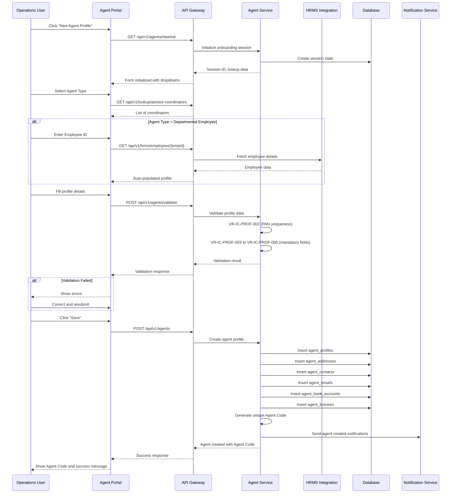
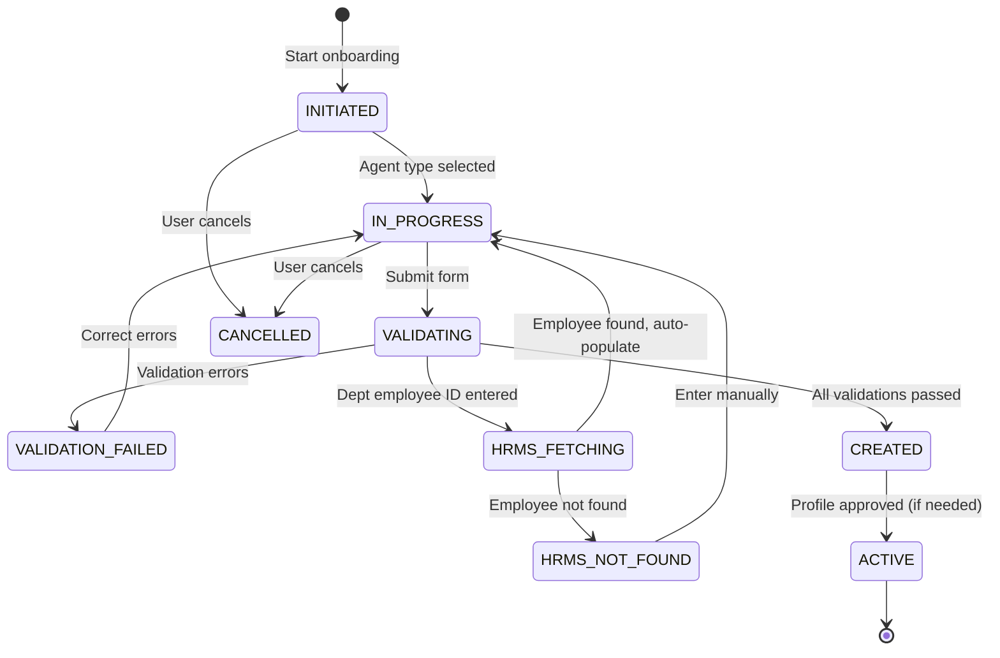

# Incentive, Commission and Producer Management - User Journey Documentation

**Module**: Incentive, Commission and Producer Management (IC)
**Version**: 1.0
**Created**: 2026-01-27
**Analysis File**: IC_Incentive_Commission_Producer_Management_Analysis.md
**Workflow**: User Journey Analysis Workflow (zenworkflow)

---

## Table of Contents

1. [Journey Catalog](#1-journey-catalog)
2. [Detailed Journey Breakdowns](#2-detailed-journey-breakdowns)
3. [Hidden/Supporting APIs](#3-hiddensupporting-apis)
4. [API Mapping Catalog](#4-api-mapping-catalog)
5. [Temporal Workflow Specifications](#5-temporal-workflow-specifications)
6. [Traceability Matrix](#6-traceability-matrix)
7. [Critical Review](#7-critical-review)
8. [Phased Implementation Plan](#8-phased-implementation-plan)

---

## 1. Journey Catalog

### 1.1 User Journey Summary

| Journey ID | Journey Name | Primary Actors | Priority | SLA | Related Components |
|------------|--------------|----------------|----------|-----|-------------------|
| **UJ-IC-001** | Agent Onboarding | Operations User, HRMS System | CRITICAL | 30 mins | FR-IC-PROF-001 to FR-IC-PROF-004, BR-IC-AH-001 to BR-IC-AH-004 |
| **UJ-IC-002** | Monthly Commission Processing | Batch Scheduler, Finance Team | CRITICAL | 6 hours batch + 10 days disbursement | FR-IC-COM-001 to FR-IC-COM-012, BR-IC-COM-001 to BR-IC-COM-012 |
| **UJ-IC-003** | License Renewal Management | Agent, Operations Team, Licensing Authority | HIGH | 3 working days | FR-IC-LIC-001 to FR-IC-LIC-003, BR-IC-LIC-003 to BR-IC-LIC-005 |
| **UJ-IC-004** | Trial Statement Approval | Finance Manager, Finance Head | CRITICAL | 7 days | FR-IC-COM-004 to FR-IC-COM-006, BR-IC-COM-002 |
| **UJ-IC-005** | Commission Disbursement | Finance Team, PFMS/Bank Gateway | CRITICAL | 10 working days | FR-IC-COM-008 to FR-IC-COM-010, BR-IC-COM-008, BR-IC-COM-011 |
| **UJ-IC-006** | Agent Termination | Operations User, Advisor Coordinator | MEDIUM | Immediate | FR-IC-PROF-005, BR-IC-PROF-004 |
| **UJ-IC-007** | Commission History Inquiry | Agent, Finance Team | MEDIUM | < 5 seconds | FR-IC-COM-011, BR-IC-COM-009 |
| **UJ-IC-008** | Commission Clawback | Finance Team, Compliance Team | CRITICAL | 24 hours | FR-IC-COM-011 to FR-IC-COM-012, BR-IC-CLAWBACK-001 |
| **UJ-IC-009** | Suspense Account Management | Finance Team, Compliance Team | HIGH | 1 hour creation + 30 days resolution | FR-IC-COM-013 to FR-IC-COM-019, BR-IC-SUSPENSE-001 to BR-IC-SUSPENSE-005 |
| **UJ-IC-010** | Commission Rate Configuration | Admin User | HIGH | N/A | FR-IC-COM-001, BR-IC-COM-006 |

### 1.2 Journey Priority Rationale

**CRITICAL (5 journeys)**:
- Business-blocking processes without which operations cannot function
- Regulatory/compliance requirements
- Direct financial impact

**HIGH (3 journeys)**:
- Significant operational improvements
- Agent experience impact
- Risk mitigation

**MEDIUM (2 journeys)**:
- Operational efficiency
- Reporting and transparency
- Periodic processes

---

## 2. Detailed Journey Breakdowns

### DETAILED JOURNEY: UJ-IC-001 - Agent Onboarding

### Journey Overview
- **User Goal**: Register new agents (Advisor, Advisor Coordinator, Departmental Employee, Field Officer) in the system
- **Entry Point**: Operations User navigates to Agent Profile Maintenance → Clicks "New Agent Profile"
- **Success Criteria**: Agent profile created with unique Agent Code, all validations passed, linked to Coordinator (for Advisors)
- **Exit Points**:
  - **Success**: Agent profile saved, Agent Code generated
  - **Cancel**: User abandons form, no data saved
  - **Error**: Validation failure, user corrects and resubmits
- **Duration (SLA)**: 15-30 minutes per profile
- **Actors**:
  - **Operations User**: Primary user performing onboarding
  - **Advisor Coordinator**: Required for Advisor onboarding
  - **HRMS System**: Integration for Departmental Employee data
  - **Validation Service**: Backend validation rules

---

### Sequence Diagram



---

### State Machine



---

### Step-by-Step Breakdown

#### Step 1: Initialize Onboarding Session

**Frontend Action**: Operations User navigates to "Agent Profile Maintenance" → Clicks "New Agent Profile"

**User Role**: Operations User

**Screen**: Agent Profile List Page

**API Call**: `GET /api/v1/agents/new/init`

**Request**: None

**Response**:
```json
{
  "session_id": "ons_abc123",
  "workflow_state": {
    "current_step": "initiated",
    "next_step": "select_agent_type",
    "allowed_actions": ["select_agent_type", "cancel"]
  },
  "lookup_data": {
    "agent_types": [
      {"code": "ADVISOR", "name": "Advisor"},
      {"code": "COORDINATOR", "name": "Advisor Coordinator"},
      {"code": "DEPT_EMPLOYEE", "name": "Departmental Employee"},
      {"code": "FIELD_OFFICER", "name": "Field Officer"}
    ],
    "circles": [
      {"code": "C001", "name": "Circle Delhi"},
      {"code": "C002", "name": "Circle Mumbai"}
    ],
    "divisions": [
      {"code": "D001", "name": "Division Central"},
      {"code": "D002", "name": "Division East"}
    ]
  },
  "validation_rules": {
    "pan_format": "^[A-Z]{5}[0-9]{4}[A-Z]{1}$",
    "email_format": "^[\\w-\\.]+@([\\w-]+\\.)+[\\w-]{2,4}$",
    "phone_format": "^[6-9]\\d{9}$"
  }
}
```

**Error Responses**:
- `500 INTERNAL_SERVER_ERROR`: System error initializing session
- `403 FORBIDDEN`: User lacks required permissions

**Components Applied**:
- FR-IC-PROF-001: Create agent profile interface
- VR-IC-PROF-001: Profile type selection mandatory

**Business Logic**:
1. Create onboarding session in cache/database
2. Fetch lookup data (agent types, circles, divisions)
3. Return validation rules for frontend validation
4. Set session timeout to 30 minutes

**State Transition**: `NULL → INITIATED`

---

#### Step 2: Select Agent Type

**Frontend Action**: Operations User selects Agent Type from dropdown

**User Role**: Operations User

**Screen**: Agent Onboarding Form

**API Call**: `POST /api/v1/agents/new/{sessionId}/select-type`

**Request**:
```json
{
  "agent_type": "ADVISOR"
}
```

**Response**:
```json
{
  "session_id": "ons_abc123",
  "agent_type": "ADVISOR",
  "workflow_state": {
    "current_step": "agent_type_selected",
    "next_step": "fill_profile_details",
    "allowed_actions": ["fill_profile", "fetch_from_hrms", "cancel"]
  },
  "form_configuration": {
    "requires_coordinator": true,
    "requires_hrms_integration": false,
    "manual_entry_allowed": true,
    "mandatory_fields": [
      "first_name", "last_name", "pan", "dob",
      "gender", "address_line1", "city", "state", "pincode",
      "mobile_number", "email", "coordinator_id"
    ]
  }
}
```

**Error Responses**:
- `400 BAD_REQUEST`: Invalid agent type
- `404 NOT_FOUND`: Session not found or expired

**Components Applied**:
- BR-IC-AH-001: Advisor must be linked to existing Advisor Coordinator
- VR-IC-PROF-001: Profile type mandatory

**Business Logic**:
1. Update session with selected agent type
2. Determine if HRMS integration needed (for Departmental Employee)
3. Return form configuration based on agent type
4. If Advisor, fetch list of active Advisor Coordinators

**State Transition**: `INITIATED → IN_PROGRESS`

---

#### Step 3: Fetch Advisor Coordinators (Lookup)

**Frontend Action**: System auto-loads coordinator list when Advisor type selected

**User Role**: None (automated)

**Screen**: Agent Onboarding Form

**API Call**: `GET /api/v1/lookup/advisor-coordinators`

**Request**: None

**Response**:
```json
{
  "coordinators": [
    {
      "coordinator_id": "AC001",
      "agent_code": "AGTCOORD001",
      "name": "Rajesh Kumar",
      "circle": "C001",
      "circle_name": "Circle Delhi",
      "division": "D001",
      "division_name": "Division Central",
      "status": "ACTIVE",
      "can_supervise": true
    },
    {
      "coordinator_id": "AC002",
      "agent_code": "AGTCOORD002",
      "name": "Priya Sharma",
      "circle": "C001",
      "circle_name": "Circle Delhi",
      "division": "D002",
      "division_name": "Division East",
      "status": "ACTIVE",
      "can_supervise": true
    }
  ]
}
```

**Error Responses**: None (returns empty array if no coordinators)

**Components Applied**:
- BR-IC-AH-001: Advisor must be linked to existing Advisor Coordinator

**Business Logic**:
1. Fetch all active Advisor Coordinators
2. Filter by circle/division if pre-selected
3. Return as dropdown options

**State Transition**: No state change (lookup call)

---

#### Step 4: Fetch Employee from HRMS (Conditional)

**Frontend Action**: Operations User enters Employee ID (only for Departmental Employee/Field Officer)

**User Role**: Operations User

**Screen**: Agent Onboarding Form

**API Call**: `GET /api/v1/hrms/employees/{employeeId}`

**Request**: None (path parameter)

**Response**:
```json
{
  "employee_id": "EMP12345",
  "employee_found": true,
  "profile_data": {
    "first_name": "Amit",
    "middle_name": "Kumar",
    "last_name": "Singh",
    "dob": "1985-05-15",
    "gender": "MALE",
    "designation": "Postal Assistant",
    "office_name": "Post Office Delhi Main",
    "circle": "C001",
    "division": "D001"
  },
  "workflow_state": {
    "current_step": "hrms_data_fetched",
    "next_step": "complete_profile",
    "allowed_actions": ["save_profile", "cancel"]
  }
}
```

**Error Responses**:
- `404 NOT_FOUND`: Employee ID not found in HRMS
  ```json
  {
    "error_code": "IC-ERR-011",
    "message": "Employee ID not found in HRMS system",
    "suggestion": "Verify Employee ID or use manual entry option"
  }
  ```
- `503 SERVICE_UNAVAILABLE`: HRMS system not accessible
  ```json
  {
    "error_code": "IC-INT-001",
    "message": "HRMS system temporarily unavailable",
    "suggestion": "Try again in a few minutes or use manual entry"
  }
  ```

**Components Applied**:
- BR-IC-AH-003: Departmental Employee data auto-populated from HRMS
- INT-IC-001: HRMS Integration
- VR-IC-PROF-007: Employee ID validation for departmental employees

**Business Logic**:
1. Call HRMS integration endpoint with Employee ID
2. If found, auto-populate profile fields
3. If not found, return error with manual entry option
4. Cache fetched data in session

**State Transition**: `IN_PROGRESS → HRMS_FETCHING → IN_PROGRESS`

---

#### Step 5: Validate Profile Data

**Frontend Action**: Operations User clicks "Validate" (real-time validation) or system validates on form submit

**User Role**: Operations User

**Screen**: Agent Onboarding Form

**API Call**: `POST /api/v1/agents/validate`

**Request**:
```json
{
  "session_id": "ons_abc123",
  "agent_type": "ADVISOR",
  "profile": {
    "first_name": "Vikram",
    "middle_name": "",
    "last_name": "Malhotra",
    "pan": "ABCDE1234F",
    "dob": "1980-03-10",
    "gender": "MALE",
    "coordinator_id": "AC001"
  },
  "address": {
    "address_line1": "123, Sector 15",
    "address_line2": "",
    "city": "Gurgaon",
    "state": "Haryana",
    "pincode": "122001",
    "address_type": "RESIDENTIAL"
  },
  "contact": {
    "mobile_number": "9876543210",
    "alternate_number": "",
    "email": "vikram.malhotra@example.com"
  },
  "bank_account": {
    "account_number": "1234567890",
    "ifsc_code": "SBIN0001234",
    "bank_name": "State Bank of India",
    "account_type": "SAVINGS"
  },
  "license": {
    "license_number": "LIC12345",
    "issue_date": "2020-01-15",
    "renewal_date": "2025-01-15",
    "issuing_authority": "IRDAI"
  }
}
```

**Response**:
```json
{
  "validation_result": "VALID",
  "errors": [],
  "warnings": [
    {
      "field": "mobile_number",
      "message": "Mobile number already exists for another agent",
      "severity": "WARNING"
    }
  ],
  "workflow_state": {
    "current_step": "validated",
    "next_step": "save_profile",
    "allowed_actions": ["save", "cancel"]
  }
}
```

**Error Response (Validation Failed)**:
```json
{
  "validation_result": "INVALID",
  "errors": [
    {
      "field": "pan",
      "error_code": "IC-ERR-002",
      "message": "PAN already exists in system",
      "rule": "VR-IC-PROF-002"
    },
    {
      "field": "email",
      "error_code": "IC-ERR-003",
      "message": "Email format invalid",
      "rule": "VR-IC-PROF-006"
    },
    {
      "field": "coordinator_id",
      "error_code": "IC-ERR-009",
      "message": "Coordinator must be selected for Advisor",
      "rule": "BR-IC-AH-001"
    }
  ],
  "workflow_state": {
    "current_step": "validation_failed",
    "allowed_actions": ["correct_and_resubmit"]
  }
}
```

**Components Applied**:
- **VR-IC-PROF-002**: PAN uniqueness across all agents
- **VR-IC-PROF-003**: First name, last name mandatory (50 chars max)
- **VR-IC-PROF-004**: Address fields mandatory
- **VR-IC-PROF-005**: Mobile number mandatory (10 digits, unique)
- **VR-IC-PROF-006**: Email mandatory, valid format, unique
- **VR-IC-PROF-007**: Employee ID validation for departmental employees
- **VR-IC-LIC-001**: License number mandatory
- **VR-IC-LIC-002**: License issue date must be in past
- **VR-IC-LIC-003**: License renewal date must be in future
- **VR-IC-BANK-001**: Bank account number mandatory and unique (if provided)
- **VR-IC-BANK-002**: IFSC code valid format
- **BR-IC-AH-001**: Advisor must be linked to existing Advisor Coordinator

**Business Logic**:
1. Validate all mandatory fields present
2. Check PAN uniqueness across `agent_profiles` table
3. Validate PAN format: 5 letters + 4 digits + 1 letter
4. Validate email format and uniqueness
5. Validate mobile number format (6-9 start, 10 digits) and uniqueness
6. Validate bank account details (if provided)
7. For Advisors: Validate coordinator_id is provided and coordinator exists
8. Validate license details (number uniqueness, dates)
9. Return detailed validation results with error codes

**State Transition**: `IN_PROGRESS → VALIDATING → VALIDATED` (or `VALIDATION_FAILED`)

---

#### Step 6: Create Agent Profile

**Frontend Action**: Operations User clicks "Save" after successful validation

**User Role**: Operations User

**Screen**: Agent Onboarding Form

**API Call**: `POST /api/v1/agents`

**Request**: (same as Step 5 validate request)

**Response (Success)**:
```json
{
  "agent_created": true,
  "agent_id": "AGT987654",
  "agent_code": "AGT2026001234",
  "profile": {
    "agent_id": "AGT987654",
    "agent_code": "AGT2026001234",
    "agent_type": "ADVISOR",
    "first_name": "Vikram",
    "last_name": "Malhotra",
    "pan": "ABCDE1234F",
    "status": "ACTIVE",
    "created_at": "2026-01-27T10:30:00Z",
    "created_by": "OPS_USER_001"
  },
  "workflow_state": {
    "current_step": "created",
    "next_step": "view_profile",
    "allowed_actions": ["view_profile", "create_another"]
  },
  "notifications_sent": [
    {
      "recipient": "vikram.malhotra@example.com",
      "type": "EMAIL",
      "template": "AGENT_ONBOARDING_SUCCESS",
      "status": "SENT"
    },
    {
      "recipient": "AC001",
      "type": "EMAIL",
      "template": "COORDINATOR_NEW_ADVISOR",
      "status": "SENT"
    }
  ]
}
```

**Error Responses**:
- `400 BAD_REQUEST`: Validation failed
- `409 CONFLICT`: PAN or Email already exists
- `500 INTERNAL_SERVER_ERROR`: Database error

**Components Applied**:
- **FR-IC-PROF-001**: Create agent profile interface
- **FR-IC-PROF-002**: Agent profile search interface
- **FR-IC-PROF-003**: Agent profile update interface
- **FR-IC-PROF-004**: Agent status management
- **BR-IC-AH-001**: Advisor linked to Coordinator
- **All Validation Rules** from Step 5

**Business Logic**:
1. **Begin Transaction**:
2. Insert into `agent_profiles`:
   - Generate unique Agent Code (format: AGT + YYYY + sequence)
   - Set status = 'ACTIVE' (default)
   - Store all profile fields
3. Insert into `agent_addresses`:
   - Store residential/permanent addresses
4. Insert into `agent_contacts`:
   - Store mobile and alternate numbers
5. Insert into `agent_emails`:
   - Store primary email
6. Insert into `agent_bank_accounts`:
   - Store bank details if provided
7. Insert into `agent_licenses`:
   - Store license details
   - Set license status tracking for renewal
8. **Commit Transaction**
9. **Post-Create Actions**:
   - Send welcome email to agent
   - Send notification to Advisor Coordinator (if applicable)
   - Log audit trail
   - Publish `AgentCreated` event to Kafka
10. **Cleanup**: Clear onboarding session

**State Transition**: `VALIDATED → CREATED → ACTIVE`

---

#### Step 7: View Created Profile (Confirmation)

**Frontend Action**: System redirects to profile view page after successful creation

**User Role**: Operations User

**Screen**: Agent Profile Details

**API Call**: `GET /api/v1/agents/{agentCode}`

**Request**: None

**Response**:
```json
{
  "agent_code": "AGT2026001234",
  "profile": {
    "agent_id": "AGT987654",
    "agent_type": "ADVISOR",
    "first_name": "Vikram",
    "middle_name": "",
    "last_name": "Malhotra",
    "pan": "ABCDE1234F",
    "dob": "1980-03-10",
    "gender": "MALE",
    "status": "ACTIVE",
    "coordinator_id": "AC001",
    "coordinator_name": "Rajesh Kumar",
    "circle": "C001",
    "division": "D001",
    "created_at": "2026-01-27T10:30:00Z",
    "created_by": "OPS_USER_001"
  },
  "contact_details": {
    "mobile_number": "9876543210",
    "email": "vikram.malhotra@example.com",
    "address": "123, Sector 15, Gurgaon, Haryana - 122001"
  },
  "bank_details": {
    "bank_name": "State Bank of India",
    "account_number": "1234567890",
    "ifsc_code": "SBIN0001234"
  },
  "license_details": {
    "license_number": "LIC12345",
    "issue_date": "2020-01-15",
    "renewal_date": "2025-01-15",
    "days_until_renewal": 354
  },
  "workflow_state": {
    "allowed_actions": [
      "edit_profile",
      "change_status",
      "view_commission_history",
      "print_profile"
    ]
  }
}
```

**Components Applied**: None (read-only view)

**Business Logic**:
1. Fetch agent profile by Agent Code
2. Fetch related data (contacts, addresses, bank, license)
3. Calculate days until license renewal
4. Return complete profile
5. Log profile view in audit

**State Transition**: No state change (read operation)

---

### Summary: UJ-IC-001 Agent Onboarding

**Total APIs**: 8
- 1 initialization
- 2 lookup APIs (agent types, coordinators)
- 1 HRMS integration (conditional)
- 1 validation API
- 1 create API
- 1 view API
- 1 cancel API (not detailed)

**Total Steps**: 7
**Duration**: 15-30 minutes
**Critical Path**: Select Type → Fill/Validate → Save
**Conditional Paths**: HRMS fetch for Departmental Employees

**Key Integration Points**:
- HRMS System (for Departmental Employees)
- Notification Service (welcome emails)
- Kafka (AgentCreated event)

**Error Recovery**:
- Validation errors: Correct and resubmit
- HRMS unavailable: Manual entry option
- Session timeout: Restart from beginning

---

